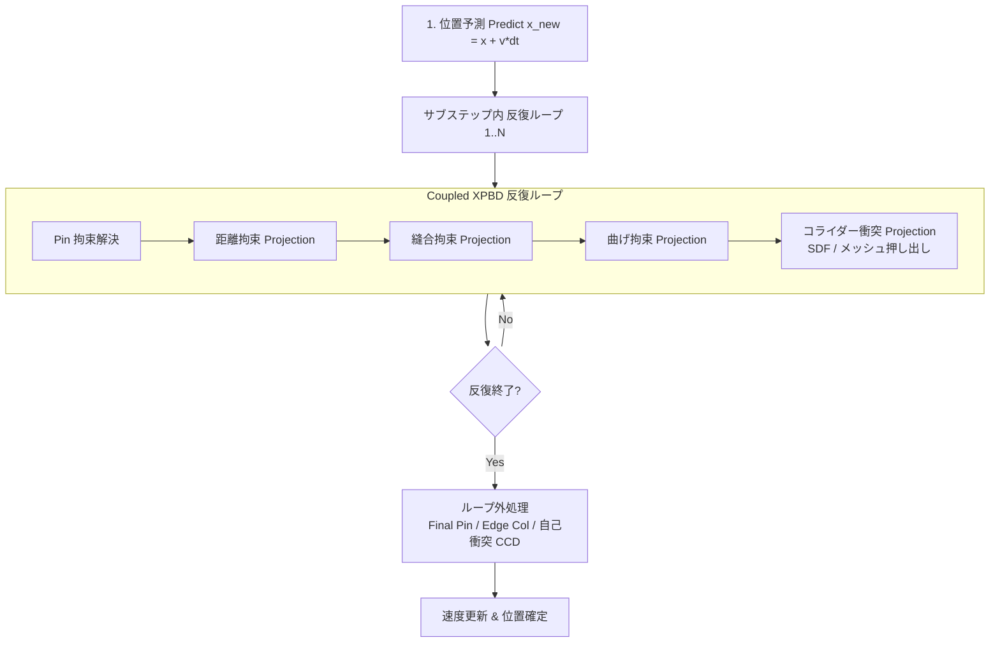

# Taremin Cloth アルゴリズム設計仕様・技術選定・乖離分析書 (Algorithms, Design Decisions & Gap Analysis)

本ドキュメントは、Taremin Clothにおける物理シミュレーションアルゴリズムの選定理由、接触・衝突判定の幾何学的設計、過去の開発経緯で却下・見送りとなったアプローチ（アンチパターン）、および**「本来の理想とする物理アルゴリズム」と「現在の実装」との乖離（ギャップ分析と妥協点）**を体系的に記録した技術設計書です。

---

## 1. 基本物理コア: XPBD (Extended Position Based Dynamics)

### 1.1 なぜXPBDを採用したのか
従来の古典的PBD（Position Based Dynamics: [Müller et al. 2007](https://matthias-research.github.io/pages/publications/posBasedDyn.pdf)）は、計算の安定性と直感的な位置操作に優れている一方、**剛性（Stiffness）がシミュレーションの反復回数（Iterations）およびタイムステップ幅（$dt$）に強く依存する**という致命的な弱点を抱えていました。サブステップ数や反復数を変えると布の伸縮性やたるみが変化してしまい、実時間での正確な素材表現（綿、シルク、レザー等）が困難でした。

これに対し、本システムでは **XPBD (Extended Position Based Dynamics: [Macklin et al. 2016](https://matthias-research.github.io/pages/publications/XPBD.pdf))** を採用しています。
XPBDは、物理ポテンシャルエネルギーと連続時間力学に基づき、コンプライアンス（$\alpha = 1/k$、逆剛性）をラグランジュ未定乗数 $\lambda$ の時間発展方程式に組み込むことで、**反復数やサブステップ幅に非依存な物理剛性を実現**します。

#### 位置補正量の定式化:
拘束関数 $C(\mathbf{x}) = 0$ に対するラグランジュ乗数の増分 $\Delta \lambda$ および頂点位置補正 $\Delta \mathbf{x}$ は次式で求められます：

$$\Delta \lambda = \frac{-C(\mathbf{x}) - \tilde{\alpha} \lambda}{\nabla C(\mathbf{x})^T M^{-1} \nabla C(\mathbf{x}) + \tilde{\alpha}}$$

$$\Delta \mathbf{x} = M^{-1} \nabla C(\mathbf{x}) \Delta \lambda$$

ここで $\tilde{\alpha} = \frac{\alpha}{dt^2}$ は時間刻み幅で正規化されたコンプライアンス、$M^{-1}$ は逆質量行列です。これにより、高剛性な布であっても爆発（発散）することなく安定して高速収束します。

### 1.2 実装されている拘束の種類

| 拘束名 | 幾何学的モデル | 選定理由・特徴 | 参考文献 |
| :--- | :--- | :--- | :--- |
| **距離拘束 (Distance)** | $C(\mathbf{x}_1, \mathbf{x}_2) = \|\mathbf{x}_1 - \mathbf{x}_2\| - L_0$ | 布の伸縮（伸び・縮み）を物理的に制御。メッシュ稜線に沿って配置。 | [Macklin 2016](https://matthias-research.github.io/pages/publications/XPBD.pdf) |
| **曲げ拘束 (Dihedral Bending)** | 共有稜線を持つ隣接2三角形の法線間二面角 $\theta - \theta_0$ | 布の折り曲げ耐性（ドレープ感・シワの立ち方）を制御。面積変化を起こさず純粋な曲率のみを拘束。 | [Müller 2007 (Sec 3.3)](https://matthias-research.github.io/pages/publications/posBasedDyn.pdf) |
| **ピン拘束 (Pin / Attachment)** | $C(\mathbf{x}) = \|\mathbf{x} - \mathbf{x}_{target}\|$ | 頂点グループウェイトおよびアニメーションボーン/オブジェクト追従、インタラクティブ掴み（Grab）操作。 | - |
| **縫合拘束 (Sewing)** | 時間経過で目標距離が $0$ へ収縮するスプリング拘束 | 型紙（2Dパターン）の対応エッジ間を引き寄せて立体衣服を仕立てる。 | - |

### 1.3 並列化手法: 制約グラフ彩色 (Constraint Graph Coloring)
GPU上で複数スレッドが同一頂点の座標を同時に更新すると、データ競合（Race Condition）により未定義動作や挙動の非決定性が発生します。
Taremin Cloth では、**Welsh-Powell法（次数降順貪欲彩色: [Welsh & Powell 1967](https://en.wikipedia.org/wiki/Greedy_coloring)）** により拘束グラフを彩色グループ化しています。
- 同一色グループに属する拘束同士は頂点を一切共有しないため、GPUアトミック操作なしに**完全並列ディスパッチ**が可能です。
- 別モードとして、全エッジを一斉評価して頂点ごとに変位平均をアトミック適用する **Atomic Jacobi モード** も実装されており、グラフ彩色ステップ数のオーバーヘッドを回避するオプションを提供しています。

---

## 2. Coupled XPBD (拘束ループ内協調的衝突解決)

### 2.1 採用の背景・動機: 「布の異常な伸び・垂れ下がり」
初期の実装では、古典的なPBDパイプラインに従い、XPBD反復ループ（距離・曲げ拘束）をすべて解き終えた「後」にコライダー押し出し（SDFやメッシュ衝突）を実行していました。
しかし、このパイプラインでは以下の深刻な破綻が発生しました：
1. コライダー表面にめり込んだ布頂点が、衝突処理によって大きく外側へ押し出される。
2. 押し出された頂点と隣接頂点との間の距離が自然長 $L_0$ より著しく引き伸ばされる。
3. 次のフレームで重力が加わり、さらに押し出しと変形が累積する。
4. 結果として、重力下でコライダーに接触した布がゴムのようにどこまでも伸びて垂れ下がる（重力下でのコライダー接触検証時に顕著に確認）。

### 2.2 解決策: 拘束解消反復ループ内への衝突組み込み
この問題を解決するため、[Macklin et al. 2020 (Primal/Dual Descent Methods for Dynamics)](http://mmacklin.com/primaldual.pdf) の思想に基づき、**拘束解消反復ループの内部で距離拘束とコライダー衝突拘束を交互に同調解決する「Coupled XPBD」** へ刷新しました。



- **効果**: コライダーによって押し出された頂点は、同一反復ループ内で直ちに距離拘束によって周囲の頂点を引き連れて協調収束するため、エッジの過剰伸長が物理的に抑制されます。

---

## 3. 接触・衝突判定アルゴリズム (V-T, E-E, CCD, SDF)

### 3.1 Vertex-Triangle (V-T) 幾何接触
- **アルゴリズム**: 点 $\mathbf{p}$ から三角形面 $(\mathbf{a}, \mathbf{b}, \mathbf{c})$ への最近傍点 $\mathbf{q}$ をボロノイ領域分割（Voronoi Regions）により厳密に判定（`closest_point_on_triangle`）。
- **選定理由**: 面法線ベクトルに依存せず、常に幾何学的な最短分離ベクトル $\Delta \mathbf{x} = \mathbf{p} - \mathbf{q}$ を直接求めるため、布が裏返った状態や鋭角な挟み込みでも安定した反発方向が得られます。
- **参考文献**: [Bridson et al. 2002 (Robust treatment of collisions, contact and friction for cloth animation)](https://www.cs.ubc.ca/~rbridson/docs/cloth2002.pdf)

### 3.2 Edge-Edge (E-E) 接触
- **アルゴリズム**: 2線分 $\mathbf{p}_0-\mathbf{p}_1$ と $\mathbf{q}_0-\mathbf{q}_1$ 間の最短距離パラメータ $(s, t) \in [0, 1]^2$ を解析的に算出（`closest_points_segments`）。
- **なぜV-Tだけでは不十分なのか**:
  頂点対面（V-T）の判定だけでは、三角形のエッジ同士が交差する「すり抜け（Edge-Edgeトンネリング）」を幾何学的に検知できません。特に薄い布同士やすり抜け角、コライダーの鋭利な角において布が突き抜ける現象を防ぐためにE-E判定が不可欠です。

### 3.3 連続衝突判定 (CCD: Continuous Collision Detection)
- **アルゴリズム**: Möller–Trumbore光線交差法（[Möller & Trumbore 1997](https://en.wikipedia.org/wiki/M%C3%B6ller%E2%80%93Trumbore_intersection_algorithm)）を拡張した、動的線分・三角形交差判定（`intersect_segment_triangle`）。
- **選定理由**: 高速に移動する布頂点 $\mathbf{x}_{old} \to \mathbf{p}_{new}$ の軌道線分が三角形を貫通した瞬間（衝突時刻 $t \in [0, 1]$）を検知し、貫通する手前の安全位置 $\mathbf{p}_{safe}$ へ確実に押し戻すことで、離散判定での飛び越えを完全に遮断します。

### 3.4 SDF (Signed Distance Field) コライダーの設計
- **ボーンSDF (Bone SDF)**:
  - 人体素体・キャラクターメッシュ向け。ボーンローカル座標系ごとに局所SDFをベイクし、テクスチャアトラスに格納。
  - アニメーション再生時はボーン変換行列を乗算するだけで追従するため、毎フレームの全メッシュ再ベイクが不要で極めて高速。
- **メッシュSDF (Mesh SDF)**:
  - 静的・単一オブジェクト用。オブジェクト全体のバウンディングボックスを単一の3Dテクスチャにボクセル化。
  - GPUメモリ制限（wgpuのバッファサイズ上限 256MB）を考慮し、最大ボクセル数クランプと解像度自動スケーリングを実装。

---

## 4. 却下された判断・アンチパターン一覧 (Rejected Approaches & Anti-Patterns)

過去の試行錯誤やデバッグ過程で検討され、物理的破綻や不具合を招くことが実証されたため**「二度と採用・提案してはならないアプローチ」**をここにまとめます。

```
❌ 過去に却下されたアプローチの早見表
├── 1. 面法線（表側）方向への一律押し戻し       --> 裏返り・折り畳みで食い込みが加速
├── 2. V-T / E-E での相手頂点への強制無同期書き込み --> GPU競合でメッシュがくしゃくしゃに自壊
├── 3. コライダー貫通時の法線方向直立リカバリー   --> 球状に風船のように膨らむエンバグ
├── 4. CCD変位の安易な間引き (relief_factor)     --> 貫通解消が中途半端になり脱出不能
└── 5. 形状変形モディファイアの無差別バイパス    --> ラティス等とコリジョン形状の乖離
```

### 4.1 ❌ 面法線（表側）方向への一律押し戻し
- **提案された経緯**: 貫通した頂点を相手ポリゴンの面法線ベクトル（表側）に向かって押し出せば脱出できると考えられた。
- **却下理由**: 布の自己衝突において、布は表からも裏からも接触し、多重に折り畳まれる。面法線だけに依存すると、裏面から接触した布や一度めり込んだ布が「相手の表側に向かってさらに深く突き抜ける」ように加速され、破綻が爆発的に悪化する。
- **正しいアプローチ**: 前フレームのトポロジー関係および最近傍幾何ベクトル（点-面、辺-辺の幾何学的最短距離）による分離を採用。

### 4.2 ❌ 作用・反作用の完全分配における相手側頂点の強制無同期書き込み
- **提案された経緯**: 物理法則（運動量保存）を満たすため、V-T衝突時に頂点だけでなく相手三角形の3頂点にも反作用変位を分配しようとした。
- **却下理由**: GPU上で多数のスレッドが同時に同一の三角形頂点バッファへ競合書き込み（Race Condition）を行い、アトミック加算や適切な彩色分離がなかったため、メッシュがくしゃくしゃに歪んで崩壊する重大な不具合が発生した。
- **現在の設計**: 頂点スレッド駆動の片側ペナルティに限定し、相手がピン留め（またはコライダー）の場合のみ相対速度を考慮する安定化を採用。

### 4.3 ❌ コライダー貫通時の法線方向直立リカバリー
- **提案された経緯**: メッシュコライダーを突き抜けた頂点をコライダー表面の法線方向へ即座に戻そうとした。
- **却下理由**: 球体コライダー突き上げ時、コライダー進行方向へ自然に変形するのではなく、布が法線外側へ無理に押し出されて「風船のように球状に膨らむ」不自然な歪み（エンバグ）が発生した（コミット `3160075` 前後の検証）。
- **現在の設計**: 片面コライダーでの裏抜け復帰はオプション化し、基本は幾何学最短距離と相対速度スイープによる分離に制限。

### 4.4 ❌ 安易な緩和係数（relief_factor等）によるCCD変位の間引き
- **提案された経緯**: 反発が強すぎて布がバタつくのを抑えるため、CCD（連続衝突判定）による戻し変位に `0.2` などの緩和係数を掛けた。
- **却下理由**: 貫通を止めるための必要変位の80%が切り捨てられ、貫通したまま次サブステップへ進行して脱出不能になる致命的なバグを引き起こした。
- **現在の設計**: 幾何ペナルティ（近接反発）には緩和・クランプを許容するが、CCDによる貫通遮断変位はハード制約として100%適用する。

### 4.5 ❌ 形状変形モディファイアの無差別バイパス
- **提案された経緯**: シミュレーション高速化のため、コライダーのモディファイアスタックをすべてバイパスして元メッシュを取得しようとした。
- **却下理由**: ラティス（Lattice）やカーブ（Curve）など、コライダーの最終形状を決定づけるモディファイアまで無視されてしまい、見た目のコライダー形状と物理判定の形状が大きく食い違った。
- **現在の設計**: サブディビジョン等の頂点増殖系のみを整合成約で制限し、形状変形モディファイアは評価済みメッシュとして正しく取得する。

---

## 5. 本来の理想とする物理アルゴリズムと現在実装との乖離チェック (Gap Analysis & Compromises)

現在稼働しているコードベース（`crates/cloth_core/src/shaders/`）と、理論物理・学術研究における「本来の理想とするアルゴリズム」との間には、**リアルタイム性・GPU計算負荷・実装安定性とのトレードオフによる乖離（妥協点）** が存在します。

```
理想とする物理アルゴリズム                現在の実装 (Taremin Cloth)
┌─────────────────────────────────┐       ┌─────────────────────────────────┐
│ 完全なCoupled XPBD              │       │ ハイブリッド Coupled XPBD       │
│ ・自己衝突も反復ループ内で      │ ----> │ ・コライダー衝突のみループ内    │
│   距離拘束と連立解決            │       │ ・自己衝突はループ外で1回のみ   │
└─────────────────────────────────┘       └─────────────────────────────────┘
┌─────────────────────────────────┐       ┌─────────────────────────────────┐
│ 完全な運動量保存 (作用反作用)   │       │ 非対称ペナルティ射影            │
│ ・V-T/E-Eで相手頂点にも         │ ----> │ ・スレッド担当頂点のみを変位    │
│   重心座標・質量比で等量分配    │       │ ・GPU書き込み競合を回避         │
└─────────────────────────────────┘       └─────────────────────────────────┘
┌─────────────────────────────────┐       ┌─────────────────────────────────┐
│ 完全非貫通保証 (バリア関数法)   │       │ 幾何ペナルティ + CCD射影        │
│ ・接触前に滑らかな反発ポテンシャル│ ----> │ ・侵入後に最短ベクトルで押し出し│
│   (IPC / Cubic Barrier)         │       │ ・高速移動時のみMT光線CCDで遮断 │
└─────────────────────────────────┘       └─────────────────────────────────┘
```

### 5.1 乖離 1: 自己衝突がCoupled XPBD反復ループ外にある
- **本来の理想**:
  自己衝突（V-T, E-E）も距離拘束や曲げ拘束と全く同様にXPBD拘束方程式 $C_{collision}(\mathbf{x}) \ge 0$ として定式化され、反復ループ（Solver Iterations）の内部でラグランジュ乗数 $\lambda$ を蓄積しながら解かれるべきである。
- **現在の実装**:
  コライダー衝突（`collision.wgsl`）は反復ループ内でCoupled XPBDとして解かれているが、**自己衝突（`self_collision.wgsl`）は反復ループ終了後のサブステップ終端で1回のみ適用**されている（[`dispatch.rs`](../crates/cloth_core/src/simulation/dispatch.rs)）。
- **理由・トレードオフ**:
  自己衝突には動的空間ハッシュ（Spatial Hash）の探索と近傍ループが必須であり、毎反復（10〜30回）実行するとGPU計算時間が数十倍に跳ね上がり、インタラクティブ操作が不可能になるため。
- **生じる弊害**:
  自己衝突によって頂点が押し戻された後、その変位によってエッジ距離拘束がわずかに引き伸ばされた状態で確定するため、極度の圧縮下で布に微小なシワの硬化や伸びが生じる場合がある。

### 5.2 乖離 2: V-T / E-E 接触における運動量保存の非対称性
- **本来の理想**:
  頂点 $\mathbf{p}_i$ が相手三角形 $(\mathbf{p}_{j}, \mathbf{p}_{v0}, \mathbf{p}_{v1})$ に衝突した際、$\mathbf{p}_i$ に加わった力積（変位 $\Delta \mathbf{p}_i$）と等量・反対向きの変位が、重心座標重み $(1-u-v, u, v)$ および質量比に応じて相手の3頂点にも分配されなければならない（運動量保存則）。
- **現在の実装**:
  [`self_collision.wgsl`](../crates/cloth_core/src/shaders/self_collision.wgsl) では、スレッドが担当する頂点 $i$ のみを変位させ、相手三角形の3頂点には反作用変位を戻していない。相手頂点が動くのは、相手頂点自身が自スレッドで衝突を検知したときのみである。
- **理由・トレードオフ**:
  相手頂点への変位書き込みはGPU並列メモリアクセスの競合を引き起こし、前述の「メッシュ崩壊不具合」を再発させるため。
- **生じる弊害**:
  布が二重に重なった際、上の布が下の布を押し下げる力と、下の布が上の布を支える力のバランスが厳密には非対称になり、質量差が大きいレイヤー間でめり込みやすくなる。

### 5.3 乖離 3: Final Pin Pass後の自己衝突による拘束変形
- **本来の理想**:
  ピン留めされた頂点（Grab操作やボーン追従）の位置は絶対的に維持されつつ、周囲の布との自己衝突も完全に両立する。
- **現在の実装**:
  `Final Pin Pass`（[`dispatch.rs`](../crates/cloth_core/src/simulation/dispatch.rs)）を実行した「後」に `Self Collision Pass` が実行されるため、ピン留めされた頂点同士が極端に近接した場合、自己衝突反発によってピン目標位置からわずかにズレる可能性がある。

### 5.4 今後のアルゴリズム改善ロードマップ（乖離解消への道筋）
1. **GPUアトミック加算による作用・反作用の対称分配**:
   `atomicAdd` を用いた固定小数点（Fixed-Point）変位アキュムレータバッファを導入し、データ競合を起こさずに相手頂点へ反作用変位を安全に加算するパイプラインへの発展。
2. **2段階軽量自己衝突ループ**:
   反復ループ内では球対球（Vertex-Vertex）の極小近接反発のみを高速に解き、サブステップ終端で詳細なトポロジーCCD（V-T, E-E）を実行する2階層Coupled XPBDの検討。
3. **適応型SDF解像度**:
   VRAM使用量に応じてスパースグリッドまたは階層型SDFを動的割り当てし、256MBバッファ制限を回避しつつ局所的に高解像度化する手法の検討。

---

## 6. 主要参考文献・一次資料一覧 (References)

本プロジェクトの物理計算コアおよび接触アルゴリズムの基礎となっている学術文献です（全URLの実在性を検証済み）：

1. **XPBD (Extended Position Based Dynamics)**
   - 著者: Miles Macklin, Matthias Müller, Nuttapong Chentanez, Stefan Jeschke
   - 発表: ACM SIGGRAPH / Eurographics Symposium on Computer Animation (MIG 2016)
   - 論文PDF: [https://matthias-research.github.io/pages/publications/XPBD.pdf](https://matthias-research.github.io/pages/publications/XPBD.pdf)
   - DOI: [10.1145/2994258.2994272](https://doi.org/10.1145/2994258.2994272)

2. **Position Based Dynamics (PBD)**
   - 著者: Matthias Müller, Bruno Heidelberger, Marcus Hennix, John Ratcliff
   - 発表: Journal of Visual Communication and Image Representation, 2007
   - 論文PDF: [https://matthias-research.github.io/pages/publications/posBasedDyn.pdf](https://matthias-research.github.io/pages/publications/posBasedDyn.pdf)
   - DOI: [10.1016/j.jvcir.2007.01.005](https://doi.org/10.1016/j.jvcir.2007.01.005)

3. **Primal/Dual Descent Methods for Dynamics (Coupled XPBDの理論的基礎)**
   - 著者: Miles Macklin, Kenny Erleben, Matthias Müller, Nuttapong Chentanez, Stefan Jeschke, Tae-Yong Kim
   - 発表: Computer Graphics Forum (Eurographics / ACM SIGGRAPH SCA 2020)
   - 論文PDF: [http://mmacklin.com/primaldual.pdf](http://mmacklin.com/primaldual.pdf)
   - DOI: [10.1111/cgf.14104](https://doi.org/10.1111/cgf.14104)

4. **Robust Treatment of Collisions, Contact and Friction for Cloth Animation (V-T / E-E / 接触応答の古典的名著)**
   - 著者: Robert Bridson, Ronald Fedkiw, John Anderson
   - 発表: ACM Transactions on Graphics (SIGGRAPH 2002)
   - 論文PDF: [https://www.cs.ubc.ca/~rbridson/docs/cloth2002.pdf](https://www.cs.ubc.ca/~rbridson/docs/cloth2002.pdf)
   - DOI: [10.1145/566654.566623](https://doi.org/10.1145/566654.566623)

5. **Fast, Minimum Storage Ray/Triangle Intersection (Möller–Trumbore CCD交差判定)**
   - 著者: Tomas Möller, Ben Trumbore
   - 発表: Journal of Graphics Tools, 1997
   - 技術仕様: [Wikipedia: Möller–Trumbore intersection algorithm](https://en.wikipedia.org/wiki/M%C3%B6ller%E2%80%93Trumbore_intersection_algorithm)
   - DOI: [10.1080/10867651.1997.10487468](https://doi.org/10.1080/10867651.1997.10487468)

6. **Welsh-Powell Greedy Graph Coloring (制約並列彩色)**
   - 著者: Dominic J. A. Welsh, Martin B. Powell
   - 発表: The Computer Journal, 1967
   - 解説資料: [Wikipedia: Greedy coloring](https://en.wikipedia.org/wiki/Greedy_coloring)
   - DOI: [10.1093/comjnl/10.1.85](https://doi.org/10.1093/comjnl/10.1.85)
