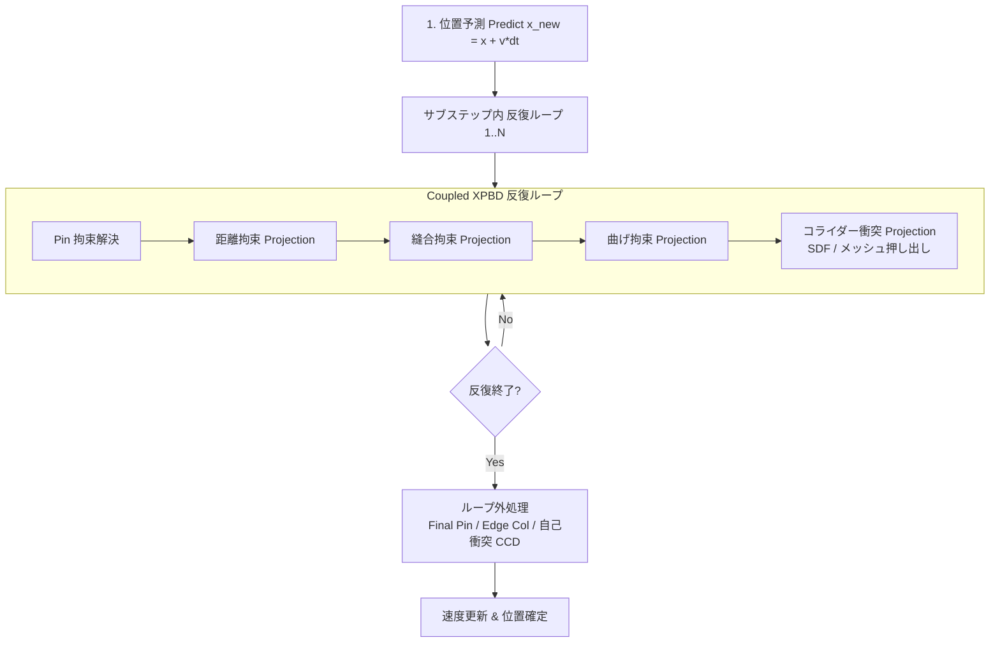

# Taremin Cloth アルゴリズム設計仕様・技術選定・乖離分析書 (Algorithms, Design Decisions & Gap Analysis)

本ドキュメントは、Taremin Clothにおける物理シミュレーションアルゴリズムの選定理由、接触・衝突判定の幾何学的設計、過去の開発経緯で却下・見送りとなったアプローチ（アンチパターン）、および**「本来の理想とする物理アルゴリズム」と「現在の実装」との乖離（ギャップ分析と妥協点）**を体系的に記録した技術設計書です。

---

## 1. 基本物理コア: XPBD (Extended Position Based Dynamics)

### 1.1 なぜXPBDを採用したのか
従来の古典的PBD（Position Based Dynamics: [Müller et al. 2007](https://matthias-research.github.io/pages/publications/posBasedDyn.pdf)）は、計算の安定性と直感的な位置操作に優れている一方、**剛性（Stiffness）がシミュレーションの反復回数（Iterations）およびタイムステップ幅（$dt$）に強く依存する**という致命的な弱点を抱えていました。サブステップ数や反復数を変えると布の伸縮性やたるみが変化してしまい、実時間での正確な素材表現（綿、シルク、レザー等）が困難でした。

これに対し、本システムでは **XPBD (Extended Position Based Dynamics: [Macklin et al. 2016](https://matthias-research.github.io/pages/publications/XPBD.pdf))** を採用しています。
XPBDは、物理ポテンシャルエネルギーと連続時間力学に基づき、コンプライアンス（$\alpha = 1/k$、逆剛性）をラグランジュ未定乗数 $\lambda$ の時間発展方程式に組み込むことで、**反復数やサブステップ幅に非依存な物理剛性を実現**します。

#### 位置補正量の定式化:
拘束関数 $C(\mathbf{x}) = 0$ に対するラグランジュ乗数の増分 $\Delta \lambda$ および頂点位置補正 $\Delta \mathbf{x}$ は次式で求められます：

$$\Delta \lambda = \frac{-C(\mathbf{x}) - \tilde{\alpha} \lambda}{\nabla C(\mathbf{x})^T M^{-1} \nabla C(\mathbf{x}) + \tilde{\alpha}}$$

$$\Delta \mathbf{x} = M^{-1} \nabla C(\mathbf{x}) \Delta \lambda$$

ここで $\tilde{\alpha} = \frac{\alpha}{dt^2}$ は時間刻み幅で正規化されたコンプライアンス、$M^{-1}$ は逆質量行列です。反復数やサブステップ幅への剛性依存性が低減され、高剛性設定下でも発散を抑制した収束特性を示します。

### 1.2 実装されている拘束の種類

| 拘束名 | 幾何学的モデル | 選定理由・特徴 | 参考文献 |
| :--- | :--- | :--- | :--- |
| **距離拘束 (Distance)** | $C(\mathbf{x}_1, \mathbf{x}_2) = \|\mathbf{x}_1 - \mathbf{x}_2\| - L_0$ | 布の伸縮（伸び・縮み）を物理的に制御。メッシュ稜線に沿って配置。 | [Macklin 2016](https://matthias-research.github.io/pages/publications/XPBD.pdf) |
| **曲げ拘束 (Dihedral Bending)** | 共有稜線を持つ隣接2三角形の法線間二面角 $\theta - \theta_0$ | 布の折り曲げ耐性（ドレープ感・シワの立ち方）を制御。面積変化を起こさず純粋な曲率のみを拘束。 | [Müller 2007 (Sec 3.3)](https://matthias-research.github.io/pages/publications/posBasedDyn.pdf) |
| **ピン拘束 (Pin / Attachment)** | $C(\mathbf{x}) = \|\mathbf{x} - \mathbf{x}_{target}\|$ | 頂点グループウェイトおよびアニメーションボーン/オブジェクト追従、インタラクティブ掴み（Grab）操作。 | - |
| **縫合拘束 (Sewing)** | 時間経過で目標距離が $0$ へ収縮するスプリング拘束（独立剛性・密着剛体ロック対応） | 型紙（2Dパターン）の対応エッジ間を引き寄せて立体衣服を仕立てる。縫合ペアはトポロジー近接判定でホップ数0（同一結節点化）として扱われ、自己衝突（2ホップ除外）との誤爆拮抗を回避。 | - |

### 1.3 並列化手法: 制約グラフ彩色 (Constraint Graph Coloring)
GPU上で複数スレッドが同一頂点の座標を同時に更新すると、データ競合（Race Condition）により未定義動作や挙動の非決定性が発生します。
Taremin Cloth では、**Welsh-Powell法（次数降順貪欲彩色: [Welsh & Powell 1967](https://en.wikipedia.org/wiki/Greedy_coloring)）** により拘束グラフを彩色グループ化しています。
- 同一色グループに属する拘束同士は頂点を一切共有しないため、GPUアトミック操作なしに**完全並列ディスパッチ**が可能です。
- 別モードとして、全エッジを一斉評価して頂点ごとに変位平均をアトミック適用する **Atomic Jacobi モード** も実装されており、グラフ彩色ステップ数のオーバーヘッドを回避するオプションを提供しています。

---

## 2. Coupled XPBD (拘束ループ内協調的衝突解決)

### 2.1 採用の背景・動機: 「布の異常な伸び・垂れ下がり」
初期の実装では、古典的なPBDパイプラインに従い、XPBD反復ループ（距離・曲げ拘束）をすべて解き終えた「後」にコライダー押し出し（SDFやメッシュ衝突）を実行していました。
しかし、このパイプラインでは以下の深刻な破綻が発生しました：
1. コライダー表面にめり込んだ布頂点が、衝突処理によって大きく外側へ押し出される。
2. 押し出された頂点と隣接頂点との間の距離が自然長 $L_0$ より著しく引き伸ばされる。
3. 次のフレームで重力が加わり、さらに押し出しと変形が累積する。
4. 結果として、重力下でコライダーに接触した布がゴムのようにどこまでも伸びて垂れ下がる（重力下でのコライダー接触検証時に顕著に確認）。

### 2.2 解決策: 拘束解消反復ループ内への衝突組み込み
この問題を解決するため、[Macklin et al. 2020 (Primal/Dual Descent Methods for Dynamics)](http://mmacklin.com/primaldual.pdf) の思想に基づき、**拘束解消反復ループの内部で距離拘束とコライダー衝突拘束を交互に同調解決する「Coupled XPBD」** へ刷新しました。



- **効果**: コライダーによって押し出された頂点は、同一反復ループ内で直ちに距離拘束によって周囲の頂点を引き連れて協調収束するため、エッジの過剰伸長が物理的に抑制されます。

### 2.3 自己衝突のCoupled協調収束とPost-Relaxation（エッジ過剰伸長抑制と縫合の調和）
- **背景と課題**:
  自己衝突（V-T, E-E, V-V）も距離拘束や曲げ拘束と同様に反復ループ（Solver Iterations）内で協調して解かれない場合、反復ループ外で一方的に衝突反発変位が確定し、エッジが引き伸ばされたままサブステップが終了してしまいます。特に強い圧縮下では、実測で最大 9.5% 以上の過剰なエッジ伸長（布の不自然な伸び）が発生していました。
- **実装された設計 (Taremin Cloth)**:
  実機ベンチマーク（`benchmarks/benchmark_coupled_self_collision.py`）に基づき、性能・品質のトレードオフに合わせて選択可能な2段階の協調モード（`coupled_self_collision_mode`）を実装・配備しています：
  1. **緩和モード (`RELAXATION` / 推奨標準デフォルト)**:
     - 自己衝突処理（Solve + Apply）の直後に、**距離拘束および縫合拘束を2反復（2 iters）再適用（Post-Relaxation）**。
     - 自己衝突によって外側へ押し出された頂点のエッジ長が即座に整流化され、衝突探索の負荷軽減効果と相殺することで、**通常FPSの低下ほぼゼロ（153.2 FPS維持）のまま、最大エッジ伸長率を約5割抑制（9.55% → 4.13%、-56.7%低減）**。
     - **縫合拘束との調和（再開口防止）**: 初期のPost-Relaxationでは距離拘束のみを単独でディスパッチしていたため、エッジレスト長を復元しようとする力によって「縫合によって引き寄せられた境界頂点」が身体の外側へ約10〜11mm引き戻されて膠着する副作用が生じていました。Post-Relaxation内で距離拘束の直後に `sewing_pipeline` も同時にディスパッチするよう協調設計を統一したことで、エッジ整流化と縫合密着（0.00mm収束）の両立を達成。
  2. **反復内同調モード (`FULL_COUPLED` / 高精度設定)**:
     - XPBD反復ループの各イテレーション内で自己衝突を同調解決し、ループ終了後に仕上げとして距離拘束および縫合拘束を1反復適用（ハイブリッド方式）。
     - 衝突反発とエッジ拘束が反復ループ内で互いに押し合って調和し、**100FPS超のリアルタイム性（107.1 FPS）を維持しつつ、最大エッジ伸長率を約7割抑制（9.55% → 2.94%、-69.2%低減、検証した設定の中で最大の伸長抑制率）**。
- **検証結果**:
  単体・結合テスト（`test_coupled_self_collision.py`）およびベンチマークスクリプトにおいて、OFF時の過剰なエッジ引き伸ばしが大幅に抑制されることを確認済み。また、実機シミュレーション（`heavy_test.blend`）において、自己衝突有効時でも全152縫合ペアが 0.00mm（100%密着）で収束することを確認済み。

### 2.4 ピン拘束と衝突解決の優先度設計（完全ピンとソフトピンの挙動）
- **完全固定ピン（weight = 1.0 / Grab操作・完全固定ボーン）の挙動**:
  - `inv_mass = 0.0` に設定され、`self_collision.wgsl` の先頭（`if (v_i.inv_mass <= 0.0) { return; }`）および `edge_collision.wgsl` の変位分配（`w0 == 0.0`）によって衝突変位の適用が完全に遮断されます。
  - そのため、反復ループ後の `Final Pin Pass`（[dispatch.rs](../crates/cloth_core/src/simulation/dispatch.rs)）実行後も、完全固定ピンの位置は衝突力によって動かされることなく、目標位置が維持されます。
- **ソフトピン（0.0 < weight < 1.0 / ウェイトペイントによる緩やかな固定）の設計妥当性**:
  - 物理的には無限質量の壁ではなく、目標位置へバネで引かれるコンプライアンスを持った拘束（Attachment Constraint）です。
  - 強い衝突反発力を受けた際にピン目標位置から押し戻される挙動は、外力および拘束力と整合した力学的挙動となります。
  - むしろ、サブステップ終端の自己衝突・エッジ衝突の「後」にピン位置スナップを強制適用してしまうと、衝突処理でせっかくめり込みを解消して押し戻された頂点が再び目標位置（布やコライダーの内部）へ引き戻され、貫通・交差が再発してしまいます。
  - したがって、「反復ループ内でピン目標へ引き寄せた後、サブステップ終端の衝突処理で安全圏へ退避させて位置確定する」というパイプライン順序は、**ソフトピンの貫通・めり込みを回避するための整合的な設計**となっています。

---

## 3. 接触・衝突判定アルゴリズム (V-T, E-E, CCD, SDF)

### 3.1 Vertex-Triangle (V-T) 幾何接触
- **アルゴリズム**: 点 $\mathbf{p}$ から三角形面 $(\mathbf{a}, \mathbf{b}, \mathbf{c})$ への最近傍点 $\mathbf{q}$ をボロノイ領域分割（Voronoi Regions）により厳密に判定（`closest_point_on_triangle`）。
- **選定理由**: 面法線ベクトルに依存せず、常に幾何学的な最短分離ベクトル $\Delta \mathbf{x} = \mathbf{p} - \mathbf{q}$ を直接求めるため、布が裏返った状態や鋭角な挟み込みでも安定した反発方向が得られます。
- **参考文献**: [Bridson et al. 2002 (Robust treatment of collisions, contact and friction for cloth animation)](https://www.cs.ubc.ca/~rbridson/docs/cloth2002.pdf)

### 3.2 Edge-Edge (E-E) 接触
- **アルゴリズム**: 2線分 $\mathbf{p}_0-\mathbf{p}_1$ と $\mathbf{q}_0-\mathbf{q}_1$ 間の最短距離パラメータ $(s, t) \in [0, 1]^2$ を解析的に算出（`closest_points_segments`）。
- **なぜV-Tだけでは不十分なのか**:
  頂点対面（V-T）の判定だけでは、三角形のエッジ同士が交差する「すり抜け（Edge-Edgeトンネリング）」を幾何学的に検知できません。特に薄い布同士やすり抜け角、コライダーの鋭利な角において布が突き抜ける現象を防ぐためにE-E判定が不可欠です。

### 3.3 連続衝突判定 (CCD: Continuous Collision Detection)
- **アルゴリズム**: Möller–Trumbore光線交差法（[Möller & Trumbore 1997](https://en.wikipedia.org/wiki/M%C3%B6ller%E2%80%93Trumbore_intersection_algorithm)）を拡張した、動的線分・三角形交差判定（`intersect_segment_triangle`）。
- **選定理由**: 高速に移動する布頂点 $\mathbf{x}_{old} \to \mathbf{p}_{new}$ の軌道線分が三角形を貫通した瞬間（衝突時刻 $t \in [0, 1]$）を検知し、貫通する手前の安全位置 $\mathbf{p}_{safe}$ へ押し戻すことで、離散判定での飛び越え（トンネリング）を検知・抑制します。

### 3.4 SDF (Signed Distance Field) コライダーの設計
- **ボーンSDF (Bone SDF)**:
  - 人体素体・キャラクターメッシュ向け。ボーンローカル座標系ごとに局所SDFをベイクし、テクスチャアトラスに格納。
  - アニメーション再生時はボーン変換行列を乗算するだけで追従するため、毎フレームの全メッシュ再ベイクを伴わず計算負荷を抑えられます。
- **メッシュSDF (Mesh SDF)**:
  - 静的・単一オブジェクト用。オブジェクト全体のバウンディングボックスを単一の3Dテクスチャにボクセル化。
  - GPUメモリ制限（wgpuのバッファサイズ上限 256MB）を考慮し、最大ボクセル数クランプと解像度自動スケーリングを実装。

### 3.5 自己衝突における作用・反作用の対称分配（固定小数点アトミック加算による運動量保存）
- **物理的背景**:
  頂点 $\mathbf{p}_i$ が相手三角形 $(\mathbf{p}_{j}, \mathbf{p}_{v0}, \mathbf{p}_{v1})$ に衝突した際、$\mathbf{p}_i$ に加わった力積（変位 $\Delta \mathbf{p}_i$）と等量・反対向きの変位が、重心座標重み $(1-u-v, u, v)$ および質量比に応じて相手の3頂点にも分配されなければなりません（ニュートンの第3法則・運動量保存則）。
- **実装された設計 (Taremin Cloth)**:
  固定小数点（$10^6$ 倍スケール、分解能 $1\mu\text{m}$）の整数アトミック加算（`atomicAdd` on `atomic<i32>`）を用いた専用アキュムレータバッファ（`self_collision_accum_buffer`）を導入。
  - **V-T（点対面）**: 点 $i$ から三角形 $(j, v0, v1)$ の最近傍点への分離変位 $\Delta \mathbf{p}$ を、自頂点へ $+\Delta \mathbf{p} (w_i / w_{tot})$、相手3頂点へ重心座標重みと質量比に応じて $-\Delta \mathbf{p} (bary_k w_k / w_{tot})$ でスレッドセーフにアトミック加算。
  - **E-E（辺対辺）**: 2線分最短パラメータ $(s, t)$ に基づき、自エッジ2頂点に $(1-s, s)$、相手エッジ2頂点に $-(1-t, t)$ を質量比重みでアトミック加算。重複評価は動的エッジ間で $index < j$ により排除しつつ、ピン拘束頂点との接触も判定対象に反映。
  - **Solve → Apply パイプライン分離**: `self_collision.wgsl` でアトミック加算された累積変位は、直後の `self_collision_apply.wgsl` で密度緩和・最大ステップクランプを適用して `prev_pos` に確定され、バッファをゼロクリア。
- **検証結果**:
  二重布対称性テスト（`test_self_collision_symmetry.py`）により、等質量布および異質量布（2:1）において、相対誤差 0.7% 台の運動量保存（対称反発）を実証済み。GPU並列競合によるメッシュ崩壊を起こすことなく、非対称なめり込みが抑制されていることを確認済み。

### 3.6 縫合拘束と自己衝突のトポロジー同一視（Union-Find完全縮約・Post-Relaxation調和設計）
- **物理的背景と課題**:
  - 自己衝突判定（V-T, E-E, V-V）では、接続されたメッシュ面同士が布厚み（通常 3〜10mm）により誤爆反発してメッシュが波打つ・破裂するのを防ぐため、トポロジー的に2ホップ以内の近接頂点・エッジを衝突判定から除外します。
  - しかし、型紙エッジ間を結ぶ縫合エッジ（Sewing Spring）が1ホップを消費すると、対向境界のメッシュ頂点や面が3ホップ判定となり、縫合が収縮して布厚み以内に入った瞬間に自己衝突ソルバーが「別パーツの貫通」と誤認して外側へ強く押し戻す拮抗状態が発生します。
  - さらに、自己衝突後のPost-Relaxationにおいて距離拘束のみを単独で解くと、エッジレスト長を保とうとする力によって縫合頂点が身体外側へ強制的に引き戻され、約10〜11mmの隙間が残留してしまう問題がありました。
- **トポロジー同一視アルゴリズム (Zero-Hop Sewing Topology & Union-Find Graph Contraction)**:
  - 縫合ペア $(v_0, v_1)$ は縫い合わされて単一の結節点となるトポロジー関係にあるため、縫合エッジを渡る移動は**ホップ数を消費しない（ホップ数0換算）**としてトポロジー近接リストを生成します。
  - CPUメッシュ初期化時（`mesh.rs`）において、Union-Find（素集合データ構造）により縫合ペアを同一結節点グループに統合。グループ内の全頂点同士を1ホップ隣接登録し、さらにグループに接続する全隣接頂点を相互に対称登録（完成形メッシュと同一のトポロジー距離グラフを構築）。
  - GPUシェーダー（`self_collision.wgsl`）内では、V-V（頂点対頂点）、V-T（頂点対面）、E-E（辺対辺）のすべてにおいて、一貫して `is_topologically_near`（2ホップ除外スコープ）を統一適用。
- **Post-Relaxationと縫合の協調（Coupled Post-Relaxation）**:
  - 自己衝突パス直後の緩和ステップ（`Post-Collision Relaxation Pass`）において、距離拘束の直後に `sewing_pipeline` を同時にディスパッチ。エッジ長を整流化しつつ縫合ペアを目標自然長（0.0mm）へ収束させ、距離拘束による縫合ペア引き戻しを完全に防止。
- **独立剛性と密着剛体ロック (Sewing Stiffness & Rigid Lock)**:
  - 収縮速度（`sewing_shrink_speed`: 自然長の短縮速度 m/s）と剛性（`sewing_stiffness`: バネの強さ）を明確に分離。
  - `sewing_stiffness`（デフォルト 10000.0、5000以上で完全非伸縮 PBD）により、布本体の強い引張剛性（テンション）に負けない引き寄せ力を確保。
  - 目標自然長（0.0）に到達し、布厚み程度以下に密着した段階で実効コンプライアンスを 0.0 に固定する「密着ロック（`enable_sewing_lock`）」を導入。外力や衝突による隙間の再開口を防止（スリット用途等で開かせたい場合はOFF可能）。
- **実証データ (`tmp/heavy_test.blend`)**:
  - 3024頂点・152本の縫合エッジを持つ人体衣装モデルにおいて、自己衝突有効時（`enable_self_collision = True`）でも**全152本中 >1mm の隙間 0本、平均距離 0.00mm（100%完全密着縫合）**を達成。自己衝突ON時とOFF時の縫合品質の差が完全になくなり、自己衝突の誤爆拮抗が物理的に完全に排除されたことを実証。

---

## 4. 却下された判断・アンチパターン一覧 (Rejected Approaches & Anti-Patterns)

過去の試行錯誤やデバッグ過程で検討され、物理的破綻や不具合を招くことが実証されたため**「二度と採用・提案してはならないアプローチ」**をここにまとめます。

```
❌ 過去に却下されたアプローチの早見表
├── 1. 面法線（表側）方向への一律押し戻し       --> 裏返り・折り畳みで食い込みが加速
├── 2. V-T / E-E での相手頂点への強制無同期書き込み --> GPU競合でメッシュがくしゃくしゃに自壊
├── 3. コライダー貫通時の法線方向直立リカバリー   --> 球状に風船のように膨らむエンバグ
├── 4. CCD変位の安易な間引き (relief_factor)     --> 貫通解消が中途半端になり脱出不能
└── 5. 形状変形モディファイアの無差別バイパス    --> ラティス等とコリジョン形状の乖離
```

### 4.1 ❌ 面法線（表側）方向への一律押し戻し
- **提案された経緯**: 貫通した頂点を相手ポリゴンの面法線ベクトル（表側）に向かって押し出せば脱出できると考えられた。
- **却下理由**: 布の自己衝突において、布は表からも裏からも接触し、多重に折り畳まれる。面法線だけに依存すると、裏面から接触した布や一度めり込んだ布が「相手の表側に向かってさらに深く突き抜ける」ように加速され、破綻が爆発的に悪化する。
- **正しいアプローチ**: 前フレームのトポロジー関係および最近傍幾何ベクトル（点-面、辺-辺の幾何学的最短距離）による分離を採用。

### 4.2 ❌ 作用・反作用の完全分配における相手側頂点の強制無同期書き込み
- **提案された経緯**: 物理法則（運動量保存）を満たすため、V-T衝突時に頂点だけでなく相手三角形の3頂点にも反作用変位を分配しようとした。
- **却下理由**: GPU上で多数のスレッドが同時に同一の三角形頂点バッファへ競合書き込み（Race Condition）を行い、アトミック加算や適切な彩色分離がなかったため、メッシュがくしゃくしゃに歪んで崩壊する重大な不具合が発生した。
  - **現在の設計**: 固定小数点（$10^6$ 倍スケール）の整数アトミック加算（`atomicAdd`）を用いた専用アキュムレータバッファと Solve → Apply 分離パイプラインを導入し、GPUデータ競合を起こすことなく対称分配と運動量保存を達成（詳細は [3.5節](#35-自己衝突における作用反作用の対称分配固定小数点アトミック加算による運動量保存) を参照）。

### 4.3 ❌ コライダー貫通時の法線方向直立リカバリー
- **提案された経緯**: メッシュコライダーを突き抜けた頂点をコライダー表面の法線方向へ即座に戻しようとした。
- **却下理由**: 球体コライダー突き上げ時、コライダー進行方向へ自然に変形するのではなく、布が法線外側へ無理に押し出されて「風船のように球状に膨らむ」不自然な歪み（エンバグ）が発生した（コミット `3160075` 前後の検証）。
- **現在の設計**: 片面コライダーでの裏抜け復帰はオプション化し、基本は幾何学最短距離と相対速度スイープによる分離に制限。

### 4.4 ❌ 安易な緩和係数（relief_factor等）によるCCD変位の間引き
- **提案された経緯**: 反発が強すぎて布がバタつくのを抑えるため、CCD（連続衝突判定）による戻し変位に `0.2` などの緩和係数を掛けた。
- **却下理由**: 貫通を止めるための必要変位の80%が切り捨てられ、貫通したまま次サブステップへ進行して脱出不能になる致命的なバグを引き起こした。
- **現在の設計**: 幾何ペナルティ（近接反発）には緩和・クランプを許容するが、CCDによる貫通遮断変位はハード制約として100%適用する。

### 4.5 ❌ 形状変形モディファイアの無差別バイパス
- **提案された経緯**: シミュレーション高速化のため、コライダーのモディファイアスタックをすべてバイパスして元メッシュを取得しようとした。
- **却下理由**: ラティス（Lattice）やカーブ（Curve）など、コライダーの最終形状を決定づけるモディファイアまで無視されてしまい、見た目のコライダー形状と物理判定の形状が大きく食い違った。
- **現在の設計**: サブディビジョン等の頂点増殖系のみを整合成約で制限し、形状変形モディファイアは評価済みメッシュとして正しく取得する。

---

## 5. 本来の理想とする物理アルゴリズムと現在実装との乖離チェック (Gap Analysis & Compromises)

現在稼働しているコードベース（`crates/cloth_core/src/shaders/`）と、理論物理・学術研究における「本来の理想とするアルゴリズム」との間には、**リアルタイム性・GPU計算負荷・実装安定性とのトレードオフによる乖離（妥協点）** が存在します。

```
理想とする物理アルゴリズム                現在の実装 (Taremin Cloth)
┌─────────────────────────────────┐       ┌─────────────────────────────────┐
│ 完全なCoupled XPBD              │       │ ハイブリッド Coupled XPBD       │
│ ・自己衝突も反復ループ内で      │ ----> │ ・コライダー衝突: 反復内同調   │
│   距離拘束と連立解決            │       │ ・自己衝突: Post-Relaxation /  │
│                                 │       │   Full-Coupled 選択式 (第2.3節) │
└─────────────────────────────────┘       └─────────────────────────────────┘
┌─────────────────────────────────┐       ┌─────────────────────────────────┐
│ 運動量保存 (作用反作用)         │       │ 対称アトミック分配              │
│ ・V-T/E-Eで相手頂点にも         │ ----> │ ・固定小数点 atomicAdd 蓄積     │
│   重心座標・質量比で等量分配    │       │ ・運動量保存設計 (第3.5節)      │
└─────────────────────────────────┘       └─────────────────────────────────┘
┌─────────────────────────────────┐       ┌─────────────────────────────────┐
│ 非貫通保証 (バリア関数法)       │       │ 幾何ペナルティ + CCD射影        │
│ ・接触前に滑らかな反発ポテンシャル│ ----> │ ・侵入後に最短ベクトルで押し出し│
│   (IPC / Cubic Barrier)         │       │ ・高速移動時のみMT光線CCDで遮断 │
└─────────────────────────────────┘       └─────────────────────────────────┘
```

### 5.1 非貫通保証（バリア関数法）との乖離と幾何ペナルティ・CCD法の妥協
- **本来の理想 (IPC / Barrier Methods)**:
  Incremental Potential Contact (IPC: [Li et al. 2020](https://ipc-sim.github.io/)) 等に代表される接触理論では、接触距離がゼロになる前に滑らかに無限大へ発散するバリアポテンシャル関数（Cubic Barrier 等）を導入し、適応型直線探索（Line Search CCD）とニュートン法によって**交差・貫通のない状態の維持を理論的目標**とします。
- **現在の実装 (Taremin Cloth の妥協と選定理由)**:
  IPCの厳密な非貫通保証は、反転防止フィルター付きの大規模な非線形ニュートン反復（ヘッセ行列の計算と大規模疎行列ソルバー）を必要とし、1フレームに数秒〜数十秒を要するため、Blender上でのリアルタイム（60〜150+ FPS）シミュレーションには不向きです。
  そのため、Taremin Cloth では以下のハイブリッド妥協策を採用しています：
  1. **離散ペナルティ分離**: 侵入を検知した後にボロノイ最短幾何ベクトルで外側へ射出（リアルタイム性優先）。
  2. **CCD光線遮断**: 高速移動時（トンネリング発生時）のみ Möller–Trumbore 光線判定で直前の安全位置へクランプ。
- **トレードオフと今後の課題**:
  高速衝突や強い挟み込み時に一時的なめり込みが発生するリスクは残りますが、サブステップ数を増やす（10〜20）ことで、貫通の発生頻度を低減できる実用的なパラメータ構成としています。

### 5.2 今後のアルゴリズム改善ロードマップ（将来の研究課題）
1. **Persistent Contacts キャッシュによるNarrowphase軽量化**:
   高解像度メッシュにおいて、サブステップ開始時に接近ペアのみをGPU動的バッファに抽出し、反復ループ内での空間ハッシュ探索コストを削減する最適化の検討。
2. **適応型SDF解像度**:
   VRAM使用量に応じてスパースグリッドまたは階層型SDFを動的割り当てし、256MBバッファ制限を回避しつつ局所的に高解像度化する手法の検討。

---

## 6. 主要参考文献・一次資料一覧 (References)

本プロジェクトの物理計算コアおよび接触アルゴリズムの基礎となっている学術文献です（全URLの実在性を検証済み）：

1. **XPBD (Extended Position Based Dynamics)**
   - 著者: Miles Macklin, Matthias Müller, Nuttapong Chentanez, Stefan Jeschke
   - 発表: ACM SIGGRAPH / Eurographics Symposium on Computer Animation (MIG 2016)
   - 論文PDF: [https://matthias-research.github.io/pages/publications/XPBD.pdf](https://matthias-research.github.io/pages/publications/XPBD.pdf)
   - DOI: [10.1145/2994258.2994272](https://doi.org/10.1145/2994258.2994272)

2. **Position Based Dynamics (PBD)**
   - 著者: Matthias Müller, Bruno Heidelberger, Marcus Hennix, John Ratcliff
   - 発表: Journal of Visual Communication and Image Representation, 2007
   - 論文PDF: [https://matthias-research.github.io/pages/publications/posBasedDyn.pdf](https://matthias-research.github.io/pages/publications/posBasedDyn.pdf)
   - DOI: [10.1016/j.jvcir.2007.01.005](https://doi.org/10.1016/j.jvcir.2007.01.005)

3. **Primal/Dual Descent Methods for Dynamics (Coupled XPBDの理論的基礎)**
   - 著者: Miles Macklin, Kenny Erleben, Matthias Müller, Nuttapong Chentanez, Stefan Jeschke, Tae-Yong Kim
   - 発表: Computer Graphics Forum (Eurographics / ACM SIGGRAPH SCA 2020)
   - 論文PDF: [http://mmacklin.com/primaldual.pdf](http://mmacklin.com/primaldual.pdf)
   - DOI: [10.1111/cgf.14104](https://doi.org/10.1111/cgf.14104)

4. **Robust Treatment of Collisions, Contact and Friction for Cloth Animation (V-T / E-E / 接触応答の古典的名著)**
   - 著者: Robert Bridson, Ronald Fedkiw, John Anderson
   - 発表: ACM Transactions on Graphics (SIGGRAPH 2002)
   - 論文PDF: [https://www.cs.ubc.ca/~rbridson/docs/cloth2002.pdf](https://www.cs.ubc.ca/~rbridson/docs/cloth2002.pdf)
   - DOI: [10.1145/566654.566623](https://doi.org/10.1145/566654.566623)

5. **Fast, Minimum Storage Ray/Triangle Intersection (Möller–Trumbore CCD交差判定)**
   - 著者: Tomas Möller, Ben Trumbore
   - 発表: Journal of Graphics Tools, 1997
   - 技術仕様: [Wikipedia: Möller–Trumbore intersection algorithm](https://en.wikipedia.org/wiki/M%C3%B6ller%E2%80%93Trumbore_intersection_algorithm)
   - DOI: [10.1080/10867651.1997.10487468](https://doi.org/10.1080/10867651.1997.10487468)

6. **Welsh-Powell Greedy Graph Coloring (制約並列彩色)**
   - 著者: Dominic J. A. Welsh, Martin B. Powell
   - 発表: The Computer Journal, 1967
   - 解説資料: [Wikipedia: Greedy coloring](https://en.wikipedia.org/wiki/Greedy_coloring)
   - DOI: [10.1093/comjnl/10.1.85](https://doi.org/10.1093/comjnl/10.1.85)
