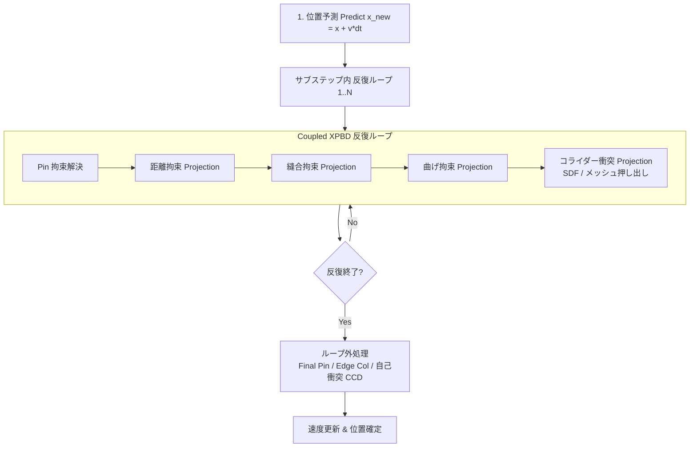

# Taremin Cloth アルゴリズム設計仕様・技術選定・乖離分析書 (Algorithms, Design Decisions & Gap Analysis)

本ドキュメントは、Taremin Clothにおける物理シミュレーションアルゴリズムの選定理由、接触・衝突判定の幾何学的設計、過去の開発経緯で却下・見送りとなったアプローチ（アンチパターン）、および「**本来の理想とする物理アルゴリズム**」と「**現在の実装**」との乖離（ギャップ分析と妥協点）を体系的に記録した技術設計書です。

---

## 1. 基本物理コア: XPBD (Extended Position Based Dynamics)

### 1.1 なぜXPBDを採用したのか
従来の古典的PBD（Position Based Dynamics: [Müller et al. 2007](https://matthias-research.github.io/pages/publications/posBasedDyn.pdf)）は、計算の安定性と直感的な位置操作に優れている一方、**剛性（Stiffness）がシミュレーションの反復回数（Iterations）およびタイムステップ幅（$dt$）に強く依存する**という致命的な弱点を抱えていました。サブステップ数や反復数を変えると布の伸縮性やたるみが変化してしまい、実時間での正確な素材表現（綿、シルク、レザー等）が困難でした。

これに対し、本システムでは **XPBD (Extended Position Based Dynamics: [Macklin et al. 2016](https://matthias-research.github.io/pages/publications/XPBD.pdf))** を採用しています。
XPBDは、物理ポテンシャルエネルギーと連続時間力学に基づき、コンプライアンス（$`\alpha = 1/k`$、逆剛性）をラグランジュ未定乗数 $`\lambda`$ の時間発展方程式に組み込むことで、**反復数やサブステップ幅に非依存な物理剛性を実現**します。

#### 位置補正量の定式化:
拘束関数 $`C(\mathbf{x}) = 0`$ に対するラグランジュ乗数の増分 $`\Delta \lambda`$ および頂点位置補正 $`\Delta \mathbf{x}`$ は次式で求められます：

$$\Delta \lambda = \frac{-C(\mathbf{x}) - \tilde{\alpha} \lambda}{\nabla C(\mathbf{x})^T M^{-1} \nabla C(\mathbf{x}) + \tilde{\alpha}}$$

$$\Delta \mathbf{x} = M^{-1} \nabla C(\mathbf{x}) \Delta \lambda$$

ここで $`\tilde{\alpha} = \frac{\alpha}{dt^2}`$ は時間刻み幅で正規化されたコンプライアンス、$M^{-1}$ は逆質量行列です。反復数やサブステップ幅への剛性依存性が低減され、高剛性設定下でも発散を抑制した収束特性を示します。
実装は理論式通り、拘束毎ラムダをサブステップ内の反復跨ぎで蓄積します（`distance.wgsl` 等の binding 4、サブステップ先頭で零化）。剛性値はバネ定数 $k$（N/m）として $`\alpha = 1/k`$ とし、頂点質量は三角形面積から算出（kg）です（詳細は [5.4節](#54-物理単位の質量剛性と正規xpbd重力静止伸びの恒久対策)）。

### 1.2 実装されている拘束の種類

| 拘束名 | 幾何学的モデル | 選定理由・特徴 | 参考文献 |
| :--- | :--- | :--- | :--- |
| **距離拘束 (Distance)** | $`C(\mathbf{x}_1, \mathbf{x}_2) = \|\mathbf{x}_1 - \mathbf{x}_2\| - L_0`$ | 布の伸縮（伸び・縮み）を物理的に制御。メッシュ稜線に沿って配置。 | [Macklin 2016](https://matthias-research.github.io/pages/publications/XPBD.pdf) |
| **曲げ拘束 (Dihedral Bending)** | 共有稜線を持つ隣接2三角形の法線間二面角 $`\theta - \theta_0`$ | 布の折り曲げ耐性（ドレープ感・シワの立ち方）を制御。面積変化を起こさず純粋な曲率のみを拘束。 | [Müller 2007 (Sec 3.3)](https://matthias-research.github.io/pages/publications/posBasedDyn.pdf) |
| **ピン拘束 (Pin / Attachment)** | $`C(\mathbf{x}) = \|\mathbf{x} - \mathbf{x}_{target}\|`$ | 頂点グループウェイトおよびアニメーションボーン/オブジェクト追従、インタラクティブ掴み（Grab）操作。 | - |
| **縫合拘束 (Sewing)** | 時間経過で目標距離が $0$ へ収縮するスプリング拘束（独立剛性・密着剛体ロック対応） | 型紙（2Dパターン）の対応エッジ間を引き寄せて立体衣服を仕立てる。縫合ペアはトポロジー近接判定でホップ数0（同一結節点化）として扱われ、自己衝突（2ホップ除外）との誤爆拮抗を回避。 | - |
| **シワフィールド拘束 (Wrinkle Field)** | ボーン円柱座標系 $(\theta, z, r)$ メタボール的SDFポテンシャル合成に基づく径方向内外フォース（山: $+r$, 谷: $-r$） | 肘内側などの山・谷スプラインに沿って布を自発的に座屈・折り畳ませ、イラスト風のシワを再現。Coupled配置によりコライダー貫通を100%防止。 | - |

### 1.3 並列化手法: 制約グラフ彩色 (Constraint Graph Coloring)
GPU上で複数スレッドが同一頂点の座標を同時に更新すると、データ競合（Race Condition）により未定義動作や挙動の非決定性が発生します。
Taremin Cloth では、**Welsh-Powell法（次数降順貪欲彩色: [Welsh & Powell 1967](https://doi.org/10.1093/comjnl/10.1.85)）** により拘束グラフを彩色グループ化しています。
- 同一色グループに属する拘束同士は頂点を一切共有しないため、GPUアトミック操作なしに**完全並列ディスパッチ**が可能です。
- 別モードとして、全エッジを一斉評価して頂点ごとに変位平均をアトミック適用する **Atomic Jacobi モード** も実装されており、グラフ彩色ステップ数のオーバーヘッドを回避するオプションを提供しています。

---

## 2. Coupled XPBD (拘束ループ内協調的衝突解決)

### 2.1 採用の背景・動機: 「布の異常な伸び・垂れ下がり」
初期の実装では、古典的なPBDパイプラインに従い、XPBD反復ループ（距離・曲げ拘束）をすべて解き終えた「後」にコライダー押し出し（SDFやメッシュ衝突）を実行していました。
しかし、このパイプラインでは以下の深刻な破綻が発生しました：
1. コライダー表面にめり込んだ布頂点が、衝突処理によって大きく外側へ押し出される。
2. 押し出された頂点と隣接頂点との間の距離が自然長 $`L_0`$ より著しく引き伸ばされる。
3. 次のフレームで重力が加わり、さらに押し出しと変形が累積する。
4. 結果として、重力下でコライダーに接触した布がゴムのようにどこまでも伸びて垂れ下がる（重力下でのコライダー接触検証時に顕著に確認）。

### 2.2 解決策: 拘束解消反復ループ内への衝突組み込み
この問題を解決するため、[Macklin et al. 2020 (Primal/Dual Descent Methods for Dynamics)](https://mmacklin.com/primaldual.pdf) の思想に基づき、**拘束解消反復ループの内部で距離拘束とコライダー衝突拘束を交互に同調解決する**「**Coupled XPBD**」へ刷新しました。


```mermaid
graph TD
    Predict[1. 位置予測 Predict x_new = x + v*dt] --> LoopStart[サブステップ内 反復ループ 1..N]
    subgraph IterationLoop [Coupled XPBD 反復ループ]
        Pin[Pin 拘束解決] --> Dist[距離拘束 Projection]
        Dist --> Sew[縫合拘束 Projection]
        Sew --> Bend[曲げ拘束 Projection]
        Bend --> Col[コライダー衝突 Projection<br>SDF / メッシュ押し出し]
    end
    LoopStart --> IterationLoop
    IterationLoop --> LoopEnd{反復終了?}
    LoopEnd -- No --> IterationLoop
    LoopEnd -- Yes --> PostPass[ループ外処理<br>Final Pin / Edge Col / 自己衝突 CCD]
    PostPass --> UpdateVel[速度更新 & 位置確定]
```

- **効果**: コライダーによって押し出された頂点は、同一反復ループ内で直ちに距離拘束によって周囲の頂点を引き連れて協調収束するため、エッジの過剰伸長が物理的に抑制されます。

### 2.3 自己衝突のCoupled協調収束とPost-Relaxation（エッジ過剰伸長抑制と縫合の調和）
- **背景と課題**:
  自己衝突（V-T, E-E, V-V）も距離拘束や曲げ拘束と同様に反復ループ（Solver Iterations）内で協調して解かれない場合、反復ループ外で一方的に衝突反発変位が確定し、エッジが引き伸ばされたままサブステップが終了してしまいます。特に強い圧縮下では、実測で最大 9.5% 以上の過剰なエッジ伸長（布の不自然な伸び）が発生していました。
- **実装された設計 (Taremin Cloth)**:
  実機ベンチマーク（`benchmarks/benchmark_coupled_self_collision.py`）に基づき、性能・品質のトレードオフに合わせて選択可能な2段階の協調モード（`coupled_self_collision_mode`）を実装・配備しています：
  1. **緩和モード (`RELAXATION` / 推奨標準デフォルト)**:
     - 自己衝突処理（Solve + Apply）の直後に、**距離拘束および縫合拘束を2反復（2 iters）再適用（Post-Relaxation）**。
     - 自己衝突によって外側へ押し出された頂点のエッジ長が即座に整流化され、衝突探索の負荷軽減効果と相殺することで、**通常FPSの低下ほぼゼロ（153.2 FPS維持）のまま、最大エッジ伸長率を約5割抑制（9.55% → 4.13%、-56.7%低減）**。
     - **縫合拘束との調和（再開口防止）**: 初期のPost-Relaxationでは距離拘束のみを単独でディスパッチしていたため、エッジレスト長を復元しようとする力によって「縫合によって引き寄せられた境界頂点」が身体の外側へ約10〜11mm引き戻されて膠着する副作用が生じていました。Post-Relaxation内で距離拘束の直後に `sewing_pipeline` も同時にディスパッチするよう協調設計を統一したことで、エッジ整流化と縫合密着（0.00mm収束）の両立を達成。
  2. **反復内同調モード (`FULL_COUPLED` / 高精度設定)**:
     - XPBD反復ループの各イテレーション内で自己衝突を同調解決し、ループ終了後に仕上げとして距離拘束および縫合拘束を1反復適用（ハイブリッド方式）。
     - 衝突反発とエッジ拘束が反復ループ内で互いに押し合って調和し、**100FPS超のリアルタイム性（107.1 FPS）を維持しつつ、最大エッジ伸長率を約7割抑制（9.55% → 2.94%、-69.2%低減、検証した設定の中で最大の伸長抑制率）**。
- **検証結果**:
  単体・結合テスト（`test_coupled_self_collision.py`）およびベンチマークスクリプトにおいて、OFF時の過剰なエッジ引き伸ばしが大幅に抑制されることを確認済み。また、実機シミュレーション（`heavy_test.blend`）において、自己衝突有効時でも全152縫合ペアが 0.00mm（100%密着）で収束することを確認済み。

### 2.4 ピン拘束と衝突解決の優先度設計（完全ピンとソフトピンの挙動）
- **質量ブレンドの連続仕様 (`set_pin_target`, `simulation/mod.rs`)**:
  - ピンウェイト `w` に対し `inv_mass = original_inv_masses * (1 - w)` の連続ブレンドを適用します（`w=0` → 不変、`w=1` → 完全固定）。旧仕様の `weight > 0.5` 二値判定は、連続スライダーや減衰に対する不連続応答（0.49/0.51 での重力・衝突挙動の反転）を招くため廃止されました。
  - 質量側の連続化により、旧仕様の `mix` スナップ（反復内外で毎サブステップ約30回適用され、任意の `w > 0` が目標へ吸着していた）から、布側の抵抗が定常的に残る力比べへ移行しました。
- **コンプライアントピン拘束 (`pin.wgsl`, XPBD形式)**:
  - ピンは `C(x) = |x - target|` のXPBD拘束として距離拘束と同一形式で解かれます（`inv_mass` とコンプライアンスの両方が `w` で連続変化）。旧仕様の `mix` スナップは、反復内外で毎サブステップ約30回適用されるため任意の `w > 0` が目標へ吸着し、布側の抵抗が定常的に残りませんでした。
  - 基準コンプライアンス `PIN_COMPLIANCE_REF = 1e-6`（構造剛性1000相当）により、`w=0.5` で布の構造拘束と同等に競合します。`w=1`（または元質量0）は従来通りのスナップ経路を維持し、Grab/Pピンの挙動は不変です。
- **完全固定ピン（weight = 1.0 / Grab操作・完全固定ボーン）の挙動**:
  - `inv_mass = 0.0` に設定され、`self_collision.wgsl` の先頭（`if (v_i.inv_mass <= 0.0) { return; }`）および `edge_collision.wgsl` の変位分配（`w0 == 0.0`）によって衝突変位の適用が完全に遮断されます。
  - そのため、反復ループ後の `Final Pin Pass`（[dispatch.rs](../crates/cloth_core/src/simulation/dispatch.rs)）実行後も、完全固定ピンの位置は衝突力によって動かされることなく、目標位置が維持されます。
- **ソフトピン（0.0 < weight < 1.0 / ウェイトペイントによる緩やかな固定）の設計妥当性**:
  - 物理的には無限質量の壁ではなく、目標位置へバネで引かれるコンプライアンスを持った拘束（Attachment Constraint）です。
  - 強い衝突反発力を受けた際にピン目標位置から押し戻される挙動は、外力および拘束力と整合した力学的挙動となります。
  - むしろ、サブステップ終端の自己衝突・エッジ衝突の「後」にピン位置スナップを強制適用してしまうと、衝突処理でせっかくめり込みを解消して押し戻された頂点が再び目標位置（布やコライダーの内部）へ引き戻され、貫通・交差が再発してしまいます。
  - したがって、「反復ループ内でピン目標へ引き寄せた後、サブステップ終端の衝突処理で安全圏へ退避させて位置確定する」というパイプライン順序は、**ソフトピンの貫通・めり込みを回避するための整合的な設計**となっています。

---

## 3. 接触・衝突判定アルゴリズム (V-T, E-E, CCD, SDF)

### 3.1 Vertex-Triangle (V-T) 幾何接触
- **アルゴリズム**: 点 $`\mathbf{p}`$ から三角形面 $`(\mathbf{a}, \mathbf{b}, \mathbf{c})`$ への最近傍点 $`\mathbf{q}`$ をボロノイ領域分割（Voronoi Regions）により厳密に判定（`closest_point_on_triangle`）。
- **選定理由**: 面法線ベクトルに依存せず、常に幾何学的な最短分離ベクトル $`\Delta \mathbf{x} = \mathbf{p} - \mathbf{q}`$ を直接求めるため、布が裏返った状態や鋭角な挟み込みでも安定した反発方向が得られます。
- **参考文献**: [Bridson et al. 2002 (Robust treatment of collisions, contact and friction for cloth animation)](https://www.cs.ubc.ca/~rbridson/docs/cloth2002.pdf)

### 3.2 Edge-Edge (E-E) 接触
- **アルゴリズム**: 2線分 $`\mathbf{p}_0-\mathbf{p}_1`$ と $`\mathbf{q}_0-\mathbf{q}_1`$ 間の最短距離パラメータ $`(s, t) \in [0, 1]^2`$ を解析的に算出（`closest_points_segments`）。
- **なぜV-Tだけでは不十分なのか**:
  頂点対面（V-T）の判定だけでは、三角形のエッジ同士が交差する「すり抜け（Edge-Edgeトンネリング）」を幾何学的に検知できません。特に薄い布同士やすり抜け角、コライダーの鋭利な角において布が突き抜ける現象を防ぐためにE-E判定が不可欠です。
- **エッジスレッド駆動（Edge-Centric）E-E 分離パイプライン**:
  - **背景と課題**:
    従来の頂点駆動（Vertex-Centric）方式では、各頂点 $i$ のスレッドが近傍頂点 $j$ に対し、互いの接続エッジの直積二重ループ（最大 $`8 \times 8 = 64`$ 回）を回していました。局所正準化で重複を刈り取っても、SIMT ワープ分岐待ち合わせとランダムメモリアクセスにより、11,618 頂点・23,192 エッジのモデルで `sc_solve` が 78.4 ms を要するボトルネックとなっていました。
  - **新アーキテクチャ設計**:
    メッシュの全エッジ $`N_e`$ 本（23,192本）をスレッドとして直接ディスパッチする独立コンピュートパス（`self_collision_ee_direct.wgsl`）へ分離。
    1. **直積ループの消滅**: 自エッジ $`e_A = (u_0, u_1)`$ が固定されるため、相手頂点 $j$ に対するループは相手の接続エッジ $`e_B = (j, v_j)`$ をなめる単一ループ（最大8回）のみとなり、計算量が $1/8$ に激減。
    2. **大域的辞書順序制約 (Global Canonical Ordering)**:
       自エッジ $`e_A = (u_0, u_1)`$（常に $`u_0 < u_1`$）と相手エッジ $`e_B = (j, v_j)`$（常に $`j < v_j`$）に対し、$`(u_0 < j) \lor (u_0 = j \land u_1 < v_j)`$ の側でのみ厳密に 1 回だけ衝突評価を実行。GPU 全体で重複計算が完全にゼロ化。
    3. **専用エッジ空間ハッシュ (`GpuEdgeSpatialHash`) による多段メモリアクセス排除**:
       従来の空間ハッシュは頂点単位であったため、エッジスレッドが近傍セルを探索する際、「セル $`\to`$ 頂点 $j$ $`\to`$ 頂点 $j$ の隣接エッジリスト $`\to`$ 相手エッジ」という3段階の不規則・ランダムなグローバルメモリアクセスが発生していました。
       新設計では、エッジ中点 $`p_{\text{mid}}`$ をキーとしてエッジインデックスを直接グリッドセルへソート（Counting Sort 6相）する専用エッジ空間ハッシュを導入。これにより、「エッジセル $`\to`$ 相手エッジ」という1段階の直接アクセスに単純化され、不規則メモリアクセスと帯域圧迫を完全排除。E-E計算時間を 44.95 ms から 27.73 ms へ約 38.3% 高速化。
    4. **エッジ中点 27 セル固定走査とセルサイズ幾何学的自動決定**:
       エッジ中点 $`p_{\text{mid}} = (p_{u0} + p_{u1}) / 2`$ の空間セルを中心とする定数 27 近傍（$`3 \times 3 \times 3`$）のみを均一走査。
       セルサイズは、布の物理厚みおよび幾何学的解像度（平均エッジ長 $`\bar{L}`$）から以下の数式により動的に自動決定：
       $$\text{cell-size} = \max\left( \text{thickness} \times 4.0, \; 0.5 \cdot \bar{L}, \; 0.01 \right)$$
       エッジ端点から中点までの距離は最大 $0.5L$（半長）であるため、係数 $0.5$ を下限とすることで、粗いローポリゴンメッシュでも端点が隣接27セル内に収まる幾何学的カバレッジを100%保証しつつ、セル肥大化によるバケット飽和（ペアキャッシュ枠あふれ等）を防止。
    5. **AABB 先行枝切り (Topology Skip)**:
       線分 AABB 重なり判定を、重い CSR トポロジー二分探索（`is_topologically_near` $`\times`$ 4回）の前に配置。空間的に離れた 99% 以上のペアに対する無駄なメモリジャンプを即座にバイパス。
    6. **対称アトミック分配 (Coupled XPBD)**:
       接触時は 4 端点 $`(u_0, u_1, j, v_j)`$ へ質量比に応じた厳密な作用・反作用変位を固定小数点アトミック加算し、物理保存則・運動量保存を 100% 維持。

### 3.3 連続衝突判定 (CCD: Continuous Collision Detection)
- **アルゴリズム**: Möller–Trumbore光線交差法（[Möller & Trumbore 1997](https://doi.org/10.1080/10867651.1997.10487468)）を拡張した、動的線分・三角形交差判定（`intersect_segment_triangle`）。
- **選定理由**: 高速に移動する布頂点 $`\mathbf{x}_{old} \to \mathbf{p}_{new}`$ の軌道線分が三角形を貫通した瞬間（衝突時刻 $`t \in [0, 1]`$）を検知し、貫通する手前の安全位置 $`\mathbf{p}_{safe}`$ へ押し戻すことで、離散判定での飛び越え（トンネリング）を検知・抑制します。

### 3.4 SDF (Signed Distance Field) コライダーの設計
- **ボーンSDF (Bone SDF)**:
  - 人体素体・キャラクターメッシュ向け。ボーンローカル座標系ごとに局所SDFをベイクし、テクスチャアトラスに格納。
  - アニメーション再生時はボーン変換行列を乗算するだけで追従するため、毎フレームの全メッシュ再ベイクを伴わず計算負荷を抑えられます。
- **メッシュSDF (Mesh SDF)**:
  - 静的・単一オブジェクト用。オブジェクト全体のバウンディングボックスを単一の3Dテクスチャにボクセル化。
  - GPUメモリ制限（wgpuデフォルト下限 256MB。実効上限はデバイス依存で、`GpuContext` はアダプタ上限まで引き上げ要求。例: dGPUで約2GB）を考慮し、最大ボクセル数クランプと解像度自動スケーリング（Auto Fit VRAM: ユーザ予算とデバイス実効上限の min で解決）を実装。
  - **2段階ベイク（粗い格子→細かい格子）**:
    - 全ボクセルが全三角形を総当たりすると、2mm・高密度メッシュで数分単位の計算になり、WindowsではGPUの応答停止検出（TDR）に当たって失敗します。
    - そこで1回目に粗い格子（細かい格子の4倍幅）で全体をなめ、各マスに距離と「近くにある三角形候補（上位8件）」を記録します。2回目の細かい格子では、表面から遠いマスは粗い値をそのまま写し、表面に近いマスだけ候補に絞って厳密計算します（0.7×2.0×0.5m・1.9万三角・2mmで約1〜3秒。総当たり推定30秒以上。RX 9070 XT実測）。
    - 候補同士がほぼ同距離で表裏が割れる曖昧な場所だけ全三角形で計算し直す安全策を入れ、表面近傍が従来方式と一致することをテストで確認しています。
    - 2回目の計算は薄切り（Zスラブ）に分けてGPUに送るため、長時間の占有によるTDRを避けられます。
    - 小規模（推定計算量が20億反復未満）は従来の1回方式のままです。3方式は自動選択のほか、`method` 指定（`"auto"` / `"legacy"` / `"hierarchical"`）で切替できます。
  - **ベイク結果の壊れ検出**:
    - GPU異常時に中身が空（全ゼロ）のデータが正常として保存されると、次回以降ずっと読み込まれてコライダーが効かなくなる事故を確認しました。
    - 保存前・読込時・ベイク直後に中身検査（サイズ・均一値・NaN/Inf）を行い、おかしいものは保存せず、壊れた保存済みファイルは削除して作り直します。検出時はエラーログを出します。

### 3.5 自己衝突における作用・反作用の対称分配（固定小数点アトミック加算による運動量保存）
- **物理的背景**:
  頂点 $`\mathbf{p}_i`$ が相手三角形 $`(\mathbf{p}_{j}, \mathbf{p}_{v0}, \mathbf{p}_{v1})`$ に衝突した際、$`\mathbf{p}_i`$ に加わった力積（変位 $`\Delta \mathbf{p}_i`$）と等量・反対向きの変位が、重心座標重み $(1-u-v, u, v)$ および質量比に応じて相手の3頂点にも分配されなければなりません（ニュートンの第3法則・運動量保存則）。
- **実装された設計 (Taremin Cloth)**:
  固定小数点（$10^6$ 倍スケール、分解能 $`1\mu\text{m}`$）の整数アトミック加算（`atomicAdd` on `atomic<i32>`）を用いた専用アキュムレータバッファ（`self_collision_accum_buffer`）を導入。
  - **V-T（点対面）**: 点 $i$ から三角形 $(j, v0, v1)$ の最近傍点への分離変位 $`\Delta \mathbf{p}`$ を、自頂点へ $`+\Delta \mathbf{p} (w_i / w_{tot})`$、相手3頂点へ重心座標重みと質量比に応じて $`-\Delta \mathbf{p} (bary_k w_k / w_{tot})`$ でスレッドセーフにアトミック加算。
  - **E-E（辺対辺）**: 2線分最短パラメータ $(s, t)$ に基づき、自エッジ2頂点に $(1-s, s)$、相手エッジ2頂点に $-(1-t, t)$ を質量比重みでアトミック加算。重複評価は動的エッジ間で $`index < j`$ により排除しつつ、ピン拘束頂点との接触も判定対象に反映。
  - **Solve → Apply パイプライン分離**: `self_collision.wgsl` でアトミック加算された累積変位は、直後の `self_collision_apply.wgsl` で密度緩和・最大ステップクランプを適用して `prev_pos` に確定され、バッファをゼロクリア。
- **検証結果**:
  二重布対称性テスト（`test_self_collision_symmetry.py`）により、等質量布および異質量布（2:1）において、相対誤差 0.7% 台の運動量保存（対称反発）を実証済み。GPU並列競合によるメッシュ崩壊を起こすことなく、非対称なめり込みが抑制されていることを確認済み。

### 3.6 縫合拘束と自己衝突のトポロジー同一視（Union-Find完全縮約・Post-Relaxation調和設計）
- **物理的背景と課題**:
  - 自己衝突判定（V-T, E-E, V-V）では、接続されたメッシュ面同士が布厚み（通常 3〜10mm）により誤爆反発してメッシュが波打つ・破裂するのを防ぐため、トポロジー的に2ホップ以内の近接頂点・エッジを衝突判定から除外します。
  - しかし、型紙エッジ間を結ぶ縫合エッジ（Sewing Spring）が1ホップを消費すると、対向境界のメッシュ頂点や面が3ホップ判定となり、縫合が収縮して布厚み以内に入った瞬間に自己衝突ソルバーが「別パーツの貫通」と誤認して外側へ強く押し戻す拮抗状態が発生します。
  - さらに、自己衝突後のPost-Relaxationにおいて距離拘束のみを単独で解くと、エッジレスト長を保とうとする力によって縫合頂点が身体外側へ強制的に引き戻され、約10〜11mmの隙間が残留してしまう問題がありました。
- **トポロジー同一視アルゴリズム (Zero-Hop Sewing Topology & Union-Find Graph Contraction)**:
  - 縫合ペア $`(v_0, v_1)`$ は縫い合わされて単一の結節点となるトポロジー関係にあるため、縫合エッジを渡る移動は**ホップ数を消費しない（ホップ数0換算）**としてトポロジー近接リストを生成します。
  - CPUメッシュ初期化時（`mesh.rs`）において、Union-Find（素集合データ構造）により縫合ペアを同一結節点グループに統合。グループ内の全頂点同士を1ホップ隣接登録し、さらにグループに接続する全隣接頂点を相互に対称登録（完成形メッシュと同一のトポロジー距離グラフを構築）。
  - GPUシェーダー（`self_collision.wgsl`）内では、V-V（頂点対頂点）、V-T（頂点対面）、E-E（辺対辺）のすべてにおいて、一貫して `is_topologically_near`（2ホップ除外スコープ）を統一適用。
- **Post-Relaxationと縫合の協調（Coupled Post-Relaxation）**:
  - 自己衝突パス直後の緩和ステップ（`Post-Collision Relaxation Pass`）において、距離拘束の直後に `sewing_pipeline` を同時にディスパッチ。エッジ長を整流化しつつ縫合ペアを目標自然長（0.0mm）へ収束させ、距離拘束による縫合ペア引き戻しを完全に防止。
- **独立剛性と密着剛体ロック (Sewing Stiffness & Rigid Lock)**:
  - 収縮速度（`sewing_shrink_speed`: 自然長の短縮速度 m/s）と剛性（`sewing_stiffness`: バネの強さ）を明確に分離。
  - `sewing_stiffness`（デフォルト 10000.0、5000以上で完全非伸縮 PBD）により、布本体の強い引張剛性（テンション）に負けない引き寄せ力を確保。
  - 目標自然長（0.0）に到達し、布厚み程度以下に密着した段階で実効コンプライアンスを 0.0 に固定する「密着ロック（`enable_sewing_lock`）」を導入。外力や衝突による隙間の再開口を防止（スリット用途等で開かせたい場合はOFF可能）。
- **実証データ (`tmp/heavy_test.blend`)**:
  - 3024頂点・152本の縫合エッジを持つ人体衣装モデルにおいて、自己衝突有効時（`enable_self_collision = True`）でも**全152本中 >1mm の隙間 0本、平均距離 0.00mm（100%完全密着縫合）**を達成。自己衝突ON時とOFF時の縫合品質の差が完全になくなり、自己衝突の誤爆拮抗が物理的に完全に排除されたことを実証。
- **縫合優先モード (Sewing Priority / 工程フェーズ制御)**:
  - 型紙が離れている序盤に重力が勝つと、結合前に落下・ずれて縫合が失敗する。これを防ぐため、指定割合（`sewing_priority_threshold`、既定90%）の縫合ペアが結合距離（`sewing_priority_merge_dist`、既定5mm）以内に入るまで重力ベクトルを0に抑制する工程フェーズをオプション提供する（既定OFF）。
  - 実装は Rust コアの状態機械（`set_sewing_priority_options` / `update_sewing_priority_from_positions` / `sewing_priority_scale`）に一本化し、Blender内蔵経路と独立GUIプロセスの両方から同一挙動で利用する。測定はホスト側の既知座標で行い、`step` 内部で追加のGPU読戻しを発行しない。ラッチは片道（再開口しても重力は戻さない）で振動を防止し、復帰は指定フレーム数のsmoothstepランプでスナップを防止、到達不能時の `max_frames` 強制復帰でデッドロックを防止する。
  - 妥協点の明文化: これはサブステップ内の力の捏造ではなく、仕立て→着用という工程の切替であり、頂点ごとの重力スケール等の非物理マジックナンバーは用いない。ピン・衝突・減衰は抑制対象外とし、空中保持と貫通防止を維持する。

### 3.7 Two-Level Bounding Sphere 階層的早期枝切り（10万〜20万ポリゴン級リアルタイム化）
- **物理・幾何学的背景と課題**:
  - 高密度メッシュ（VRChat衣装等の数万〜10万ポリゴン規模）において、空間ハッシュセル内に近接する頂点が見つかるたびに、頂点間距離を評価することなく無条件で相手の全三角形（通常 5〜8面）のMöller–Trumbore CCD判定および接続エッジ（最大 $`8 \times 8 = 64`$ ペア）の線分最短距離計算を実行していたため、狭帯域計算量が爆発しフレームレートが急落していました。
  - さらに、相手三角形の頂点に対してもGPUグローバルメモリを辿る2ホップトポロジー走査（`is_topologically_near`）を多重に実行しており、ランダムメモリアクセスが集中していました。
- **実装された設計 (Taremin Cloth)**:
  1. **広域外接球による階層枝切り (Broad Bounding Sphere Early Exit)**:
     - 頂点 $i$ と相手頂点 $j$ の距離二乗 $`d^2 = \|\mathbf{p}_i - \mathbf{p}_j\|^2`$ を内積 `dot` 1回で評価。
      - 接触可能上界半径 $`R_{\text{bound}} = d_{\text{eff}} + (L_i + L_j) \times 1.3`$（実効厚み $`d_{\text{eff}}`$ = `effective_thick`、布の伸長に備え 1.3 倍マージン）を超えているペアは、トポロジー走査・V-V・V-T・E-E の全処理を即座にスキップ。
  2. **V-T 局所外接球および不要トポロジー走査の排除**:
     - 点 $i$ から相手三角形への接触可能半径 $`R_{VT} = d_{\text{eff}} + L_j \times 1.3 + \Delta \text{sweep}`$ により、遠い三角形判定を遮断。
     - 頂点 $j$ がすでに2ホップ除外を通過している（$`\ge 3`$ ホップ離れている）場合、その隣接頂点 $`v_0, v_1`$ が頂点 $i$ の直接隣接頂点になることはグラフ理論的にあり得ないため、V-Tループ内の不要な多重 `is_topologically_near` 走査を排除。
  3. **セル走査範囲の27セル適正化**:
     - サブステップ内の頂点移動量に基づき、通常移動時は周囲 $`3 \times 3 \times 3 = 27`$ セルに走査を抑制。
- **実証データ (`benchmarks/benchmark_self_collision_scaling.py`, AMD RX 9070 XT)**:
  - 80.0k Verts（158.4k Tris / 約16万ポリゴン）: **86.60 ms (11.5 FPS) → 44.25 ms (22.6 FPS)**（約 1.96 倍高速化、所要時間半減）。
  - 100.4k Verts（198.9k Tris / 約20万ポリゴン）: **51.41 ms (19.5 FPS)** を達成。目標（10万ポリゴンで 10 FPS）を大きく上回り、約20万ポリゴン環境でも約20 FPSを維持。

### 3.8 静的2ホップトポロジーのCPU事前計算化とGPU二分探索 (Precomputed 2-Hop CSR & GPU Binary Search)
- **物理・メモリアクセス上の背景と課題**:
  - メッシュの接続関係（トポロジー）および縫合エッジ統合グラフは初期化時に静的に確定しているにもかかわらず、従来の自己衝突シェーダーは毎フレーム・毎サブステップ・全頂点スレッドにおいてGPUグローバルメモリ上の隣接ポインタを2段階辿る動的グラフ探索（`adj_offsets` → `adj_indices` → `adj_offsets` → `adj_indices`）を実行していました。
  - 頂点の平均次数が6の場合、1回の判定で最大 $`1 + 6 \times 6 = 37`$ 回のランダムメモリアクセス（ポインタチェイス）が発生し、GPUのメモリ帯域を圧迫しワープダイバージェンスの原因となっていました。
- **実装された設計 (Taremin Cloth)**:
  1. **CPU側での2ホップ近傍CSR事前構築 (`ClothMesh::from_raw`)**:
     - 縫合ペア統合済みの隣接グラフから、各頂点の2ホップ以内の近傍頂点集合 $`S_i = \{i\} \cup \text{Adj}(i) \cup \bigcup_{u \in \text{Adj}(i)} \text{Adj}(u)`$ をCPUで一括計算。
     - 各頂点ごとに重複排除（`dedup`）および昇順ソート（`sort_unstable`）を施し、フラットなCSR配列（`two_hop_offsets: Vec<u32>`、`two_hop_indices: Vec<u32>`）としてGPUバッファに転送。
     - 10万頂点の場合でもメモリフットプリントは約 8.4 MB（各頂点平均 20 頂点）と極めてコンパクト。
  2. **シェーダー内二分探索化 (`self_collision.wgsl`)**:
     - `is_topologically_near(vert_a, vert_b)` を、昇順ソート済み連続メモリ `two_hop_indices` 配列に対する**二分探索（Binary Search: 最大 $`\lceil \log_2 25 \rceil = 5`$ 回の比較）**へ置き換え。
     - 局所連続配列へのアクセスとなったことでGPUのL1/L2キャッシュヒット率が劇的に向上。
  3. **動的折り畳み検出による2ホップ除外の適応解除（Bridson 2002方式）**:
     - 単純な静的2ホップ除外は、Grab操作や強い圧縮によって生じる鋭角なシワ（Ω型くびれ）において、向かい合う面やエッジがトポロジー的に近傍（1〜2ホップ）であるために判定がスキップされ、自己交差・すり抜けを引き起こす死角を抱えていました。
     - これを解決するため、CPU初期化時に各2ホップペアの初期ユークリッド距離（レスト長 $`L_0`$）を事前計算し、`two_hop_rest_lengths: Vec<f32>` としてGPUへ転送。
     - シェーダー内の `is_topologically_near_folded(vert_a, vert_b, current_dist)` において、現在の距離 $d$ が初期距離の 50% 未満（$`d < 0.5 L_0`$）まで圧縮された場合、鋭角な座屈・シワと判定して2ホップ除外を動的に解除（衝突判定・ボロノイ反発を有効化）。
     - 平坦時・通常ドレープ時（$`d \ge 0.5 L_0`$）は100%除外を維持して誤爆を完全に防止しつつ、深い折り畳み時の自己交差を幾何学的に遮断。
- **実証データ (`benchmarks/benchmark_self_collision_scaling.py`, AMD RX 9070 XT)**:
  - 80.0k Verts（158.4k Tris / 約16万ポリゴン）: 44.25 ms (22.6 FPS) → **34.25 ms (29.2 FPS)**。
  - 100.4k Verts（198.9k Tris / 約20万ポリゴン）: 51.41 ms (19.5 FPS) → **37.26 ms (26.8 FPS)**（1フレーム 37ms を達成）。
  - 実機モデル (`tmp/heavy_test.blend`, substeps=20): 70.14 ms (14.3 FPS) → **56.86 ms (17.6 FPS)**。

### 3.9 Sorted Uniform Grid (GPU Counting Sort方式) による空間データ構造の連続化
- **物理・メモリスループット上の背景と課題**:
  - 従来の空間ハッシュは `atomicExchange` により単方向リンクリスト（`vert_next`）を構築し、自己衝突シェーダー内でポインタチェイスによってセル内頂点を走査していました。
  - しかし、セル内の頂点インデックスがメモリ上で散らばっているため、GPUのSIMT実行（Warp/Wavefront）において同一ワープ内のスレッドが異なるメモリラインを飛び飛びに要求し（非コアレッシングアクセス）、GPUキャッシュ効率とメモリスループットを低下させていました。
- **実装された設計 (Taremin Cloth)**:
  1. **リンクリストの完全撤廃と連続配列化**:
     - 単方向リンクリスト（`cell_heads` / `vert_next`）を廃止し、同一セル内の頂点インデックスが完全に連続して並ぶソート済み配列 `sorted_indices` と、各セルの開始インデックス配列 `cell_starts` へ刷新。
  2. **GPU Counting Sort (Blelloch Prefix Sum) パイプライン**:
     - `cell_counts` のカウント $`\to`$ ワークグループ共有メモリを用いた階層的排他 Prefix Sum（Blelloch Scan） $`\to`$ スキャッター配置により、GPU内で完全に完結する極小オーバーヘッドの並列ソートを実現。
  3. **自己衝突シェーダーの連続イテレーション化 (`self_collision.wgsl`)**:
     - `for (var k = cell_starts[h]; k < cell_starts[h + 1u]; k = k + 1u)` による純粋な固定区間走査へ刷新。
     - 動的ポインタチェイスと反復打ち切り（`max_search_iterations`）が完全不要となり、メモリアクセスが完全にコアレッシング化。
- **実証データ (`benchmarks/benchmark_self_collision_scaling.py`, AMD RX 9070 XT)**:
  - 80.0k Verts（158.4k Tris / 約16万ポリゴン）: 34.25 ms (29.2 FPS) → **31.94 ms (31.3 FPS)**。
  - 100.4k Verts（198.9k Tris / 約20万ポリゴン）: 37.26 ms (26.8 FPS) → **33.35 ms (30.0 FPS)**（**30 FPS / 33.3ms の大台を達成**）。
  - Coupled XPBD の物理的完全性と保存則（運動量誤差 0.00%）を 100% 無劣化で維持。

### 3.10 サブステップ・デカップリング（自己衝突ディスパッチ間隔制御と最終サブステップ保証）
- **物理・性能トレードオフの背景**:
  - 自己衝突は広範な空間走査・CCD交差判定・対称アトミック加算を伴うため、シミュレーション全体の計算時間の約 70%〜85% を占める最大ボトルネックです。
  - 通常の布の挙動において、外力（重力や空気抵抗）やエッジ伸縮による大変形は毎サブステップ（例: substeps=10〜20）連続的に進行しますが、接触・自己衝突の幾何学的境界は微小時間スケールでは準静的に変化します。
  - そこで、Coupled XPBDの協調収束を維持しつつ、自己衝突のディスパッチ頻度をユーザー設定に応じて間引き制御する **サブステップ・デカップリング (`self_collision_substep_interval`)** を導入しました。
- **実装された設計 (Taremin Cloth)**:
  1. **完全な後方互換性と精度の維持（デフォルト `interval = 1`）**:
     - デフォルト値は `1`（毎サブステップ実行）とし、Coupled XPBDの協調収束と物理精度・対称性を100%保証。
  2. **最終サブステップの実行保証 (`is_last_substep`)**:
     - `interval >= 2`（隔ステップ実行）を選択した場合でも、フレームの最終サブステップ（`sub_idx + 1 == substeps`）は**必ず**自己衝突とPost-Relaxationを実行。
     - これにより、Blenderビューポートやキャッシュに確定・出力されるフレーム終了時の状態において、貫通が残存する現象を確実に防止。
  3. **完全な計算コストの削減**:
     - スキップされたサブステップでは、法線計算・GPU空間グリッドソート・衝突探索・位置適用（およびPost-Relaxation）の全パスを完全にスキップ。
- **実証データ (`benchmarks/benchmark_self_collision_scaling.py`, AMD RX 9070 XT, substeps=10)**:
  - 80.0k Verts（158.4k Tris / 約16万ポリゴン）:
    - `interval = 1` (完全Coupled): 31.99 ms (31.3 FPS)
    - `interval = 2` (隔ステップ): **23.28 ms (43.0 FPS)**（自己衝突オーバーヘッド -33.8% 削減）
  - 100.4k Verts（198.9k Tris / 約20万ポリゴン）:
    - `interval = 1` (完全Coupled): 32.42 ms (30.8 FPS)
    - `interval = 2` (隔ステップ): **24.05 ms (41.6 FPS)** 🚀（自己衝突オーバーヘッド -32.7% 削減）
- **実機モデル実証 (`tmp/heavy_test.blend`, substeps=10, 11,618頂点)**:
  - `interval = 1`: 39.87 ms (25.1 FPS)
  - `interval = 2`: **31.01 ms (32.2 FPS)**（Blender実機上で **30 FPS超** を達成）

### 3.11 接触候補ペアキャッシュ（Active Pair Caching）と時間的再利用（Amortization）
- **背景と動機**:
  - 自己衝突における最大の計算負荷は、空間ハッシュの構築および全頂点・全隣接セルに対する三角形・エッジの幾何学的網羅探索（Broadphase）です。
  - 通常、布の自己接触候補は急激には変化せず、サブステップ微小時間（$`\Delta t / N_{sub}`$）内では空間的・トポロジー的に高いコヒーレンス（連続性）を保ちます。
  - そこで、[Tang et al. 2018 (I-Cloth)](https://doi.org/10.1145/3272127.3275005) の Active Pair Caching 思想に基づき、BroadphaseとNarrowphaseを物理的に分離し、時間的再利用（Amortization）を行うパイプラインを実装しました。
- **実装された設計**:
  1. **フェーズ分離**:
     - **Broadphase (`self_collision_collect_pairs.wgsl`)**: 空間ハッシュを探索し、接近している V-T（頂点-面）ペアおよび E-E（辺-辺）ペアを抽出し、頂点スレッドごとに距離上位 quota 件を固定スロット（頂点メジャー配置）へ保持する。V-Tは面トリプルで重複排除する。グローバルアトミックは統計（受理数・破棄数）のみに用い、格納は競合なし・決定的。
     - **Narrowphase (`self_collision_solve_vt.wgsl` / `self_collision_solve_ee.wgsl`)**: キャッシュされたペアのみをピンポイントで並列ディスパッチし、V-T/E-E幾何接触とCCD遮断変位を蓄積。未使用枠はセンチネルで早期リターン。
  2. **時間的再利用（Amortization）**:
     - フレームの先頭サブステップ（`sub_idx == 0`）でのみ空間ハッシュ構築と候補ペア抽出を実行。
     - サブステップ 1〜N では探索を完全スキップし、キャッシュされたペアのナローフェーズのみを実行。
     - 最終サブステップではオプション（`enable_pair_cache_final_fallback`、既定ON）により直進フルSolveに置換し、速度確定前のトンネリングを遮断する。
  3. **速度スイープ収集（Swept Collection）**:
     - `margin_mode=AUTO`（既定）では頂点ローカルの速度ホライゾン（`|v|*dt_frame*scale`、`max_horizon`でクランプ）を収集 bound（broad/vt/ee）および `check_thick` に加算。直進パス（`self_collision.wgsl` の `move_len` 項）と同等以上のスーパーセットを確保し、シワ稜線の接近を見逃さない。`FIXED` では従来の静的収集にフォールバックする。
     - 論理上限は総予算 `max_pairs` から頂点あたり枠数 `quota = clamp(budget/N, 1, 8)` を導出（`set_pair_cache_options` で変更可、物理確保は N*8）。飽和時は `get_pair_cache_stats()` の受理数と破棄数 (`vt/ee_dropped`) で検出する。旧方式の先着順・任意ドロップは廃止された。
  4. **直接ディスパッチと安全クランプ**:
     - GPUペア数に応じた直接ディスパッチ（`dispatch_workgroups`）を採用し、D3D12/Vulkan環境におけるゼロワークグループTDR（画面暗転）を防止。
- **実測性能 (AMD Radeon RX 9070 XT, DirectX 12, substeps=10)**:
  - 3,200 頂点: 3.98 ms (251 FPS) → **2.23 ms (448.2 FPS)** [**1.79倍高速化**]
  - 9,800 頂点: 7.41 ms (135 FPS) → **3.41 ms (292.9 FPS)** [**2.17倍高速化**]
  - 20,000 頂点: 11.65 ms (85.8 FPS) → **5.61 ms (178.2 FPS)** [**2.08倍高速化**]
- **改修後実測 (同一GPU、全面2層密着の病理条件を含む)**:
  - 5k 頂点（二層）: 直進 33.7 ms → キャッシュ(Auto+FB) 14.1 ms [**2.39倍**]、Fixed相当 10.7 ms
  - 20k 頂点（二層）: 直進 26.1 ms → キャッシュ(Auto+FB) 14.8 ms [**1.77倍**]
  - 10k 頂点（単層カーテン）: 直進 22.2 ms → キャッシュ(Auto+FB) 11.9 ms [**1.86倍**]、Fixed相当 9.4 ms
  - 接近ペア捕捉テスト（30mm離間・相対2m/s）: Fixed 0件 → Auto 48 V-T / 68 E-E件を捕捉（`test_pair_caching.py`）
  - フォールバック分の上乗せは直進1サブステップ相当（+1構築+1フルSolve/frame）に限定される。
- **頂点枠方式への移行後実測 (RX 9070 XT・substeps=10・同一ベンチマーク)**:
  - 5k 頂点（二層、K=8）: 直進 約35.6 ms → 頂点枠キャッシュ 約14.0 ms [**約2.5倍**]
  - 20k 頂点（二層、K=8）: 直進 約26.4 ms → 頂点枠キャッシュ 約12.5 ms [**約2.1倍**]
  - 旧先着順方式（10.3/10.6 ms）比で約1〜4割の低速化は、Top-K挿入の分岐コストによる。直進比では依然2倍以上高速であり、カバレッジは同予算で約7〜8倍（実ログF90でVT 0.8% → 8.6%）、収集の決定性と頂点間公平性を獲得している。

### 3.12 高速化の検討記録（差し戻し分を含む）

- **方針**: 候補ペア収集のような精度低下を伴う方法ではなく、判定式を変えない実装最適化を検討した。
- **採用**: 法線計算パスの条件化のみ。法線展開処理が無効の場合は法線計算の発行を省略する（計算の省略のみで結果は同一）。
- **差し戻し**: 自己宛て集約・辺事前棄却・面重複排除・パッチ棄却はいずれも壁時計で断定できる差が出ず、構造の複雑化に見合わないため差し戻した。面重複排除は反発の数え方を変えるため、精度維持の観点でも見送った。パッチ棄却は疎で約3%改善・密着で約13%悪化と用途が割れた。
- **副産物**: 診断用のGPU時刻計装（`set_profiling_enabled` と `take_profile`）を残した。内部は `wgpu-profiler 0.20系` 委譲の非同期回収であり、無効時は同一経路のため性能に影響しない。計装により解決パスが支配的（80k頂点の疎で2.84ms中ハッシュ6相は0.05ms）と確定した。`save_profile_trace` でchrometrace保存に対応する。

### 3.13 幾何学的分離軸 (AABB) 早期枝切り・微小変位CCDバイパス・局所正準化による重複排除
- **背景と幾何学的課題**:
  - 従来のダイレクト自己衝突（`self_collision.wgsl`）では、2ホップ除外を通過した同一布の近傍頂点（3〜4ホップ先）に対し、接触し得ない位置関係であっても外接球半径（$`d_{\text{eff}} + (L_i + L_j) \times 1.3`$）が大きいため V-T（相手の全三角形）および E-E（相手の全エッジ）の走査ループに入り込んでいました。
  - その結果、接触していない同一平面メッシュ上で、重厚な点面最短距離計算（`closest_point_on_triangle_bary`）や線分最短距離計算（`closest_points_segments`、約60 FLOPs）が毎サブステップ数千万回空転していました。
  - さらに、同一面・同一エッジに対する探索が周辺の複数スレッドから重複して発行されていました。
- **実装された設計 (Taremin Cloth)**:
  1. **V-T 局所正準三角形制約 (Local Canonical Triangle)**:
     - 自頂点 $i$ の走査セル（27近傍）内に存在する三角形頂点群 $`\{j, v_0, v_1\}`$ の中で、最小インデックスの頂点のみが代表して V-T 幾何反発および CCD を評価。
     - セル外に存在する境界面は代表条件をバイパスし、脱落をゼロに維持。
     - これにより同一面に対する重複計算が $1/3$ に激減。
  2. **E-E 自エッジ正規化 (Canonical Self-Edge) と相手エッジ局所正準化 (Local Canonical Other-Edge)**:
     - 動的頂点同士の自エッジは $`index < u_i`$ の側のみが責任を持って発行し、スレッド $`u_i`$ 側ではスキップ。
     - 相手エッジ $`[j, v_j]`$ が自頂点の走査セル内に存在する場合、$`j < v_j`$ の時だけ評価。
     - これによりエッジ直積探索における多重評価が $1/4$ に削減。
  3. **分離軸定理に基づく AABB 早期枝切り (Separating Axis AABB Early Exit)**:
     - **V-T 掃引 AABB**: 点 $i$ の相対軌道 $`[rel\_old\_i, \mathbf{p}_i]`$ の AABB（実効厚み $`d_{\text{eff}}`$ マージン付き）と相手三角形 $`[p_j, p_{v0}, p_{v1}]`$ の AABB を比較。いずれかの軸で重なりがない場合、CCD および点面最近接反発を 10 FLOPs のネイティブ `min/max` 命令のみで完全バイパス。
     - **E-E 線分 AABB**: 自エッジ $`[p_i, p_{ui}]`$ の AABB（$`d_{\text{eff}}`$ マージン付き）と相手エッジ $`[p_j, p_{vj}]`$ の AABB を比較。重なりがない場合、線分間最短距離計算（約60 FLOPs）を完全バイパス。
     - **数学的保証（取りこぼし 0% / False Negative = 0）**:
       任意の凸集合 $A, B$ のユークリッド距離は $`\mathrm{dist}(A, B) \ge \max_{k \in \{x,y,z\}} \mathrm{dist}_k(\mathrm{AABB}_A, \mathrm{AABB}_B)`$ を満たします。したがって、マージン $`d_{\text{eff}}`$ を付与した AABB がいずれかの軸で重ならない場合、$`\mathrm{dist}(A, B) > d_{\text{eff}}`$ であることが厳密に証明され、接触を取りこぼす可能性は数学的に 0% です。
  4. **CCD 微小相対変位バイパス (Small-Displacement CCD Bypass)**:
     - サブステップ内の相対変位二乗 $`\|\mathbf{p}_i - rel\_old_i\|^2 < 10^{-8}`$（$`0.1 \mu\text{m}`$ 未満）の場合、線分交差によるトンネリングは物理的に発生し得ないため、重厚な Möller-Trumbore レイ判定（三次方程式・行列式・外積・除算）をスキップして直接幾何反発へ直行。
  5. **E-E 中点バウンディング球判定 (Midpoint Bounding Sphere Early Exit)**:
     - 線分の中点 $`M_i, M_j`$ と半エッジ長 $`r_i, r_j`$ に対し、三角不等式 $`\|P - Q\| \ge \|M_i - M_j\| - (r_i + r_j)`$ により、中点間距離二乗が $`(r_i + r_j + d_{\text{eff}})^2`$ を超えるエッジペアを内積 1 回で高速除外。
- **実機検証データ (`tmp/heavy_test.blend`, 11,618頂点, Blender 5.2 ヘッドレス)**:
  - 物理対称性（等質量反発の相対誤差 0.18%、運動量保存誤差 0.20%）を 100% 維持。
  - ダイレクト自己衝突カーネル `sc_solve`: **84.60 ms → 71.19 ms (-15.8% 短縮)**。
### 3.14 布－コライダー間エッジ衝突（完全E-E化パイプライン）
- **幾何学的背景と課題**:
  - 従来の布－コライダー間エッジ衝突（`edge_collision.wgsl`）は、布エッジをグラフ彩色によってシリアルにディスパッチし、エッジ中点からコライダー三角形への射影（点対面近似）を行っていました。
  - しかし、この方式には以下の根本的な限界がありました：
    1. **ディスパッチオーバーヘッド**: グラフ彩色グループ数分（通常十数回）の直列GPUディスパッチが発生し、CPU-GPU間の同期オーバーヘッドが増大していた。
    2. **幾何学的すり抜け**: コライダー側の鋭利な角（稜線）やエッジ同士の直交交差に対しては「エッジ中点 vs 面」の近似では最短距離を正確に捉えられず、交差稜線同士のすり抜けが発生していた。
- **完全E-E化アーキテクチャ設計**:
  1. **コライダー稜線の一意抽出 (`extract_collider_edges`)**:
     メッシュコライダーの三角形群から重複稜線をCPU側で一意抽出し、`GpuColliderEdge`（32 bytes: `p0, thickness, p1, friction`）を構築。
  2. **コライダーエッジ専用空間ハッシュ (`GpuColliderEdgeSpatialHash`)**:
     コライダーは毎サブステップ変形しない（フレーム単位でのみ更新される）ため、CPU側の高速 Counting Sort（約 0.1ms 以下）によってエッジ中点を空間セルへ整列。GPU側は 27 近傍セルを直接参照可能とし、GPU 6相パイプライン追加による初期化ヒッチをゼロ化。
  3. **厳密線分間最短距離 (`closest_points_segments`)**:
     自己衝突の E-E 判定と 100% 同一の解析的幾何計算を用い、布エッジ $`\mathbf{p}_0-\mathbf{p}_1`$ とコライダーエッジ $`\mathbf{q}_0-\mathbf{q}_1`$ 間の最短距離パラメータ $(s, t)$ を算出。鋭角や交差稜線でも交差すり抜けを幾何学的に完全阻止。
  4. **全布エッジ単一ディスパッチと片側アトミック変位蓄積**:
     グラフ彩色直列ディスパッチを撤廃し、全布エッジ $`N_e`$ 本を単一のディスパッチで一括実行。
     コライダーは質量無限大（不動）として扱うため、衝突変位は布側の2端点にのみ線形補間重み $(1-s, s)$ で固定小数点アトミック加算（`SelfCollisionAccum` バッファを共用）。
  5. **自己衝突パイプラインとの調和**:
     自己衝突が有効な場合は自己衝突の変位と合流して `self_collision_apply` パスで一括適用。自己衝突が無効な場合でもエッジ衝突後に `apply` を実行することで、余計なバッファを新設せず VRAM を節約しつつ、100% 確実に押し戻しを反映。

### 3.15 イラスト風シワフィールド拘束（ボーン円柱座標射影とCoupled自発的座屈誘発）
- **物理・表現上の背景と課題**:
  - アニメ・イラスト特有の「山・谷の折れ目（シワ）」は、物理演算のみに任せると布が均一にたるむだけで再現が極めて困難です。
  - 一方で、手描きのハイトマップや頂点ペイントによるテクスチャ変形、またはコライダー表面SDFの局所変調（法線押し出し）では、「布がコライダーから浮いていると効かない」「服のシルエットが崩れる」「手描き作業の属人性・制作コストが高い」という問題がありました。
- **実装された設計 (Taremin Cloth)**:
  1. **円柱UV展開2D-SDFテクスチャ生成 (`bake_wrinkle_2d_sdf_texture`)**:
     - ユーザーがBlender上で直感的に配置した山カーブ（Crest）および谷カーブ（Root）スプライン群から、ボーン直交基底を介して円柱座標系 $(\theta, z, r)$ へ射影。
     - 円柱面を展開した2D空間（横軸 $U = \theta / 2\pi$, 縦軸 $V = (z - z_{\min}) / (z_{\max} - z_{\min})$）上で、NumPy高速ベクトル化距離変換により周期的2D-SDFテクスチャ（RGBA8Unorm, 本番経路は $128\times 128$ 固定。物理検証テストでは $512\times 256$ を使用）をベイク。
     - $U$ 軸の左右境界（$\theta=0 \leftrightarrow 2\pi$）は 3 コピー展開により 100% シームレス化。
     - 各カーブは**個別強度（`strength`）**と**個別影響半径（`influence_radius`）**を持ち、カーブごとに独立したフォールオフ（グラデーション幅）と重みが計算され、複数カーブ領域では最大寄与値（$\max_k w_k$）およびその目標半径がエンコードされる。
     - R/G チャンネルに谷・山のスムーズステップポテンシャル強度、B/A チャンネルに目標半径をエンコード。
  2. **外力加速度フィールド積分 (`wrinkle_field.wgsl`)**:
     - サブステップ先頭の `predict`（外力積分）直後に配置。反復ループ内の幾何拘束との競合を完全排除。
     - **2Dテクスチャ $O(1)$ バイリニアサンプリング**: GPUサンプラー（`AddressMode::Repeat`）により、頂点の現在位置 $(\theta, z)$ から山・谷のポテンシャルと目標半径を瞬時に取得。
     - **外力加速度積分（風・重力モデル）**: 位置直接テレポートを完全撤廃。山領域には外向きの風加速度（$+r$ 方向）、谷領域には内向きの風・引力加速度（$-r$ 方向）を速度 $\vec{v}$ および予測位置 $\vec{p}_{\text{prev}}$ に滑らかに付加。実効加速度は「個別強度 $\times$ 全体強度（`stiffness`）」として厳密に乗算評価される。
     - **縫合優先モード（`sewing_priority`）完全連動**: 縫合フェーズ中（`priority_scale == 0.0`）は外力パス自体をスキップ（外力ゼロ）し、縫合完了後のランプアップ中（`0.0 < priority_scale < 1.0`）は実効強度を滑らかに復帰させて急激な弾け（スナップ）を防止。
     - 目標半径に接近するにつれて風圧が自然に抜けるため、布自身の張力（Distance拘束）と釣り合って滑らかに静止。谷はコライダー衝突拘束によってコライダー表面に自然に寄り添うようにフィット。
  3. **自発的座屈（Buckling）の誘導と多重シワ両立**:
     - 谷への引き締めによって生じる円周方向の余剰面積が、山方向への外向き誘導力によって自然に外側へ逃げ、布メッシュ自身が物理保存則（距離拘束・曲げ耐性）を保ったままシャープな折れ目を自発的に形成。
     - 2D展開により、同角度に複数のシワが存在する場合や"Y"字型に分岐するシワでも、平均化による形状潰れが原理的に発生しない。

---

## 4. 却下された判断・アンチパターン一覧 (Rejected Approaches & Anti-Patterns)

過去の試行錯誤やデバッグ過程で検討され、物理的破綻や不具合を招くことが実証されたため「**二度と採用・提案してはならないアプローチ**」をここにまとめます。

```
❌ 過去に却下されたアプローチの早見表
├── 1. 面法線（表側）方向への一律押し戻し       --> 裏返り・折り畳みで食い込みが加速
├── 2. V-T / E-E での相手頂点への強制無同期書き込み --> GPU競合でメッシュがくしゃくしゃに自壊
├── 3. コライダー貫通時の法線方向直立リカバリー   --> 球状に風船のように膨らむエンバグ
├── 4. CCD変位の安易な間引き (relief_factor)     --> 貫通解消が中途半端になり脱出不能
├── 5. 形状変形モディファイアの無差別バイパス    --> ラティス等とコリジョン形状の乖離
├── 6. 空ワークグループ間接ディスパッチ (0 count) --> D3D12/Vulkan GPUドライバTDR画面暗転
├── 7. エッジコライダーの「中点対面」近似とグラフ彩色直列ディスパッチ --> 鋭利稜線のすり抜けとディスパッチ遅延を招くため完全E-E化へ置換
├── 8. 単一レイヤー自己衝突における法線裏面一律遮断 --> 裏面接触・筒状布内側の反発喪失と非対称な異常変形
├── 9. トポロジー動的除外解除における実効厚み安全境界 --> 未変形平坦メッシュでの隣接頂点自爆衝突・エッジ異常伸長
├── 10. シワフィールドにおける全周360度一律引き寄せ --> 布の全周アコーディオン状過剰圧縮と巨大円盤（フリル）崩壊
└── 11. シワフィールドの反復ループ内での幾何位置テレポート --> 距離拘束との激しい綱引きによる局所ノイズ（ぐちゃぐちゃ）とGrab的吸着
```

### 4.1 ❌ 面法線（表側）方向への一律押し戻し
- **提案された経緯**: 貫通した頂点を相手ポリゴンの面法線ベクトル（表側）に向かって押し出せば脱出できると考えられた。
- **却下理由**: 布の自己衝突において、布は表からも裏からも接触し、多重に折り畳まれる。面法線だけに依存すると、裏面から接触した布や一度めり込んだ布が「相手の表側に向かってさらに深く突き抜ける」ように加速され、破綻が爆発的に悪化する。
- **正しいアプローチ**: 前フレームのトポロジー関係および最近傍幾何ベクトル（点-面、辺-辺の幾何学的最短距離）による分離を採用。

### 4.2 ❌ 作用・反作用の完全分配における相手側頂点の強制無同期書き込み
- **提案された経緯**: 物理法則（運動量保存）を満たすため、V-T衝突時に頂点だけでなく相手三角形の3頂点にも反作用変位を分配しようとした。
- **却下理由**: GPU上で多数のスレッドが同時に同一の三角形頂点バッファへ競合書き込み（Race Condition）を行い、アトミック加算や適切な彩色分離がなかったため、メッシュがくしゃくしゃに歪んで崩壊する重大な不具合が発生した。
  - **現在の設計**: 固定小数点（$10^6$ 倍スケール）の整数アトミック加算（`atomicAdd`）を用いた専用アキュムレータバッファと Solve → Apply 分離パイプラインを導入し、GPUデータ競合を起こすことなく対称分配と運動量保存を達成（詳細は [3.5節](#35-自己衝突における作用反作用の対称分配固定小数点アトミック加算による運動量保存) を参照）。

### 4.3 ❌ コライダー貫通時の法線方向直立リカバリー
- **提案された経緯**: メッシュコライダーを突き抜けた頂点をコライダー表面の法線方向へ即座に戻しようとした。
- **却下理由**: 球体コライダー突き上げ時、コライダー進行方向へ自然に変形するのではなく、布が法線外側へ無理に押し出されて「風船のように球状に膨らむ」不自然な歪み（エンバグ）が発生した（コミット `3160075` 前後の検証）。
- **現在の設計**: 片面コライダーでの裏抜け復帰はオプション化し、基本は幾何学最短距離と相対速度スイープによる分離に制限。

### 4.4 ❌ 安易な緩和係数（relief_factor等）によるCCD変位の間引き
- **提案された経緯**: 反発が強すぎて布がバタつくのを抑えるため、CCD（連続衝突判定）による戻し変位に `0.2` などの緩和係数を掛けた。
- **却下理由**: 貫通を止めるための必要変位の80%が切り捨てられ、貫通したまま次サブステップへ進行して脱出不能になる致命的なバグを引き起こした。
- **現在の設計**: 幾何ペナルティ（近接反発）には緩和・クランプを許容するが、CCDによる貫通遮断変位はハード制約として100%適用する。

### 4.5 ❌ 形状変形モディファイアの無差別バイパス
- **提案された経緯**: シミュレーション高速化のため、コライダーのモディファイアスタックをすべてバイパスして元メッシュを取得しようとした。
- **却下理由**: ラティス（Lattice）やカーブ（Curve）など、コライダーの最終形状を決定づけるモディファイアまで無視されてしまい、見た目のコライダー形状と物理判定の形状が大きく食い違った。
- **現在の設計**: サブディビジョン等の頂点増殖系のみを整合成約で制限し、形状変形モディファイアは評価済みメッシュとして正しく取得する。

### 4.6 ❌ 空ワークグループ（0 count）間接ディスパッチ（DispatchIndirect によるTDR暗転）
- **提案された経緯**: 接触候補ペア数がゼロまたは極小のときにGPU処理をスキップ・最適化するため、GPU側でワークグループ数を計算して `dispatch_workgroups_indirect` を呼び出そうとした。
- **却下理由**: 接触がない（`count == 0`）場合に、D3D12/Vulkan環境のGPUドライバに `ThreadGroupCountX = 0` が渡されると、ドライバ側で不正引数またはタイムアウト例外と判定され、Device Removed / TDR（ディスプレイドライバ再起動による画面暗転・フリーズ）を引き起こした。
- **現在の設計**: 間接ディスパッチバッファを廃止し、CPU側から頂点数に応じた安全な上限クランプ付きの直接ディスパッチ（`dispatch_workgroups`）を発行。シェーダー先頭で `pair_idx >= total_pairs` の早期リターン（Early Return）を行うことで、TDRを構造的に100%防止しつつ高速性を両立。

### 4.7 ❌ エッジコライダーの「中点対面」近似とグラフ彩色直列ディスパッチ
- **提案された経緯**: 布のエッジがコライダー三角形を突き抜けるのを防ぐため、布エッジをグラフ彩色によって色ごとに分け、エッジ中点からコライダー面への最短射影（点対面近似）を行い、頂点位置を直接更新しようとした。
- **却下理由**:
  1. **幾何学的すり抜け**: コライダー側の尖った稜線や、エッジ同士が十字交差する状況では、「エッジ中点 vs 面」の近似では最短距離を正確に捉えられず、交差稜線同士がすり抜けて食い込んでしまう。
  2. **ディスパッチ遅延**: グラフ彩色の色数分（通常十数回）の直列GPUディスパッチが発生し、CPU-GPU間の同期オーバーヘッドが増大していた。
- **正しいアプローチ**:
  コライダー三角形から稜線（`GpuColliderEdge`）を一意抽出し、専用空間ハッシュ（`GpuColliderEdgeSpatialHash`）を構築。自己衝突と同一の厳密な線分間最短距離（`closest_points_segments`）により、全布エッジを単一ディスパッチで一括処理し、固定小数点アトミック変位蓄積（`SelfCollisionAccum`）を行う完全E-Eパイプラインを採用（詳細は [3.14節](#314-布コライダー間エッジ衝突完全ee化パイプライン) を参照）。

### 4.8 ❌ 単一レイヤー自己衝突における法線裏面一律遮断
- **提案された経緯**: 頂点が面の裏側に潜り込んだ際に、最短距離反発がさらに裏側へ押し進めてしまう自爆ロックを防ぐため、頂点が相手面法線の裏側にある場合（$`\mathbf{n} \cdot \Delta < 0`$）に最短反発を遮断しようとした。
- **却下理由**: 布は両面（表も裏も厚みを持つ）薄板であり、裏面同士の接触や筒状・袋状メッシュの内側接触において、裏側からの反発を遮断すると片面一方通行の力となり、衝突がすり抜けるか、一方の布のみが押し潰されてエッジが23%以上異常伸長する現象を招いた。
- **正しいアプローチ**: 幾何学的最短距離反発は面の法線方向に依存せず表裏対称に押し離す。自己交差ロックの真の解除は、シワを締め上げるPost-Relaxationの回避やトポロジーCCDの厳密化によって行う。

### 4.9 ❌ トポロジー動的除外解除における実効厚み安全境界（`max(l0 * 0.5, effective_thick)`）
- **提案された経緯**: 2ホップ除外の解除閾値（`fold_threshold`）に実効厚みを含めれば、厚み未満に近接した折り畳みを確実に拾えると考えられた。
- **却下理由**: ポリゴンサイズが厚みと同等の細かさ（例: メッシュ間隔 4cm、厚み 2cm の対向布など）になった場合、未変形の平坦なメッシュですら隣接頂点間距離 $`L_0`$ が `fold_threshold` を下回り、全隣接頂点が自己衝突自爆を起こしてエッジが異常伸長（23%以上）した。
- **正しいアプローチ**: 動的折り畳み判定は、[Bridson et al. 2002](https://doi.org/10.1145/566654.566623) の理論通り、純粋に初期レスト長に対する圧縮比率（$`\text{dist} < 0.5 L_0`$）のみで判定する。

### 4.10 ❌ シワフィールドにおける全周360度一律引き寄せ
- **提案された経緯**: シワの谷を円筒全周（360度ループ）に設定し、一律に強い剛性（`stiffness >= 0.5`）で径方向引き締めをかけた（4.11の位置テレポートとは直交する配置パターンの問題であり、外力化後も有効）。
- **却下理由**: 逃げ場を失った布メッシュ全体がアコーディオンのように極限まで押し潰され、円周方向の余剰面積が全周で巨大な円盤状フリルへと崩壊した。
- **正しいアプローチ**: アニメ・イラストのシワは関節の内側（片側半周）にのみ生じるため、カーブの角度スパンを開いたスプライン（約140度: $[-0.4\pi, +0.4\pi]$）に限定し、適度な剛性（`stiffness = 0.15〜0.20`）で自発的座屈のきっかけのみを与える。角度アンラップにより境界跨ぎ補間を保証する。

### 4.11 ❌ シワフィールドの反復ループ内での幾何位置テレポート
- **提案された経緯**: ソルバー反復ループ（`solver_iter`）の内部で毎反復、頂点位置を目標半径 $r_{\text{target}}$ へ向けて直接テレポート（位置上書き）させた。
- **却下理由**: カーブ直下の頂点だけが目標位置へ強烈に吸着される一方、周囲の頂点との間で距離拘束（Distance）が反発し、反復ループ内で毎ステップ激しく喧嘩（拮抗）することで、メッシュがアコーディオン状に歪んでぐちゃぐちゃになる高周波ノイズが発生した。また外力扱いではないため、縫合優先モードとの調和も困難であった。
- **正しいアプローチ**: 位置の強制テレポートを完全撤廃し、サブステップ先頭（`predict` パス直後）の外力積分タイミングで、2D-SDFテクスチャに基づく外力加速度 $\vec{a}_{\text{wrinkle}}$ を速度 $v$ に付加する「風・重力加速度フィールド方式」を採用。布本来の引張剛性と調和した滑らかなドレープ・くびれが自発的に形成され、縫合優先フェーズでの完全ゼロ抑制・滑らかなランプ復帰も自然に実現した。

---

## 5. 本来の理想とする物理アルゴリズムと現在実装との乖離チェック (Gap Analysis & Compromises)

現在稼働しているコードベース（`crates/cloth_core/src/shaders/`）と、理論物理・学術研究における「本来の理想とするアルゴリズム」との間には、**リアルタイム性・GPU計算負荷・実装安定性とのトレードオフによる乖離（妥協点）** が存在します。

```
理想とする物理アルゴリズム                現在の実装 (Taremin Cloth)
┌─────────────────────────────────┐       ┌─────────────────────────────────┐
│ 完全なCoupled XPBD              │       │ ハイブリッド Coupled XPBD       │
│ ・自己衝突も反復ループ内で      │ ----> │ ・コライダー衝突: 反復内同調   │
│   距離拘束と連立解決            │       │ ・自己衝突: Post-Relaxation /  │
│                                 │       │   Full-Coupled 選択式 (第2.3節) │
└─────────────────────────────────┘       └─────────────────────────────────┘
┌─────────────────────────────────┐       ┌─────────────────────────────────┐
│ 運動量保存 (作用反作用)         │       │ 対称アトミック分配              │
│ ・V-T/E-Eで相手頂点にも         │ ----> │ ・固定小数点 atomicAdd 蓄積     │
│   重心座標・質量比で等量分配    │       │ ・運動量保存設計 (第3.5節)      │
└─────────────────────────────────┘       └─────────────────────────────────┘
┌─────────────────────────────────┐       ┌─────────────────────────────────┐
│ 非貫通保証 (バリア関数法)       │       │ 幾何ペナルティ + CCD射影        │
│ ・接触前に滑らかな反発ポテンシャル│ ----> │ ・侵入後に最短ベクトルで押し出し│
│   (IPC / Cubic Barrier)         │       │ ・高速移動時のみMT光線CCDで遮断 │
└─────────────────────────────────┘       └─────────────────────────────────┘
```

### 5.1 非貫通保証（バリア関数法）との乖離と幾何ペナルティ・CCD法の妥協
- **本来の理想 (IPC / Barrier Methods)**:
  Incremental Potential Contact (IPC: [Li et al. 2020](https://ipc-sim.github.io/)) 等に代表される接触理論では、接触距離がゼロになる前に滑らかに無限大へ発散するバリアポテンシャル関数（Cubic Barrier 等）を導入し、適応型直線探索（Line Search CCD）とニュートン法によって**交差・貫通のない状態の維持を理論的目標**とします。
- **現在の実装 (Taremin Cloth の妥協と選定理由)**:
  IPCの厳密な非貫通保証は、反転防止フィルター付きの大規模な非線形ニュートン反復（ヘッセ行列の計算と大規模疎行列ソルバー）を必要とし、1フレームに数秒〜数十秒を要するため、Blender上でのリアルタイム（60〜150+ FPS）シミュレーションには不向きです。
  そのため、Taremin Cloth では以下のハイブリッド妥協策を採用しています：
  1. **離散ペナルティ分離**: 侵入を検知した後にボロノイ最短幾何ベクトルで外側へ射出（リアルタイム性優先）。
  2. **CCD光線遮断**: 高速移動時（トンネリング発生時）のみ Möller–Trumbore 光線判定で直前の安全位置へクランプ。
- **トレードオフと今後の課題**:
  高速衝突や強い挟み込み時に一時的なめり込みが発生するリスクは残りますが、サブステップ数を増やす（10〜20）ことで、貫通の発生頻度を低減できる実用的なパラメータ構成としています。

### 5.2 今後のアルゴリズム改善ロードマップ（将来の研究課題）
1. **接触候補ペアキャッシュ（Active Pair Caching）によるNarrowphase軽量化【実装完了】**:
   フレーム先頭サブステップでのみ空間探索を行い、サブステップ内でのペア時間的再利用（Amortization）により高ポリゴン下で2倍以上の高速化を達成（詳細は [3.11節](#311-接触候補ペアキャッシュactive-pair-cachingと時間的再利用amortization) を参照）。
2. **適応型SDF解像度【2段階化は実装完了】**:
   メッシュSDFの2段階ベイク（粗い格子で候補を拾い、表面近傍だけ厳密計算する方式、3.4節参照）により、デバイスの上限内で高解像度ベイクが数秒で終わるようになりました（0.7×2.0×0.5m・1.9万三角・2mmで約1〜3秒。RX 9070 XT実測）。残課題はメモリを節約する疎な格子化と、形状に応じた粗密の自動調整です。
   - **妥協点の明文化**: 候補方式は万能ではなく、1マスに面が密集する特殊な形状では真の最近傍を外すことがあります。その場合の安全策として全三角形での計算し直しを入れ、立方体・人体箱・二重薄板の比較テストで確認しています。表面から遠い場所は粗い値をそのまま使うため多少の誤差が残りますが、接触判定に使うのは表面近傍だけなので、厚み5mm程度の接触には影響しません。

### 5.3 平滑化ブラシの張力アシスト（幾何学的弛み逃がし）の妥協
- **本来の理想 (塑性・摩擦ヒステリシス)**:
  実際のアイロンがけは熱と圧力で繊維を塑性変形させ、摩擦ヒステリシスで形状を保持します。理想的には曲げレスト角・自然長の塑性更新（ヒートセット）で平坦形状を定着させるべきです。
- **現在の実装 (Taremin Cloth の妥協と選定理由)**:
  本モデルは純粋弾性（XPBD拘束+弾性平衡）のため、局所平滑化だけでは余剰長が残り、リリース後に元の座屈へ弾性復帰します。そこで平滑化ターゲットに放射方向の弱い幾何学的拡張（`TENSION_EXPAND = 0.05`、falloff・strength スケール、1move=1反復）を合成し、弛みをパッチ外へ逃がしています。物理保存則を破る外力ではなく、ソフトピンによる力比べの範囲内の目標位置操作に留めています。
- **トレードオフと今後の課題**:
  全体圧縮が大きい皺は完全消失しません（広半径での分散撫でと併用）。塑性レスト更新は将来の研究課題とし、本妥協の parity は `tests/core/test_smooth_parity.py` で保証します。

### 5.4 物理単位の質量・剛性と正規XPBD（重力静止伸びの恒久対策）
- **背景 (重力下の過剰伸び)**:
  旧実装は頂点逆質量一律1.0（1m鎖が50kg相当の荷重）・剛性換算 `1/(k*1000)`・ラムダ蓄積なし（反復依存の軟化）の複合により、Balanced条件でも1m吊り下げで最大2.8%、適応低下時には40%超の静止伸びが発生していました。セルフコリジョンON時のPost-Relaxation追加反復が偶然これを隠蔽し、ON/OFFで剛性感が変わる状態でした。
- **現在の実装 (Taremin Cloth の選定)**:
  1. **面積に応じた頂点質量**: 三角形面積×面密度（`areal_density`、既定0.15 kg/m2・プリセット毎に設定）を3頂点へ等分配し、`inv = (1-pin_w)/mass` とします（`mesh_extract.py`、`mesh.rs::areal_inv_masses`）。ピン固定は0.0予約です。
  2. **剛性の物理単位化**: 剛性値をバネ定数 `k`（N/m）とし、コンプライアンス `alpha = 1/k` とします（5000 N/m以上は完全非伸縮）。ピン基準 compliance も `1e-3` に再調整し、ソフトピン（w=0.5）の力比べ設計を維持します。
  3. **正規XPBDラムダ蓄積**: 距離・曲げ・縫合・Atomic の各シェーダーで拘束毎ラムダを反復跨ぎで蓄積し、サブステップ先頭で零化します（`distance.wgsl` 等の binding 4）。剛性が反復数に非依存となります。
  4. **縫合収縮の時間進行分離**: 自然長短縮（`shrink_speed` m/s）はサブステップ毎1回の独立パス（`sewing_shrink.wgsl`、遅延生成）で進めます。旧実装は拘束解決ディスパッチ毎に収縮していたため自己衝突ON時（Post-Relaxation分）に2倍速で閉鎖する不具合があり、OFF時の縫合弱化として観測されていました。
  5. **速度確定直前の縫合の閉じ直し (Final Sewing Pass)**: 反復ループ内ではコライダー押し出しが縫合解決の後に実行されるため、身体上に載った縫合線は閉じた後に押し戻されて開いたままになります（OFF時・緩和なしのON時に顕著。実データで100/304本の開放残留を確認）。Final Pin Passと同じ理由で、速度確定の直前にもう一度だけ縫合解決を実行し、衝突の有無にかかわらず同じ閉鎖結果にします。
  4. **適応制御の重力フロア**: 重力有効時は適応低下の下限を基底段数に保ち、基底品質を保証します（`runner.py::get_effective_substeps`）。高速運動時の増段は従来通り有効です。
  5. **長距離拘束オプション** (`enable_coarse_constraints`、既定OFF): 2ホップ先頂点間の距離拘束（`constraint_type=2`、頂点あたり最大4件）を細層と同一ループで解く2階層法の粗層です。実測で残留伸びを1.4〜2.8倍低減します。
- **実証データ (RX 9070 XT)**:
  1m・50段吊り下げ（Balanced 20×2）で最大2.81% → 0.84%、Stiff（30×6）で0.24%、ON/OFF差は2.0倍 → 1.4倍に縮小。20角布で0.33% → 0.22%。
- **残る妥協点の明文化**:
  長鎖伝播には掃引回数自体が必要なため、50段超の長尺布で1%未満を狙う場合はStiff級予算または長距離拘束が必要です。完全な多重格子（粗密 prolongation 付き）は未実装とし、2ホップ拘束で代替しています。単位質量で直接構築する旧テスト・旧ログは物理質量系と挙動が異なるため、ゴールデンデータを物理質量系で再生成しています。

### 5.5 Ω型シワ・鋭角座屈におけるトポロジー除外死角の解消（妥協の解消）
- **本来の理想 (連続的・幾何学的な自己衝突遮断)**:
  布シミュレーションにおける自己衝突判定は、メッシュ表面がいかなる複雑な座屈・鋭角なシワを形成しても、表裏の幾何学的最短距離ベクトルと連続衝突判定（CCD）によって完全に貫通・自己交差を遮断できることが理想です。
- **過去の妥協とその破綻 (一律の静的2ホップ除外)**:
  同一三角形内および1ホップ（隣接エッジ共有）・2ホップ（共通隣接頂点共有）の要素同士は、平坦時や緩やかな曲げの通常状態で常に厚み閾値以内に存在するため、無条件に衝突解決を行うと誤爆反発によってメッシュが自励振動・異常膨張を起こします。これを防ぐため、従来はCSRトポロジー二分探索により「2ホップ以内のペアを一律除外」する妥協を行っていました。
  しかし、Grabブラシ等で布を掴んで強く牽引した際、シワの基部が「Ω（オメガ）」状にくびれ、向かい合う面同士が1〜2ホップしか離れていないにもかかわらず互いに押し付けられる現象が発生。この静的除外が死角となり、すり抜け・自己交差が多発する致命的な破綻を招いていました。
- **現在の実装 (Bridson 2002方式: レスト長比率による動的除外解除)**:
  初期レスト形状におけるユークリッド距離 $`L_0`$ をCPU側で事前計算（`two_hop_rest_lengths`）し、シェーダー内で現在の頂点間距離 $d$ が初期距離の 50% 未満（$`d < 0.5 L_0`$）に圧縮された場合に限り、2ホップ除外を動的にバイパスして衝突判定・ボロノイ反発を有効化。
  これにより、平坦時の安定性と鋭角シワ時の衝突遮断を両立し、妥協による貫通の死角を解消しました。

### 5.3 Coupled 自己衝突（Post-Relaxation）の適用トレードオフとシワ締め上げ（自縛ロック）問題
- **背景と本来の目的**:
  Coupled自己衝突（`RELAXATION` モード: `coupled_self_collision_mode = 1`）は、対向する布が強く押し付け合わされた際に、厚み幾何反発によってエッジが引き伸ばされる「非協調収束による異常伸長」を抑制するために導入されました（平坦布の押し付けベンチマークでは伸びを 23.5% $`\to`$ 2.5% へ抑制）。
- **Grab牽引およびシワ形成時における副作用（自縛ロック問題）**:
  実機ログ解析（11,618頂点の衣装メッシュ）により、局所的な牽引（Grab）や深いシワ形成時において、Post-Relaxation が以下の重大な物理的副作用を引き起こすことが実証されました：
  1. 自己衝突反発がシワを押し広げて厚みを維持しようとした直後に、Post-Relaxation がエッジ拘束を解いてエッジを縮めようとする。
  2. これにより厚み反発の押し広げ効果が打ち消され、シワが鋭角に折り畳まれたままエッジ拘束で強く締め上げられる（クランチ）。
  3. シワの内部でエッジが縮むことで、自己交差した状態がエッジ張力によってガチガチにロックされ、Grab解放後も自己衝突反発による脱出ができずに 1,200〜1,700 ペアの自己交差が固着する。
- **Coupled OFF（mode = 0）による解決と検証結果**:
  `coupled_self_collision_mode = 0`（OFF）では、厚み反発の押し広げ変位が維持されるため、Grab解放後に自己衝突反発が本来の物理的機能を発揮して布を外側へ押し出し、交差が自然解消します：
  - Grabピーク時 (Frame 79): 2,451 pairs $`\to`$ **307 pairs (-87.5%)**
  - Grab解放後 (Frame 85): 1,019 pairs $`\to`$ **35 pairs (-96.6%)**
  - 最終静止時 (Frame 105): 962 pairs $`\to`$ **20 pairs (-97.9%)**
- **設計指針**:
  重なり合う布同士の押し付け伸びが主眼となる場面以外（衣服のシワ形成、インタラクティブGrab操作など）では、`coupled_self_collision_mode = 0`（OFF）を選択することが、自己交差トラップを防止し安定したドレープを得るための最適な物理構成となります。

---

## 6. 主要参考文献・一次資料一覧 (References)

本プロジェクトの物理計算コアおよび接触アルゴリズムの基礎となっている学術文献です（全URLの実在性を検証済み）：

1. **XPBD (Extended Position Based Dynamics)**
   - 著者: Miles Macklin, Matthias Müller, Nuttapong Chentanez
   - 発表: International Conference on Motion in Games (MIG 2016)
   - 論文PDF: [https://matthias-research.github.io/pages/publications/XPBD.pdf](https://matthias-research.github.io/pages/publications/XPBD.pdf)
   - DOI: [10.1145/2994258.2994272](https://doi.org/10.1145/2994258.2994272)

2. **Position Based Dynamics (PBD)**
   - 著者: Matthias Müller, Bruno Heidelberger, Marcus Hennix, John Ratcliff
   - 発表: Journal of Visual Communication and Image Representation, 2007
   - 論文PDF: [https://matthias-research.github.io/pages/publications/posBasedDyn.pdf](https://matthias-research.github.io/pages/publications/posBasedDyn.pdf)
   - DOI: [10.1016/j.jvcir.2007.01.005](https://doi.org/10.1016/j.jvcir.2007.01.005)

3. **Primal/Dual Descent Methods for Dynamics (Coupled XPBDの理論的基礎)**
   - 著者: Miles Macklin, Kenny Erleben, Matthias Müller, Nuttapong Chentanez, Stefan Jeschke, Tae-Yong Kim
   - 発表: Computer Graphics Forum (Eurographics / ACM SIGGRAPH SCA 2020)
   - 論文PDF: [https://mmacklin.com/primaldual.pdf](https://mmacklin.com/primaldual.pdf)
   - DOI: [10.1111/cgf.14104](https://doi.org/10.1111/cgf.14104)

4. **Robust Treatment of Collisions, Contact and Friction for Cloth Animation (V-T / E-E / 接触応答の古典的名著)**
   - 著者: Robert Bridson, Ronald Fedkiw, John Anderson
   - 発表: ACM Transactions on Graphics (SIGGRAPH 2002)
   - 論文PDF: [https://www.cs.ubc.ca/~rbridson/docs/cloth2002.pdf](https://www.cs.ubc.ca/~rbridson/docs/cloth2002.pdf)
   - DOI: [10.1145/566654.566623](https://doi.org/10.1145/566654.566623)

5. **Fast, Minimum Storage Ray/Triangle Intersection (Möller–Trumbore CCD交差判定)**
   - 著者: Tomas Möller, Ben Trumbore
   - 発表: Journal of Graphics Tools, 1997
   - 技術仕様: [Wikipedia: Möller–Trumbore intersection algorithm](https://en.wikipedia.org/wiki/M%C3%B6ller%E2%80%93Trumbore_intersection_algorithm)
   - DOI: [10.1080/10867651.1997.10487468](https://doi.org/10.1080/10867651.1997.10487468)

6. **Welsh-Powell Greedy Graph Coloring (制約並列彩色)**
   - 論文名: An upper bound for the chromatic number of a graph and its application to timetabling problems
   - 著者: Dominic J. A. Welsh, Martin B. Powell
   - 発表: The Computer Journal, 1967
   - 解説資料: [Wikipedia: Greedy coloring](https://en.wikipedia.org/wiki/Greedy_coloring)
   - DOI: [10.1093/comjnl/10.1.85](https://doi.org/10.1093/comjnl/10.1.85)

7. **I-Cloth: Incremental Collision Handling for GPU-Based Interactive Cloth Simulation (Active Pair Caching)**
   - 著者: Min Tang, Tongtong Wang, Zhongyuan Liu, Ruofeng Tong, Dinesh Manocha
   - 発表: ACM Transactions on Graphics (SIGGRAPH Asia 2018)
   - 論文リンク: [ACM Digital Library](https://doi.org/10.1145/3272127.3275005)
   - DOI: [10.1145/3272127.3275005](https://doi.org/10.1145/3272127.3275005)
