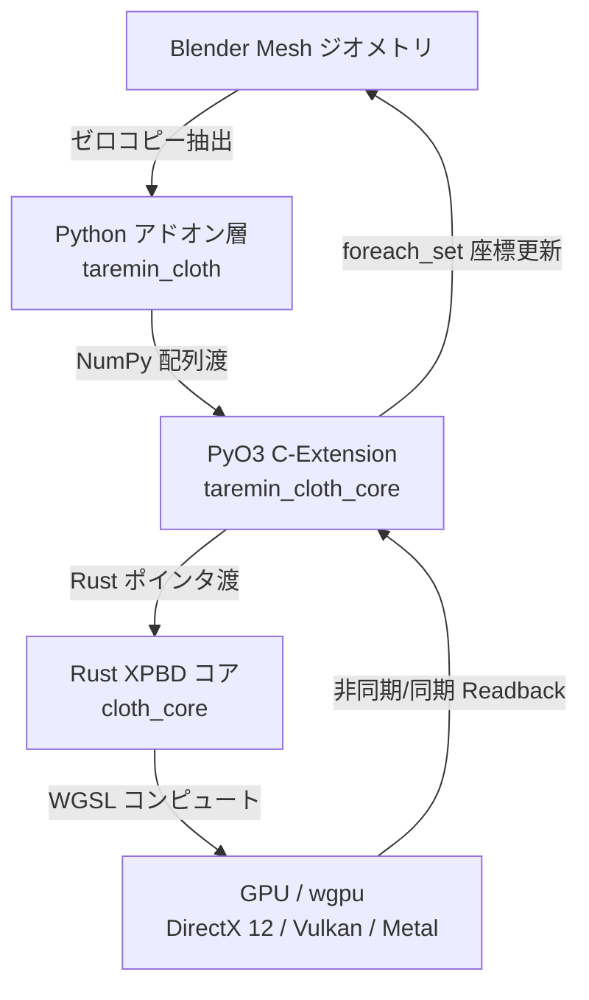

# Taremin Cloth 技術設計・アーキテクチャ仕様書 (Technical Architecture & Specification)

本ドキュメントは、Blender向けGPU加速XPBD布シミュレータ「Taremin Cloth」のシステムアーキテクチャ、物理計算アルゴリズム、GPUデータ構造、およびテスト・品質設計方針を網羅的に定義した技術仕様書です。

---

## 1. システムアーキテクチャ概要

Taremin Cloth は、GPUコンピュートパイプライン（wgpu / WGSL）を活用したゼロコピー物理シミュレータコアと、Blender Python (`bpy`) 上の直感的なUI・オペレーター層を分離したハイブリッド構成を採用しています。



### 1.1 コンポーネント構成と技術選定

| コンポーネント | 技術 | 役割・選定理由 |
| :--- | :--- | :--- |
| **GPU API** | **wgpu (v24.0+)** | WebGPU仕様準拠のRust実装。DirectX 12, Vulkan, Metalへ自動抽象化し、ベンダー非依存（NVIDIA / AMD / Intel / Apple Silicon）で動作。 |
| **Shader言語** | **WGSL (WebGPU Shading Language)** | wgpu標準のコンピュートシェーダー言語。 |
| **ネイティブコア** | **Rust (2021 edition)** | メモリ安全性、並列処理性能、マルチプラットフォーム（Windows, Linux, macOS）対応。 |
| **Pythonバインディング** | **PyO3 + rust-numpy** | Blender PythonとRust間でNumPy配列メモリをゼロコピー転送。 |
| **ビルド基盤** | **Maturin** | RustクレートをBlenderから直接利用可能な拡張モジュール（`.pyd` / `.so`）として自動ビルド。 |
| **アドオンUI/連携** | **Blender Python (`bpy`)** | Blender 3.6 LTS / 4.x / 5.x 対応。モーダルオペレーター、NパネルUI、アニメーションドライバー統合。 |

---

## 2. 物理シミュレーション仕様 (XPBD)

本システムは、**XPBD (Extended Position Based Dynamics)** に基づく時間積分および拘束解消アルゴリズムを実装しています。各フレーム（$\Delta t \approx 1/60$ 秒）において複数回のサブステップ（$N_{sub} = 10 \sim 30$）を実行し、トンネリングや発散のない高剛性布シミュレーションを実現します。

### 2.1 サブステップ内の処理シーケンス

1. **位置予測 (Predict Positions)**:
   $$v_i \leftarrow v_i + dt \cdot M^{-1} f_{ext}$$
   $$p_i \leftarrow x_i + dt \cdot v_i$$
   （$x_i$: 現在位置, $p_i$: 予測位置, $v_i$: 速度, $M$: 質量行列, $f_{ext}$: 重力・空気抵抗・外力）

2. **空間ハッシュ・近傍探索 (Spatial Hashing)**:
   - 動的空間ハッシュによりグリッドセルを構築し、自己衝突および多層布（マルチレイヤー）衝突候補を並列抽出。

3. **拘束解消ループ (Constraint Projection Loop)**:
   - **距離拘束 (Distance Constraints)**: グラフ彩色（Welsh-Powell法）により色グループごとにGPU完全並列で伸縮補正。
   - **曲げ拘束 (Bending Constraints)**: 隣接2三角形の二面角（Dihedral Angle）に基づく曲率補正。
   - **固定・追従ピン拘束 (Pin & Attachment Constraints)**: 頂点グループウェイトおよびターゲット位置・ボーン追従。
   - **縫合拘束 (Sewing Constraints)**: 型紙エッジ間を時間経過に伴い収縮（スプリング）させて衣服を仕立てる。
   - **衝突拘束 (Collisions)**:
     - **動的SDFコライダー**: GPUコンピュートシェーダーによるボーン・メッシュSDF高速ベイクと侵入位置押し出し。
     - **メッシュコライダー**: クラスタカリング付き三角パッチ衝突判定。
     - **自己衝突 (Self-Collision)**: 空間ハッシュに基づく頂点間反発。

4. **速度更新と位置確定 (Velocity Update & Commit)**:
   $$v_i \leftarrow (p_i - x_i) / dt$$
   $$x_i \leftarrow p_i$$

---

## 3. データ構造と GPU メモリアライメント

GPU構造体は、16バイト境界アライメント（WGSL仕様）に厳密に準拠して設計されています。

```rust
// 頂点データ (GPU Buffer: Read/Write)
#[repr(C)]
#[derive(Copy, Clone, Debug, bytemuck::Pod, bytemuck::Zeroable)]
pub struct GpuVertex {
    pub position: [f32; 3],  // 現在位置 x_i
    pub inv_mass: f32,       // 逆質量 (0.0 = 完全固定)
    pub prev_pos: [f32; 3],  // 直前位置 (または予測位置 p_i)
    pub layer_id: u32,       // レイヤー番号 (0, 1, 2...)
    pub velocity: [f32; 3],  // 速度 v_i
    pub thickness: f32,      // 布の厚み (m)
}

// 距離拘束 (GPU Buffer: Read-Only)
#[repr(C)]
#[derive(Copy, Clone, Debug, bytemuck::Pod, bytemuck::Zeroable)]
pub struct GpuDistanceConstraint {
    pub v0: u32,             // 頂点インデックス 0
    pub v1: u32,             // 頂点インデックス 1
    pub rest_length: f32,    // 自然長
    pub compliance: f32,     // コンプライアンス (1 / 剛性)
}

// 曲げ拘束 (GPU Buffer: Read-Only)
#[repr(C)]
#[derive(Copy, Clone, Debug, bytemuck::Pod, bytemuck::Zeroable)]
pub struct GpuBendingConstraint {
    pub v0: u32,             // 共有稜線 頂点0
    pub v1: u32,             // 共有稜線 頂点1
    pub v2: u32,             // 翼頂点 0
    pub v3: u32,             // 翼頂点 1
    pub rest_angle: f32,     // 初期二面角
    pub compliance: f32,     // コンプライアンス
    pub _pad: [f32; 2],      // 16バイトアライメントパディング
}

// ピン・追従拘束 (GPU Buffer: Read/Write)
#[repr(C)]
#[derive(Copy, Clone, Debug, bytemuck::Pod, bytemuck::Zeroable)]
pub struct GpuPinConstraint {
    pub vertex_idx: u32,     // 対象頂点インデックス
    pub weight: f32,         // ピン留め強度 (0.0〜1.0)
    pub _pad: [f32; 2],
    pub target_pos: [f32; 3],// 目標ワールド座標
    pub _pad2: f32,
}
```

---

## 4. 拘束並列化（グラフ彩色）仕様

GPU上でデータ競合（Race Condition）を起こさずに拘束を更新するため、**Welsh-Powell法（次数降順貪欲彩色）** を用いて制約グラフをグループ化します。

- 同一色グループ内の拘束は互いに頂点を共有しないため、アトミック操作なしに完全並列でディスパッチ可能です。
- 各色グループの拘束数およびバッファオフセットは `color_counts` / `color_offsets` によりGPUディスパッチ時に管理されます。

---

## 5. ソフトウェアテスト・品質保証原則

手戻りや退行（Regression）を防止し、物理挙動の安定性を担保するため、以下の工学的検証原則を定めています：

1. **物理不変量 (Invariants) 検証**:
   - シミュレーションの各ステップ後、全頂点座標および速度に NaN / Inf が発生しないことを機械的に保証。
   - 閉じた系でのエネルギー保存および対称メッシュでの幾何学的変形対称性の維持。
2. **ゴールデンマスター回帰テスト (`tests/test_golden_regression.py`)**:
   - 基準バージョン（コミット `3160075`）で生成された高精度スナップショット (`tests/golden_master/*.npz`) との頂点座標誤差が許容値（ミリメートル未満）以内であることを毎コミット検証。
3. **メモリアライメント自動検証 (`tests/test_shader_alignment.rs`)**:
   - Rust側の `repr(C)` 構造体サイズ・オフセットと WGSL シェーダー側の Uniform / Storage バッファレイアウトが一致することを `naga` による自動解析テストで常時検証。
4. **Blender非依存の高速解析 (`python -m taremin_cloth.log_tools`)**:
   - デバッグレコーダーが出力する `.jsonl.gz` を活用し、Blender非依存のCLIおよびPythonテストコード上でサブステップ解析・異常検出を実行。
