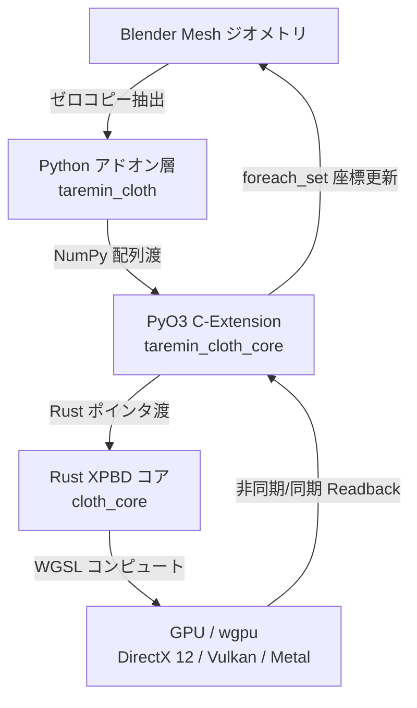
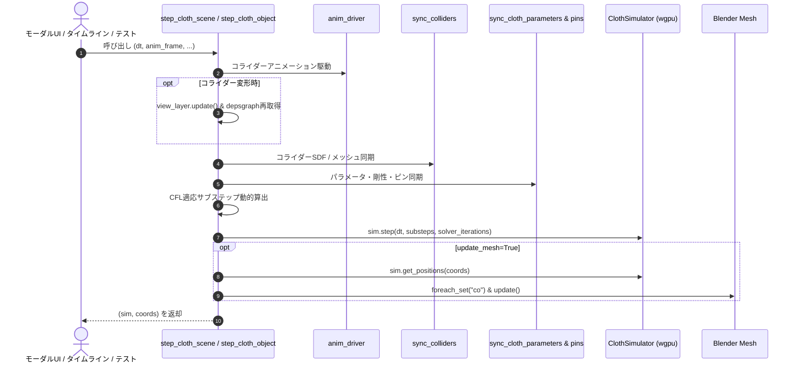
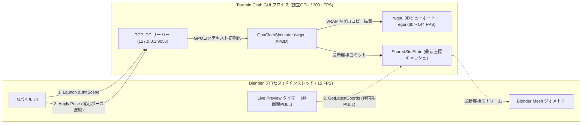
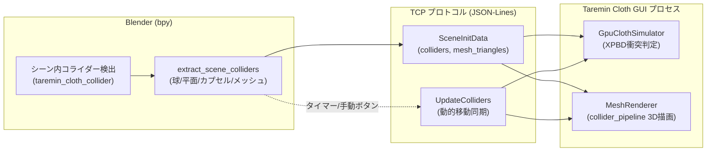
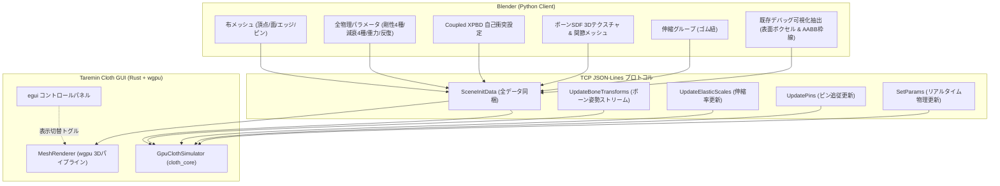
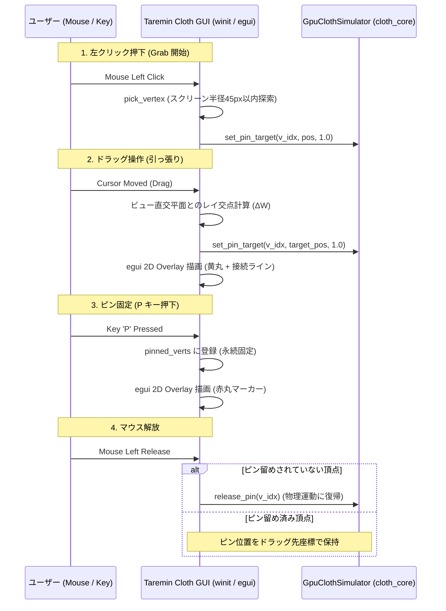
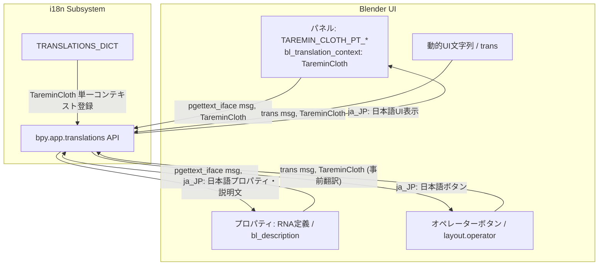
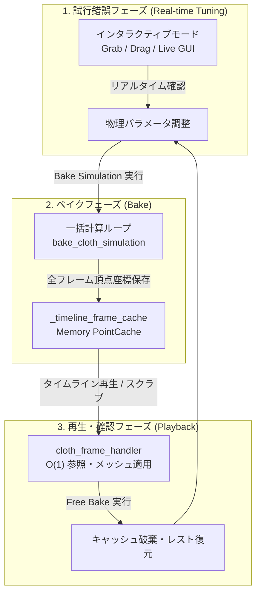

# Taremin Cloth 技術設計・アーキテクチャ仕様書 (Technical Architecture & Specification)

本ドキュメントは、Blender向けGPU加速XPBD布シミュレータ「Taremin Cloth」のシステムアーキテクチャ、物理計算アルゴリズム、GPUデータ構造、およびテスト・品質設計方針を網羅的に定義した技術仕様書です。

---

## 1. システムアーキテクチャ概要

Taremin Cloth は、GPUコンピュートパイプライン（wgpu / WGSL）を活用したゼロコピー物理シミュレータコアと、Blender Python (`bpy`) 上のオペレーターおよびパネルUI層を分離したハイブリッド構成を採用しています。



### 1.1 コンポーネント構成と技術選定

| コンポーネント | 技術 | 役割・選定理由 |
| :--- | :--- | :--- |
| **GPU API** | **wgpu (v24.0+)** | WebGPU仕様準拠のRust実装。DirectX 12, Vulkan, Metalへ自動抽象化し、ベンダー非依存（NVIDIA / AMD / Intel / Apple Silicon）で動作。 |
| **Shader言語** | **WGSL (WebGPU Shading Language)** | wgpu標準のコンピュートシェーダー言語。 |
| **ネイティブコア** | **Rust (2021 edition)** | メモリ安全性、並列処理性能、マルチプラットフォーム（Windows, Linux, macOS）対応。 |
| **Pythonバインディング** | **PyO3 + rust-numpy** | Blender PythonとRust間でNumPy配列メモリをゼロコピー転送。 |
| **ビルド基盤** | **Maturin** | RustクレートをBlenderから直接利用可能な拡張モジュール（`.pyd` / `.so`）として自動ビルド。 |
| **アドオンUI/連携** | **Blender Python (`bpy`)** | Blender 3.6 LTS / 4.x / 5.x 対応。モーダルオペレーター、NパネルUI、アニメーションドライバー統合。 |

### 1.2 シミュレーション実行パイプラインとフレーム進行ライフサイクル

シミュレーションの1フレーム進行ライフサイクルは、モーダルオペレーター（インタラクティブモード）、タイムライン再生ハンドラー、およびE2Eテスト環境の間で完全に同一の挙動を保証するため、共通関数 `step_cloth_scene` および `step_cloth_object` （`engine/runner.py`）に一元集約されています。



- **`step_cloth_object(obj, scene, dt, ...)`**:
  単一布オブジェクトに対する完全な同期・物理ステップ・メッシュ更新ライフサイクル。
- **`step_cloth_scene(scene, dt, anim_frame, ...)`**:
  シーン内のコライダーアニメーションを一括更新し、指定（または全）布オブジェクトに対して `step_cloth_object` を実行。テストや検証スクリプトでもこの関数を呼ぶことで、UI実行時と100%同一の物理・パラメータ同期環境で検証が可能。

### 1.3 タイムライン再生とポイントキャッシュ管理 (Timeline & Point Cache)

タイムライン再生モード（`frame_change_post` ハンドラー）では、Blender標準のPoint Cache思想に準拠した効率的なキャッシュ管理と試行錯誤サイクルを実現しています。

- **ハンドラー永続化 (`@_persistent`)**:
  `.blend` ファイルのロード時やシーン再読み込み時にハンドラーがBlenderにより自動削除されるのを防ぐため、`bpy.app.handlers.persistent` で登録。
- **通し再生とフレーム1保護**:
  シミュレーション開始フレーム（`scene.frame_start`）にタイムラインを巻き戻した際、計算済みのタイムラインキャッシュを破棄せず保持。これにより、フレーム1から最終フレームまでのスムーズな通し再生およびタイムラインスクラブをサポート。
- **パラメータ変更の自動検知 (Dirty Cache Invalidation)**:
  毎フレームのハンドラー実行時に、剛性・減衰・重力・ピン・縫合等の主要物理パラメータのハッシュシグネチャ（`get_cloth_params_signature`）を照合。設定値の変更を検知した場合のみ、該当オブジェクトのキャッシュとGPUシミュレータを自動破棄し、新しいパラメータでの再計算を開始。
- **UIステータス表示とメモリ可視化**:
  3D ViewportのNパネル（Quick Controls / Quality & Solver）に、キャッシュ済みフレーム範囲（例: `1 - 30 (30f)`）および概算メモリ使用量をリアルタイム表示。手動キャッシュクリアおよび現在の変形状態のシェイプキー保存（`Save as Shape Key`）を提供。

### 1.4 3Dビューポート・オーバーレイ描画パイプライン (Drawing & Overlay Pipeline)

3Dビューポート上の視覚的フィードバック（ピン留め頂点、掴み操作ハイライト、縫合ライン、ゴム紐テンション色、操作HUD等）は、`SpaceView3D.draw_handler_add` を利用してGPU直描画されます。

- **シミュレーション実行中（インタラクティブ時）限定ライフサイクル**:
  ビューポート操作（回転・パン・ズーム）や通常の編集作業への負荷を完全にゼロ（0.00ms）にするため、3D描画コールバック（`draw_callback_3d`）および2D描画コールバック（`draw_callback_2d`）は、先頭で `_interactive_active` フラグを検査し、シミュレーション非実行時は即座に早期リターン（Early Return）します。
- **トポロジー・インデックスキャッシュ**:
  - **ピン留め頂点**: `(obj.name, vg_name)` をキーとして頂点インデックスリストをキャッシュ。
  - **縫合エッジ（Loose Edge）**: 孤立辺探索（`mesh.calc_loop_triangles` および全エッジの排他探索）はシミュレーション開始時の初回フレームのみ実行し、インデックスペアを `_sewing_edge_indices_cache` にキャッシュ。以降のフレームでは頂点座標の参照のみを行い、高ポリゴンメッシュにおけるリアルタイムFPS低下を防止。
  - **キャッシュの自動解放**: インタラクティブモード終了時（`set_interactive_active(False)`）にすべてのオーバーレイキャッシュを一括解放。
- **GPUシェーダーキャッシュ**:
  `gpu.shader.from_builtin` による組み込みシェーダー（ポイント・ライン・2Dクアッド）の取得結果をモジュール変数に保持し、毎フレームの例外ハンドリングを伴う名前解決コストを排除。
- **深度テスト（Depth Test Z）とバイアス補正**:
  物陰にある頂点やエッジのオクルージョン判定を行い、深度テスト有効時のZ-fighting（埋没）を解消するため、カメラ距離に応じた微小な手前方向オフセット（`apply_view_depth_bias`）を適用。

---

## 2. 物理シミュレーション仕様 (XPBD)

> [!TIP]
> 各アルゴリズムの詳細な選定理由、Coupled XPBDの協調収束設計、V-T/E-E/CCD接触判定、却下されたアンチパターン、および理想アルゴリズムとの乖離分析については、[docs/algorithms.md](algorithms.md) を参照してください。

本システムは、**XPBD (Extended Position Based Dynamics)** に基づく時間積分および拘束解消アルゴリズムを実装しています。各フレーム（$\Delta t \approx 1/60$ 秒）において複数回のサブステップ（$N_{sub} = 10 \sim 30$）を実行し、トンネリングや発散を抑制した高剛性布シミュレーションを実行します。

### 2.1 サブステップ内の処理シーケンス

1. **位置予測 (Predict Positions)**:
   $$v_i \leftarrow v_i + dt \cdot M^{-1} f_{ext}$$
   $$p_i \leftarrow x_i + dt \cdot v_i$$
   （$x_i$: 現在位置, $p_i$: 予測位置, $v_i$: 速度, $M$: 質量行列, $f_{ext}$: 重力・空気抵抗・外力）

2. **空間ハッシュ・近傍探索 (Spatial Hashing)**:
   - 動的空間ハッシュによりグリッドセルを構築し、自己衝突および多層布（マルチレイヤー）衝突候補を並列抽出。

3. **拘束解消ループ (Constraint Projection Loop)**:
   - **距離拘束 (Distance Constraints)**: グラフ彩色（Welsh-Powell法）により色グループごとにGPU完全並列で伸縮補正。
   - **曲げ拘束 (Bending Constraints)**: 隣接2三角形の二面角（Dihedral Angle）に基づく曲率補正。
   - **固定・追従ピン拘束 (Pin & Attachment Constraints)**: 頂点グループウェイトおよびターゲット位置・ボーン追従。
   - **縫合拘束 (Sewing Constraints)**: 型紙エッジ間を時間経過に伴い収縮（スプリング）させて衣服を仕立てる。縫合エッジペアはトポロジー近接判定においてUnion-Find完全縮約トポロジーグラフ（ホップ数0換算・結節点隣接の相互対称登録）として扱われ、自己衝突（2ホップ除外）との誤爆拮抗を物理的に排除する。また、収縮完了時の密着剛体ロックオプション（`lock_on_close`）をサポート。
   - **衝突拘束 (Collisions)**:
     - **動的SDFコライダー**: GPUコンピュートシェーダーによるボーン・メッシュSDF高速ベイクと侵入位置押し出し。
     - **メッシュコライダー**: クラスタカリング付き三角パッチ衝突判定。
     - **自己衝突 (Self-Collision)**:
        - **Solve パス (`self_collision.wgsl`)**: 空間ハッシュに基づく近傍探索および V-T / E-E / V-V 接触判定。2ホップトポロジー近傍判定をV-V、V-T、E-Eで一貫して統一適用。固定小数点（$10^6$ スケール）`atomicAdd` により、自頂点だけでなく相手三角形・エッジ頂点へも作用・反作用（運動量保存）変位をデータ競合を回避してアキュムレータへ対称蓄積。
        - **接触候補ペアキャッシュ (Active Pair Caching / I-Cloth 2018 方式, オプション `enable_pair_cache`)**:
          - **Collect Pairs パス (`self_collision_collect_pairs.wgsl`)**: フレーム先頭サブステップ（`sub_idx == 0`）でのみ空間ハッシュ近傍探索を実行し、接近頂点・面（V-T）および稜線（E-E）ペアを抽出して専用ストレージバッファにキャッシュ。`margin_mode=AUTO`（既定）では頂点速度×フレームdt×係数（`velocity_horizon_scale=1.3`、`max_horizon=0.02`でクランプ）のスイープホライゾンを収集 bound に加算し、フレーム内に接近するペアの取りこぼしを防止。`FIXED` では従来の静的収集（厚み+マージンのみ）。
          - **時間的再利用（Amortization）**: 以降のサブステップ（`sub_idx > 0`）では空間ハッシュ構築および全頂点ペア収集パスをスキップ。フレームdtは `step()` 先頭で収集パラメータへ毎フレーム反映。
          - **Narrowphase Solve パス (`self_collision_solve_vt.wgsl` / `self_collision_solve_ee.wgsl`)**: キャッシュされた有効ペアのみをピンポイントで並列ディスパッチ。論理上限は頂点数連動（`clamp(n*8, 8192, 65536)`、物理確保65536）で `set_pair_cache_options` により変更可。飽和検出は `get_pair_cache_stats()`（vt/ee_count読戻し）で行う。
          - **最終サブステップフォールバック (`enable_pair_cache_final_fallback`, 既定ON)**: 最終サブステップのみ新鮮な空間ハッシュ構築＋直進フルSolveに置換し、速度確定前のトンネリングを遮断。追加コストは1構築+1フルSolve/frameに限定され、約1.8〜2.4倍の高速化を維持。
        - **Apply パス (`self_collision_apply.wgsl`)**: 蓄積された変位を密度緩和・ステップクランプを適用して頂点座標へ反映し、アキュムレータをゼロクリア。
        - **協調収束設計 (Coupled Modes)**:
          - `RELAXATION` モード（推奨標準）: 自己衝突直後に距離拘束および縫合拘束を2反復再適用（Post-Relaxation）。エッジ過剰伸長を約5割抑制しつつ、距離拘束による縫合ペア引き戻しを完全に防ぎ、自己衝突ON時でも0.00mmの完全密着縫合を保証。実測153.2 FPSを維持。
          - `FULL_COUPLED` モード（高精度設定）: 反復ループの各回で自己衝突を同調ディスパッチし、仕上げに1回緩和（距離拘束＋縫合拘束）を適用してエッジ伸びを約7割抑制。

4. **速度更新と位置確定 (Velocity Update & Commit)**:
   $$v_i \leftarrow (p_i - x_i) / dt$$
   $$x_i \leftarrow p_i$$

---

## 3. データ構造と GPU メモリアライメント

GPU構造体は、16バイト境界アライメント（WGSL仕様）に厳密に準拠して設計されています。

```rust
// 頂点データ (GPU Buffer: Read/Write)
#[repr(C)]
#[derive(Copy, Clone, Debug, bytemuck::Pod, bytemuck::Zeroable)]
pub struct GpuVertex {
    pub position: [f32; 3],  // 現在位置 x_i
    pub inv_mass: f32,       // 逆質量 (0.0 = 完全固定)
    pub prev_pos: [f32; 3],  // 直前位置 (または予測位置 p_i)
    pub layer_id: u32,       // レイヤー番号 (0, 1, 2...)
    pub velocity: [f32; 3],  // 速度 v_i
    pub thickness: f32,      // 布の厚み (m)
}

// 距離拘束 (GPU Buffer: Read-Only)
#[repr(C)]
#[derive(Copy, Clone, Debug, bytemuck::Pod, bytemuck::Zeroable)]
pub struct GpuDistanceConstraint {
    pub v0: u32,             // 頂点インデックス 0
    pub v1: u32,             // 頂点インデックス 1
    pub rest_length: f32,    // 自然長
    pub compliance: f32,     // コンプライアンス (1 / 剛性)
}

// 曲げ拘束 (GPU Buffer: Read-Only)
#[repr(C)]
#[derive(Copy, Clone, Debug, bytemuck::Pod, bytemuck::Zeroable)]
pub struct GpuBendingConstraint {
    pub v0: u32,             // 共有稜線 頂点0
    pub v1: u32,             // 共有稜線 頂点1
    pub v2: u32,             // 翼頂点 0
    pub v3: u32,             // 翼頂点 1
    pub rest_angle: f32,     // 初期二面角
    pub compliance: f32,     // コンプライアンス
    pub _pad: [f32; 2],      // 16バイトアライメントパディング
}

// ピン・追従拘束 (GPU Buffer: Read/Write)
#[repr(C)]
#[derive(Copy, Clone, Debug, bytemuck::Pod, bytemuck::Zeroable)]
pub struct GpuPinConstraint {
    pub vertex_idx: u32,     // 対象頂点インデックス
    pub weight: f32,         // ピン留め強度 (0.0〜1.0)
    pub _pad: [f32; 2],
    pub target_pos: [f32; 3],// 目標ワールド座標
    pub _pad2: f32,
}

// 縫合拘束 (GPU Storage Buffer: Read/Write)
#[repr(C)]
#[derive(Copy, Clone, Debug, bytemuck::Pod, bytemuck::Zeroable)]
pub struct GpuSewingConstraint {
    pub v0: u32,             // 縫合頂点0
    pub v1: u32,             // 縫合頂点1
    pub current_rest_len: f32,// 現在の目標自然長 (m)
    pub target_rest_len: f32, // 最終収縮目標長 (通常 0.0)
    pub shrink_speed: f32,   // 収縮速度 (m/s)
    pub compliance: f32,     // コンプライアンス (0.0: 完全非伸縮 PBD)
    pub lock_on_close: f32,  // 1.0: 密着時に実効コンプライアンス0.0で剛体ロック
    pub _pad1: f32,          // 32バイトアライメントパディング
}

// メッシュコライダー三角形 (GPU Buffer: Read-Only)
#[repr(C)]
#[derive(Copy, Clone, Debug, bytemuck::Pod, bytemuck::Zeroable)]
pub struct GpuMeshTriangle {
    pub p0: [f32; 3],        // 頂点0ワールド座標
    pub friction: f32,       // 摩擦係数
    pub p1: [f32; 3],        // 頂点1ワールド座標
    pub thickness: f32,      // コライダー表面厚み (m)
    pub p2: [f32; 3],        // 頂点2ワールド座標
    pub restitution: f32,    // 反発係数
    pub flags: u32,          // ビットフラグ (bit 0: 片面判定, bit 1: リカバリー無効)
    pub _pad: [f32; 3],      // 16バイトアライメントパディング
}
// flags ビットアサイン:
// - bit 0 (0x1): is_single_sided (1=片面メッシュ, 0=両面メッシュ)
// - bit 1 (0x2): recovery_disabled (1=片面裏抜け復帰無効, 0=復帰有効[デフォルト])

// 自己衝突累積変位バッファ (GPU Storage Buffer: atomic<i32> / Read-Write, 32 bytes/vert)
// WGSL: struct SelfCollisionAccum {
//     dx: atomic<i32>, dy: atomic<i32>, dz: atomic<i32>, count: atomic<u32>,        // 近接反発ペナルティ変位
//     ccd_dx: atomic<i32>, ccd_dy: atomic<i32>, ccd_dz: atomic<i32>, ccd_count: atomic<u32>, // CCDハード変位 (100%適用)
// }
// 固定小数点 10^6 スケール (1μm 分解能) により、データ競合なしに対称な作用・反作用を蓄積

// 接触候補ペアキャッシュバッファ (GPU Storage Buffer: Read/Write)
// - VtPair (8 bytes): { vertex_idx: u32, tri_idx: u32 }
// - EePair (16 bytes): { edge0_v0: u32, edge0_v1: u32, edge1_v0: u32, edge1_v1: u32 }
// - PairCounts (16 bytes): { vt_count: atomic<u32>, ee_count: atomic<u32>, max_vt: u32, max_ee: u32 }
```

---

## 4. 拘束並列化（グラフ彩色）仕様

GPU上でデータ競合（Race Condition）を起こさずに拘束を更新するため、**Welsh-Powell法（次数降順貪欲彩色）** を用いて制約グラフをグループ化します。

- 同一色グループ内の拘束は互いに頂点を共有しないため、アトミック操作なしに完全並列でディスパッチ可能です。
- 各色グループの拘束数およびバッファオフセットは `color_counts` / `color_offsets` によりGPUディスパッチ時に管理されます。

---

## 5. ソフトウェアテスト・品質保証原則

手戻りや退行（Regression）を防止し、物理挙動の安定性を担保するため、以下の工学的検証原則を定めています：

1. **物理不変量 (Invariants) 検証**:
   - シミュレーションの各ステップ後、全頂点座標および速度に NaN / Inf が発生しないことを自動テストにより常時検証。
   - 閉じた系でのエネルギー保存および対称メッシュでの幾何学的変形対称性の維持。
2. **自己衝突対称性・運動量保存テスト (`tests/core/test_self_collision_symmetry.py`)**:
   - 二枚の対向する布メッシュの自己衝突において、等質量時の上下対称変位（相対誤差 1% 未満）および異質量時（2:1）の質量比反比例変位・運動量保存則を検証。
3. **Coupled自己衝突・エッジ伸び抑制テスト (`tests/core/test_coupled_self_collision.py`)**:
   - 強い圧縮自己衝突下において、`RELAXATION` モードおよび `FULL_COUPLED` モードによりエッジ最大伸長率が大幅に抑制される物理品質を検証。
4. **ゴールデンマスター回帰テスト (`tests/test_golden_regression.py`)**:
   - 基準バージョン（コミット `3160075`）で生成された高精度スナップショット (`tests/golden_master/*.npz`) との頂点座標誤差が許容値（ミリメートル未満）以内であることを毎コミット検証。
5. **メモリアライメント自動検証 (`tests/test_shader_alignment.rs`)**:
   - Rust側の `repr(C)` 構造体サイズ・オフセットと WGSL シェーダー側の Uniform / Storage バッファレイアウトが一致することを `naga` による自動解析テストで常時検証。
6. **Blender非依存の高速解析 (`python -m taremin_cloth.log_tools`)**:
   - デバッグレコーダーが出力する `.jsonl.gz` を活用し、Blender非依存のCLIおよびPythonテストコード上でサブステップ解析・異常検出を実行。

---

## 6. Taremin Cloth GUI 独立高速プロセスアーキテクチャ

Blenderのメインスレッド依存（UI描画、Depsgraph再評価、タイムライン更新、GIL待ち）によるフレームレート低下（実測10〜15 FPS）のオーバーヘッドを解消するため、Rust+wgpu物理シミュレータコアを独立GUIプロセス「**Taremin Cloth GUI**」（`taremin_cloth_gui.exe`）として分離しました。



### 6.1 アーキテクチャの特長

1. **メインスレッド分離による高フレームレート動作（実測 300+ FPS）**:
   - 物理シミュレーションとwinit/eguiによる独立3D描画がBlenderと切り離されたプロセスで動作。
   - VRAM上の頂点バッファ（`vertex_buffer`）を直接レンダラーにバインドし、PCIeホスト・デバイス間転送を介さずに直接描画。
2. **非同期PULL型プレビュー（UDPライクな最新値同期）**:
   - Blender側はタイムライン同期ではなく、モーダルタイマー（15 FPS程度）でGUIサーバーから「最新座標のみ」をPULL取得。
   - Blenderの描画負荷やDepsgraph遅延がGUI側の物理シミュレーション速度に影響を与えにくい設計。
3. **安全な双方向コントロール**:
   - Blender側から Play / Pause / Reset / パラメータ変更を指示可能。
   - 目的の形状に変形した段階で「Apply Pose」を実行することで、確定した変形座標をBlenderのMeshへ1アクションで書き戻し可能。

### 6.2 性能比較ベンチマーク実測値（最大10万頂点）

同一マシン環境（RTX GPU / Windows 11）における、従来のBlender組み込みIn-process方式と、新アーキテクチャ「Taremin Cloth GUI」の物理計算性能実測比較：

| グリッド解像度 | 頂点数 | 面数 | 従来In-process (Blender同期) | Taremin Cloth GUI (独立物理) | 高速化倍率 |
| :--- | :--- | :--- | :--- | :--- | :--- |
| **55 × 55** | 3,025 | 5,832 | 241.2 FPS (4.15 ms) | **334.2 FPS** (2.99 ms) | **1.39×** |
| **100 × 100** | 10,000 | 19,602 | 223.3 FPS (4.48 ms) | **333.5 FPS** (3.00 ms) | **1.49×** |
| **173 × 173** | 29,929 | 59,168 | 45.2 FPS (22.15 ms) | **335.4 FPS** (2.98 ms) | **7.43×** |
| **316 × 316** | **99,856** | 198,450 | **9.2 FPS** (109.01 ms) | **317.5 FPS** (3.15 ms) | 🚀 **34.61×** |

> [!NOTE]
> - 従来方式では、頂点数が3万〜10万頂点に達するとPython-C-extension間のバッファコピーとBlender側オーバーヘッドによりフレームレートが 9.2 FPS まで急落。
> - Taremin Cloth GUI では、10万頂点規模であっても **317.5 FPS（1フレーム 3.15 ms）** を維持し、従来方式比で約 **34.6倍** のフレームレート向上を記録しています。

### 6.3 コライダー自動転送および可視化レンダリング (Phase 2 Collider Integration)

Taremin Cloth GUI は、布メッシュだけでなくBlenderシーン内の全コライダーオブジェクトとのリアルタイム連動に対応しています。



1. **コライダーの自動検出と抽出 (`extract_scene_colliders`)**:
   - シーン内の全オブジェクトを走査し、`taremin_cloth_collider.is_collider` が有効なオブジェクトを自動抽出。
   - **解析コライダー (Analytical Colliders)**: 球 (Sphere)、平面 (Plane)、カプセル (Capsule) のワールド変換済み中心座標・法線・半径・軸方向を `GuiColliderData` として抽出。
   - **メッシュコライダー (Mesh Colliders)**: `obj.to_mesh()` によるモディファイア適用済み評価ジオメトリから、ワールド変換された三角形頂点（$v_0, v_1, v_2$）を `GuiMeshTriangleData` として抽出。
2. **GPUコアへの登録と衝突判定 (`register_colliders`)**:
   - `GpuClothSimulator::add_sphere_collider`, `add_plane_collider`, `add_capsule_collider`, `add_mesh_collider` を呼び出し、XPBDサブステップループ内の衝突制約として直接登録。
3. **独立3Dビューポートでの可視化 (`collider_pipeline`)**:
   - コライダー専用のシェーダーパイプラインにより、スレートブルー・グレーの陰影付きメッシュとして描画。
   - 球・カプセル・平面はプロシージャルメッシュ（UV球、円筒＋半球キャップ、グリッド平面）を動的生成してVRAMバッファにバインド。

### 6.4 全シミュレーション機能・BONE_SDF・デバッグ可視化の機能パリティ仕様 (Phase 3 Feature Parity)

Taremin Cloth GUI は、Blender側（Python & PyO3）で提供されているXPBD物理シミュレーション機能およびデバッグ可視化機能と同等のパラメータ連携および描画に対応しています。



#### 1. 物理パラメータおよび制約のサポート
- **異方性剛性 (Stiffness 4種)**: 引張（Tension）、圧縮（Compression）、剪断（Shear）、曲げ（Bending）を設定可能。
- **粘性減衰 (Damping 4種 + 空気抵抗)**: 空気抵抗（Air Damping）に加え、4種類の変形速度成分（引張・圧縮・剪断・曲げ）に対するXPBD相対粘性減衰（`set_damping_all`）を同期。
- **Coupled XPBD 自己衝突**:
  - モード切替（`OFF`, `RELAXATION`, `FULL_COUPLED`）
  - エッジ衝突（`enable_edge_collision`, `edge_margin_scale`, `edge_margin_offset`）
  - 表裏反転解消（`enable_normal_untangling`）
  - 緩和係数・ポストリラクゼーション反復回数
- **伸縮グループ（ゴム紐エフェクト）**:
  - 指定エッジグループの自然長スケール（`set_edge_rest_length_scales`）の初期登録およびリアルタイム変更。
- **動的アタッチメントピン**:
  - アーマチュアボーンや外部オブジェクトに追従する頂点ピン座標・重みの動的同期（`set_pin_target`）。

#### 2. BONE_SDF / MESH_SDF コライダーの統合
- **3Dテクスチャ転送 (Rg16Float)**:
  - Blender側でGPUベイクされたボーン別3D SDFテクスチャ（$D, \alpha$）をBase64デコードし、`GpuClothSimulator::set_bone_sdf_colliders` によりVRAM上の3Dテクスチャとしてバインド。
  - ボーンのAABB、UVWスケール/オフセット、摩擦、厚みなどの静的メタデータ（`GpuBoneInfo`）をGPUストレージバッファへアップロード。
  - 関節部メッシュコライダー（ハイブリッドモード）も同時転送・統合。
- **ボーン姿勢行列ストリーミング (`UpdateBoneTransforms`)**:
  - アーマチュアのポーズ変化に伴い、毎フレーム（約0.5秒おきのLive Preview同期）ボーンワールド行列（`GpuBoneTransform`）を更新し、布が動くキャラクターの体表に吸着・追従。

#### 3. 組み込みデバッグ可視化機能（SDFボクセル・AABB枠線・表示切替）
- **SDF表面ボクセル3D描画 (`voxel_pipeline`)**:
  - `mesh_renderer.py` の既存アセット（`extract_sdf_surface_voxels`）を活用し、SDFのゼロ交差表面近傍ボクセルキューブをインスタンシングパイプライン（12頂点キューブ × インスタンス数）で高速描画。
- **SDF AABB枠線3D描画 (`line_pipeline`)**:
  - 各ボーンの有効判定範囲を示す12本のエッジ枠線を専用3Dラインパイプラインでシアン色描画。
- **egui 表示切替チェックボックス**:
  - `Show Cloth Mesh` / `Wireframe` / `Colliders` / `SDF Voxels` / `SDF BBox` をチェックボックス1つで瞬時にトグル表示可能。

#### 4. コライダー同期の一元化とBlender挙動パリティ保証
- **コライダー抽出の一元化 (`extract_all_scene_colliders`)**:
  - Blender In-process (`sync_colliders`) と GUIクライアント (`gui_client.py`) で二重管理されていたコライダー抽出ロジックを `collider.extract_all_scene_colliders` に一元化。
  - アナリティックコライダー（球・カプセル・平面）、一般メッシュコライダーに加え、`BONE_SDF` の関節メッシュ（Joint Mesh）も動的アクティブ化判定（`joint_rotation_threshold`）および変形モディファイア評価（`depsgraph`）を含めて統一抽出。
  - 定期同期（`UpdateColliders`）時に関節メッシュが消失する不具合を解消し、変形モディファイア（Lattice, Mirror, Armature）の評価漏れも防止。
- **シーンFPSと物理タイムステップの同期**:
  - `SceneInitData` にシーンのFPS（`fps`）を送信し、GUI側の物理固定時間刻み（`fixed_dt = 1.0 / fps`）を動的設定。
  - ディスプレイ更新レート（144Hz〜300FPS+）に影響されないタイムアキュムレータ（Fix Your Timestep）方式により、Blenderのタイムライン再生と実時間・ステップ刻みの同期（パリティ）を確保。

### 6.5 インタラクティブ操作機能 (Interactive Grab & Dynamic Pinning)

Taremin Cloth GUI は、Blenderアドオンのインタラクティブモード（`ops/interactive.py`）と同様のマウス操作（布の掴み・引っ張り・ピン留め）をスタンドアロンビューポート上で提供します。



#### 1. オンデマンド・ピッキング設計
- **オンデマンド・スクリーン空間ピッキング**:
  - 毎フレームのCPUリードバックによる性能低下を避けるため、左クリック押下時またはキー押下時のみ1度 `sim.get_positions_flat` を実行して最近傍頂点（スクリーン半径45px以内）を特定。
- **ビュー平面投影ドラッグ**:
  - クリック時のカメラ視線前方向ベクトルを法線とする平面上でマウス移動差分 $\Delta\vec{W}$ を計算し、$\vec{P}_{\text{target}} = \vec{P}_0 + \Delta\vec{W}$ として `sim.set_pin_target` を更新。ドラッグ中は3D目標座標をGPUに渡すのみで、300+ FPSのシミュレーション速度を維持。

#### 2. 動的ピン留め（Dynamic Pinning）と一括解除
- **`P` キーによるトグル**:
  - ドラッグ中またはカーソル直下の頂点をその場に固定（Pin）。再度 `P` キーを押すと解除（Unpin）され物理運動に復帰。
- 「**📌 Clear Pins**」ボタン:
  - UIのControlパネルに配置されたボタン1つで、全ピン（`pinned_verts` および `dynamic_pins`）を一括解除。

#### 3. egui 2D オーバーレイ可視化
- **GPUベクタ即時描画 (`layer_painter`)**:
  - egui の `layer_painter(Order::Foreground)` を活用し、追加のGPUシェーダーや頂点バッファを生成することなく、固定ピン（赤丸）およびドラッグ目標位置・接続ライン（黄丸＋ライン）を論理ポイント座標系で即時テッセレーション・描画。

### 6.6 高精度絶対時刻フレームペーシングとオンデマンドリードバック設計

Taremin Cloth GUI は、GPUの計算余力を活かしつつ、目標フレームレート（例: 60 FPS）の安定維持を目的とした絶対時刻フレームペーシング機構を備えています。

#### 1. 絶対時刻ペーシング（Absolute Time Pacing）
- **OSメッセージディスパッチ遅延の影響抑制**:
  - 描画ループ末尾でスリープする従来の方式では、Windows DWM や winit のイベント巡回遅延（約5ms）がフレーム周期に加算されてフレームレートが低下（16.6ms + 5ms = 21.6ms / 46 FPS）する問題がありました。
  - `RedrawRequested` の「先頭」で次フレーム予定時刻（`self.next_frame_time`）まで待機し、末尾では即座に `window.request_redraw()` を呼ぶ絶対時刻ペーシングへ刷新。OSディスパッチ遅延を待機時間内部で相殺し、安定した 60.0 FPS を維持します。
- **高精度ハイブリッド待機**:
  - `timeBeginPeriod(1)` により Windows タイマースケジューラ解像度を 1.0 ms に引き上げ。
  - 残り時間 2 ms 以上はスリープ、残り 1.5 ms 未満は `std::hint::spin_loop()` によるマイクロ秒同期を実施。
  - `about_to_wait` において実行中は `ControlFlow::Poll` を指定し、OS によるプロセス休止を防止。

#### 2. GPU 座標リードバックのオンデマンド化
- **GPU同期ストール（実測20〜25ms）の回避**:
  - Blender 連携において、定期的な `sim.get_positions_flat`（`device.poll(Maintain::Wait)`）による GPU パイプライン停止を防ぐため、Blender から `GetLatestCoords` が要求された直後の1フレームのみリードバックを実行するオンデマンド方式を採用。
  - 通常表示時および軽量ステータス要求時（`GetStatus`）はリードバックを行わず、同期待機オーバーヘッドを回避。

#### 3. Mailbox プレゼンテーションモード
- Surface の `present_mode` においてトリプルバッファリング（`Mailbox`）を優先選択し、DWM 垂直同期とアプリ内タイマーの干渉（ビート現象によるフレーム落ち）を防止。

### 6.7 配布パッケージへの同梱 (Release Bundling)

Taremin Cloth GUI 実行バイナリはプラットフォーム別にビルドされ、Blenderアドオン配布zip内に `bin/` として同梱されます（`tools/package_addon.py`、`.github/workflows/release.yml` の `Build standalone GUI` ステップ）。

- **同梱レイアウト**: `taremin_cloth/bin/taremin_cloth_gui[.exe]`（Windowsのみ `.exe`）。Linux/macOS用バイナリは zip 内で Unix 実行権限（`0o755`）付きで記録されます。
- **解決順序** (`ops/gui.py: resolve_gui_binary_path`): 配布レイアウト `bin/` を最優先し、開発レイアウト（`target/release/`、`target/<triple>/release/`、`target/debug/`）にフォールバックします。拡張子は実行プラットフォームに応じて `.exe` 付き・無しの両方を探索します。
- **macOS**: `x86_64` + `aarch64` を `lipo` で結合したUniversalバイナリを同梱します。
- **リリースCI**: パッケージング時に `--require-gui` を付与し、GUIバイナリ欠落をエラーとして検出します（ローカル開発時は警告のみでGUI無しパッケージも許容）。

---

## 7. 国際化 (i18n: Internationalization) 設計

Taremin Cloth は、Blender標準の翻訳システム（`bpy.app.translations`）に準拠した多言語UI管理モジュール（`taremin_cloth.i18n`）を備えています。デフォルト言語を英語（`en_US`）とし、日本語（`ja_JP`）に対応しています。



### 7.1 名前空間完全隔離アーキテクチャ (`TareminCloth` 単一コンテキスト + 事前翻訳)

- **他アドオンおよびBlender標準への干渉・被干渉の完全防止**:
  - 一般コンテキスト `*`（`bpy.app.translations.contexts.default`）や標準コンテキスト `Operator` にメッセージを登録すると、他のすべてのアドオンやBlender本体の同名メッセージを上書きしてしまう危険性や、逆に他アドオンによってTaremin Clothの翻訳が破壊されるリスクが生じます。
  - 本アドオンでは、**一般コンテキスト `*` および `Operator` コンテキストへの登録を一切行わない（各0件維持）完全名前空間隔離** を実現しています。
- **RNAプロパティ描画におけるコンテキスト強制問題と事前翻訳（Pre-translation）**:
  - BlenderのC++描画ルーチン（`layout.prop`）は、親パネルの `bl_translation_context` を無視し、RNAプロパティ定義自身の `translation_context`（デフォルトは `*`）で辞書を検索します。このため、一般コンテキスト `*` を排除した環境では、カスタムラベル（`layout.prop(..., text="...")`）が英語のまま未翻訳になる問題が生じます。
  - これを根本解決するため、UI描画層（`panels.py`, `preferences.py`, `presets.py`）内のすべての固定テキスト・オペレーターボタンを **`text=i18n.trans("...")` による事前翻訳** で渡すアーキテクチャを採用しています。これにより、Blender内部のコンテキスト強制を完全に回避し、一般コンテキスト `*` や `Operator` を汚染することなく100%確実に日本語が表示されます。
  - ラベルを指定しない自動プロパティ名描画に対しては、`properties.py` および `preferences.py` の全プロパティ定義関数（`FloatProperty`, `IntProperty`, `BoolProperty`, `EnumProperty`, `StringProperty`, `FloatVectorProperty`）にラッパー（`_wrap_prop`）を適用し、プロパティ定義側で `translation_context=i18n.CONTEXT`（`"TareminCloth"`）を自動付与しています。
- **オペレーターの `bl_translation_context` と `Operator` コンテキストの完全排除**:
  - UIパネル上のボタン描画はすべて事前翻訳（`text=i18n.trans("...")`）されるため、Blender内部の `Operator` 辞書検索はバイパスされます。
  - パネル外での表示（F3オペレーター検索、Undo履歴、Keymap、ツールチップ等）に対しては、アドオン内の全オペレータークラス（`ops.*`, `presets.*`）に `bl_translation_context = i18n.CONTEXT`（`"TareminCloth"`）を明示的に付与しています。
  - Blender C++ 内部のオペレーター名解決ルーチン（`WM_operatortype_name`）は、`ot->translation_context` が指定されていれば `"Operator"` ではなくそのコンテキストで辞書引きを行う仕様となっているため、`i18n.py` の辞書登録側で `("Operator", msgid)` への自動展開を行う必要が一切なくなり、**`"TareminCloth"` 単一コンテキストのみへの完全純化** を達成しています。
- **動的ラベル・メニュータイトルの接頭辞分離翻訳**:
  - `Selected: {obj.name}` や `Cloth Objects ({count})` などの動的変数を埋め込むUI要素については、固定接頭辞部分（`Selected:`, `Cloth Objects` 等）を `i18n.trans()` 経由で翻訳してから文字列結合を行うパターンに統一しています。
- **英語マスター (`en_US.json`) 基準の JSON ファイル分離データ管理**:
  - 翻訳辞書データは `i18n.py` のソースコード内から完全に排除され、`python/taremin_cloth/translations/*.json` に独立ファイルとして分離管理されています。
  - `en_US.json` を英語マスター（全メッセージIDがキーと値として定義された基準ひな形）とし、各言語ファイル（`ja_JP.json`、将来の `zh_CN.json` 等）は `en_US.json` と 1:1 に完全対応するキー構造を持ちます。
  - `i18n.py` は純粋な動的ファイルローダーとして機能し、新言語の追加時にも Python コードの修正が一切不要（JSON を配置するだけで即座に自動認識）なアーキテクチャを実現しています。

### 7.2 翻訳完全性検証テストとライフサイクル管理

- **完全性検証テストスイート (`tests/core/test_i18n.py`)**:
  - `TestI18nStrictBlenderUsage`: アドオン登録時にBlenderが認識する全RNA構造体（Properties/Enum）、全オペレーター（`bl_label`/`bl_description`/プロパティ）、全パネル/メニュー、動的Enumアイテム、UI引数を完全抽出し、辞書内の全エントリが **100% 実際に使われていること（デッドキー0件）** を機械的に厳密検証。
  - `TestI18nDynamicUIDraw`: `MockLayout`（UIインスペクター）により、オブジェクト未選択、布・コライダー無効、簡単モード、詳細モード、全コライダー種別（Sphere, Capsule, Plane, Mesh, Bone SDF, Mesh SDF）、アニメーション駆動など **全UI状態マトリクスを網羅** して全パネルの `draw()` を動的実行。日本語文字（ひらがな・カタカナ・漢字）の含有判定により、事前翻訳された英字混じりテキスト（例: "Taremin Cloth GUIを起動", "FPSを表示"）の誤検知を防ぎつつ、未翻訳の英語テキストを1件の漏れもなく確実に検知。
  - `TestI18nRNACoverage`: 全設定クラス（RNA定義・Enum選択肢）および全オペレーターを走査し、辞書登録漏れ（未翻訳キー）を自動検知。
- **再登録・リロード耐性**:
  - `i18n.register()` では、アドオンの再読み込み（F8やスクリプト再実行）時に `ValueError` が発生することを防ぐため、事前に `bpy.app.translations.unregister(__name__)` を例外安全に呼び出してから再登録を行います。
- **CLI・スタンドアロン実行との透過性**:
  - `HAS_BPY` および `IS_REAL_BLENDER` チェックにより、Blender GUIが存在しないヘッドレス環境や単体テスト・CLIツール（`log_tools`）から呼び出された場合でも、未定義エラーを起こさず安全にフォールバック（原文英語をそのまま返却）します。

---

## 8. タイムラインキャッシュとシミュレーションベイク設計 (Simulation Bake & Read-only Playback)

### 8.1 課題と設計思想：オンザフライ計算から完全ベイク制への移行

XPBD物理シミュレーションは本質的に「直前フレーム（$t-1$）の状態から次フレーム（$t$）を積分する」時系列依存（マルコフ過程）を持ちます。
一方、Blenderのタイムラインはマウスによるスクラブ（任意フレームへのドラッグ移動）、逆再生、キーフレームジャンプなどの非連続・非決定論的なフレーム移動を許容します。

タイムライン再生中にオンザフライで1フレームずつ動的計算を行うアーキテクチャでは、飛び飛びのフレーム移動時に未計算フレームのスキップガードやGPU内部状態同期、穴あきキャッシュの検知など極めて複雑な例外処理が必要となり、不具合の温床となっていました。

これを抜本的に解決するため、Taremin Cloth ではBlender標準の物理シミュレーション（Clothモディファイア、Mantaflow等）に準拠した「**一括ベイク（Bake）＆タイムライン参照専用（Read-only Playback）**」アーキテクチャを採用しています。



### 8.2 コアコンポーネントと動作仕様

1. **一括ベイク実行 (`bake_cloth_simulation` / `taremin_cloth.bake`)**:
   - `scene.frame_start` から `scene.frame_end` までの全フレームをヘッドレスループで連続ステップ計算。
   - 不要なビューポート再描画を抑止し、純粋なGPU物理ステップと頂点座標収集を高速に実行。
   - 各フレームの座標を `_timeline_frame_cache[obj.name][frame]` に完全格納。
   - ウィンドウマネージャーのプログレスバー（`progress_begin` / `progress_update` / `progress_end`）により進捗を表示。
2. **タイムライン参照専用ハンドラー (`cloth_frame_handler`)**:
   - `frame_change_post` ハンドラー内では、**GPUシミュレーション計算を一切実行しない**。
   - `current_frame in obj_cache` の場合は、キャッシュされた頂点配列を $O(1)$ でメッシュに適用するのみ。
   - 未ベイク時またはキャッシュ範囲外の場合は初期レスト形状を維持。
   - これにより、高速スクラブ、逆再生、ジャンプを行ってもシミュレーション破綻や時系列崩壊が原理的に発生しない。
3. **ベイク破棄 (`free_scene_bake` / `taremin_cloth.free_bake`)**:
   - キャッシュを破棄し、メッシュを初期レストポーズ（`restore_rest_positions`）に復元し、タイムラインを開始フレームに巻き戻す。
4. **ベイク中のパラメータ保護（ロック）**:
   - ベイク完了後は、不用意なパラメータ変更による結果の齟齬を防ぐため、UIパネル上の物理設定を自動的にロック（`layout.active = False`）。
   - パラメータを再調整したい場合は `Free Bake` ボタンを押してロックを解除するワークフローを徹底。


