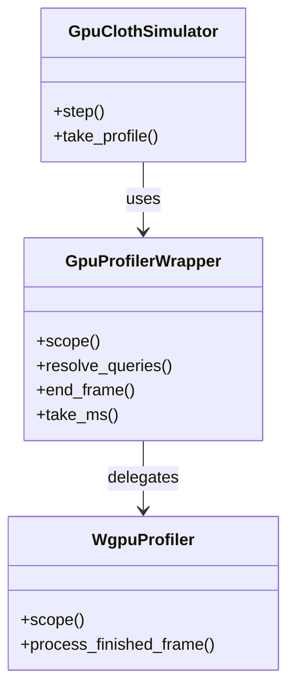

# GPUプロファイラ強化 実装計画（Stage1: wgpu 24維持 + wgpu-profiler 0.20系）

## 背景と目的
現状の診断用GPU時刻計装は自前 `GpuProfiler`（`crates/cloth_core/src/simulation/profile.rs:21`）で、平面ラベル列と同期回収（`take_ms`内の`poll(Wait)`＋`block_on`）に留まる。関数・区間の入れ子集計や非同期回収、Chrome/Tracy可視化がない。
Stage1ではwgpu更新なしで定番クレート `Wumpf/wgpu-profiler 0.20系`（wgpu 24対応）に乗っかり、スコープ計測とchrometrace出力を得る。Stage2（wgpu 30＋profiler 0.28＋egui更新）は別計画とする。

## 提案する変更

### 1. 依存追加
#### [MODIFY] `crates/cloth_core/Cargo.toml:8`
- **変更内容**: `wgpu = "24.0"` の次に `wgpu-profiler = "0.20"` を追加。`default-features`は触らない。
- **影響**: `Cargo.lock` に `wgpu-profiler 0.20.x`＋`tracy-client`なし（既定featureのみ）が追加される。ビルド時間は微増。
- **確認手順**: `cargo tree -p cloth_core | findstr profiler` で版数確定。0.20系の最新パッチを採用。

```toml
# Before
wgpu = "24.0"
# After
wgpu = "24.0"
wgpu-profiler = "0.20"
```

### 2. 自前Profilerのラッパ化（公開API維持）
#### [MODIFY] `crates/cloth_core/src/simulation/profile.rs:1-193`
- **変更内容**: 構造体内部を `wgpu_profiler::GpuProfiler` への委譲に置換。公開シグネチャは維持し、呼出側の churn を抑える。
  - 維持: `new(context)`, `supported()`, `is_enabled()`, `set_enabled(bool)->bool`, `frame_begin()`, `frame_end(encoder)`, `take_ms()->Vec<(String,f32)>`
  - 廃止: `MAX_QUERIES:15`, `next/used:29-30`, `labels:31`, `query_set/resolve/staging:25-27` の手管理、`enter()->u32:106`, `writes(u32):121` の素朴版
  - 新設: 内部 `prof: Option<wgpu_profiler::GpuProfiler>`＋`enabled: AtomicBool`＋直近結果キャッシュ `Mutex<Vec<(String,f32)>>`
  - 新設（任意）: `save_chrometrace(path)->Result` を追加し、chrometrace JSON書出しに対応
- **擬似コード**:
```rust
// Before: 手動クエリ割当
let ts = self.profiler.enter("sc_solve");
let mut cpass = encoder.begin_compute_pass(&wgpu::ComputePassDescriptor {
    label: Some("Self Collision Pass"),
    timestamp_writes: self.profiler.writes(ts),
});

// After案B（推奨）: スコープガードで入れ子化
{
    let mut scope = self.profiler.scope("self_collision", encoder);
    {
        let mut cpass = scope.scoped_compute_pass("sc_solve");
        cpass.set_pipeline(...); cpass.dispatch_workgroups(...);
    } // Dropで区間確定
}
```
- **影響**: クエリプール自動拡張により枯渇分岐（`u32::MAX`素通り）が不要になる。無効時はbool早期returnで従来同等のゼロオーバーヘッド。

### 3. フレームライフサイクルの置換
#### [MODIFY] `crates/cloth_core/src/simulation/dispatch.rs:273-294`（`step`）
- **変更内容**:
  - `frame_begin:286` → profiler側のフレーム開始（版数APIに合わせる。0.20系の実シグネチャは`cargo doc`で確定）。
  - `frame_end:288` → `resolve_queries(&mut encoder)` を `encoder.finish()` 前に呼ぶ。
  - `queue.submit:289` 後に `end_frame()` を呼ぶ。
  - `take_profile` 側で `process_finished_frame(period)` を呼び、最古完成フレームを `Vec<(String,f32)>` に変換（非同期のため1〜2フレーム遅延あり）。
- **影響**: 従来の `resolve_query_set:profile.rs:143`＋別エンコーダ回収 `profile.rs:161-167` が不要になり、同期待機 `poll(Wait):174` を避けられる。

### 4. 計測点のスコープ化（段階的）
#### [MODIFY] `crates/cloth_core/src/simulation/dispatch.rs:883-1005`（`dispatch_self_collision_passes`）
- **変更内容**: `sc_normals/pair_collect/pair_vt/pair_ee/pair_apply/sc_solve/sc_solve_ee/sc_apply` の8点をスコープガード化。親スコープ `self_collision:Outer/In-Loop` で入れ子化し、合計時間も取得。
- **非対象**: `encode_simulation_steps:99-269` の `Sew Shrink/Predict/Solver Iteration/Final Pin/Edge Collision/Relaxation/Final Sewing/Update Vel`（`timestamp_writes: None`）はStage1では触らない。効果確認後に追加計装を検討。

#### [MODIFY] `crates/cloth_core/src/spatial_hash.rs:144-218`（`dispatch_build`頂点6相）＋ edge側 `359-416`
- **変更内容**: 引数 `prof: &GpuProfiler:149` の型は維持し、内部の `prof.writes(prof.enter(..)):158` をスコープ版に置換。親スコープ `hash_build` の下に `hash_clear/count/scan/top/add/scatter` を配置。
- **影響**: 12パス分のフラット列がツリー化され、ハッシュ6相合計とSolve系の比率比較が容易になる。

### 5. 公開APIの互換維持
#### [MODIFY] `crates/cloth_core/src/simulation/mod.rs:739-746`（`set_profiling_enabled/take_profile`）
- **変更内容**: シグネチャ変更なし。内部委譲先のみ新profilerに切替。ドキュメントコメントの「同期待機を伴う」を「最大2フレーム遅延の非同期回収」に更新。
#### [MODIFY] `crates/cloth_py/src/lib.rs:1293-1301`（`set_profiling_enabled/take_profile`）
- **変更内容**: 変更なし（Rust側互換のため）。chrometrace保存を公開する場合は `save_profile_trace(path)` を1件追加する（要否は実装時に判断）。

### 6. Context側の要件確認（変更なし見込み）
#### [READ-ONLY] `crates/cloth_core/src/context.rs:230,304-307`
- `required_features: TIMESTAMP_QUERY` のみ要求は継続。wgpu-profilerのパス境界計測は同featureで足りる見込み。`TIMESTAMP_QUERY_INSIDE_ENCODERS/PASSES` が要る粒度にするかはStage1では見送る。

## パフォーマンス影響分析
| 観点 | 内容 | 影響度 |
|---|---|---|
| 時間計算量 | スコープはクエリ2件/区間。フレーム内区間数は10〜20のためO(区間数)で無視可 | 🟢 低 |
| 空間計算量 | QueryPool自動管理。旧固定2048枠から可変プールへ（微増） | 🟢 低 |
| 無効時オーバーヘッド | boolチェックのみで `timestamp_writes: None` と同一経路を維持 | 🟢 低 |
| 有効時 | 従来の同期 `poll(Wait)+block_on` から非同期回収へ。計測自体の stall が減る | 🟡 中（改善方向） |
| フレームレート | `cloth_gui` のRenderパス（`app.rs:937,973`）は非計装のまま。Computeのみ影響 | 🟢 低 |

## 設計上の考慮事項
- **依存関係**: 新規 `wgpu-profiler 0.20` のみ。Tracy/puffin featureはStage1で有効化しない（C++ toolchain・外部viewer要件を避ける）。
- **責務**: `profile.rs` がQuerySet/Buffer管理を持たず、割当・解決・回収をクレートに委譲（SRP改善、DRY）。
- **公開API**: 破壊なし。`set_profiling_enabled/take_profile` のPython署名を維持。
- **状態管理**: 完成フレーム遅延（最大2フレーム）を `take_ms` 仕様として明文化する。


## ベストプラクティスの遵守チェック
- [ ] SOLID: 計測管理を外部クレートへ委譲し、自前プール管理を削除
- [ ] DRY: `enter/writes/frame_end` の定型反復をスコープに集約
- [ ] KISS: Stage1ではchrometraceのみ。Tracy/puffinは見送り
- [ ] YAGNI: 未使用パス（Sew/Predict等）の計装追加は効果確認後
- [ ] 命名規則: 既存ラベル `sc_*/pair_*/hash_*` を維持し、差分比較可能にする

## エラーハンドリングと例外処理
- **非対応環境**: `timestamp_query_supported()==false` 時は旧同様 `set_enabled(true)->false`、全スコープは no-op、空Vec返却。
- **クエリ枯渇**: プール自動拡張のため旧 `u32::MAX` 分岐は削除。`end_frame()->Err` 時はログ＋空結果で継続（panic禁止）。
- **未完成フレーム**: `process_finished_frame()->None` 時は前回キャッシュまたは空Vecを返し、呼び出し側をブロックしない。
- **chrometrace書出し失敗**: `io::Error` を呼出側へ返却。シミュレーション継続を妨げない。

## テスト計画
| テストタイプ | 内容 |
|---|---|
| Rust単体 | `cargo test -p cloth_core profile` 新設：無効時no-op、有効時スコープ開閉＋`end_frame`成功（GPUなしCIではAdapterNotFound許容の既存方針を踏襲） |
| Python統合 | `tests/core/test_debug_recorder.py` 既存通過＋新規：`set_profiling_enabled(True)`→`step`→`take_profile` が `list[(str,float)]` かつ非負msを返す（対応環境のみ、非対応時は空リスト許容） |
| 回帰 | `python run_tests.py --ci -t test_config_parity.py`（写像漏れ検出）、golden差分なし（物理無変更の確認） |
| 手動 | `log_tools inspect/render` 併用で計測ON/OFFの座標一致を確認。chrometrace JSONを `chrome://tracing` で開けること |
- クリーンアップ: 生成した `*.json` traceは `scratch/` 配下に限定し、テスト後は削除。GPU Contextのグローバル状態は変更しない。

## 後方互換性とマイグレーション
- 破壊的変更なし。`set_profiling_enabled/take_profile` のPython署名・戻り型維持。
- 挙動差分1点のみ: `take_profile` が直前フレーム同期値→最大2フレーム遅延の完成値になる。AGENTS.mdの「同期待機」記述を更新して周知。
- マイグレーション作業不要。既存ログ・テストの修正なし。

## セキュリティとプライバシー
- Tracyのブロードキャスト送信懸念はStage1対象外（Tracy無効）。
- chrometraceはローカルJSONのみ。パス・時刻以外の個人情報を含まない。
- ログ出力にデバイス名を含める場合は既存 `get_adapter_info` 範囲に限定。

## ドキュメント更新計画
- [ ] `AGENTS.md:98-104`（Step 6計測手順）: 同期待機→非同期遅延、chrometrace保存手順に更新
- [ ] `docs/algorithms.md:310`（副産物記述）: 自前計装→wgpu-profiler委譲に更新
- [ ] `docs/architecture.md`（該当節があれば）: プロファイラ構成の委譲図に更新
- [ ] `crates/cloth_core/src/simulation/profile.rs:1-5` モジュールdoc: 無効時同一経路の保証を維持記載
- [ ] README更新要否: ユーザ操作に影響なしのため不要と判定

## リスクと代替案
| リスク | 発生確率 | 影響度 | 軽減策 |
|---|---|---|---|
| 0.20系APIが0.28文書と異なる | 高 | 中 | `cargo doc -p wgpu-profiler` で実シグネチャ確定後に着手 |
| 非対応GPUで計測不能 | 低 | 低 | 旧同様false返却＋空結果。CIはAdapterNotFound許容 |
| 完成フレーム遅延で直後比較がずれる | 中 | 低 | 遅延を仕様化し、厳密比較は穏やか区間で実施 |
| QueryPool肥大 | 低 | 低 | 既定Settingsのまま運用し、必要時のみ上限設定 |

| アプローチ | メリット | デメリット |
|---|---|---|
| 案A: Stage1（本計画） | wgpu更新なし・低リスクで効果検証可 | 最新profiler機能（0.28改善）は得られない |
| 案B: 一気にwgpu30＋0.28 | 長期保守性が最大 | `context.rs`定型置換＋`egui-wgpu 0.31`連動更新が必須で工数大 |
| 案C: 自前維持＋RAII追加 | 依存ゼロ | ネスト集約・可視化を自作する工数が残る |

## 作業順序（目安）
1. `Cargo.toml` に `wgpu-profiler="0.20"` 追加＋`cargo tree`で版数確定
2. `profile.rs` ラッパ化＋`step:286-288` の解決/end_frame置換
3. `dispatch_self_collision_passes:883-1005` と `spatial_hash:158-213` のスコープ化
4. `cargo test -p cloth_core`＋`python run_tests.py --ci` で回帰確認
5. AGENTS.md＋algorithms.mdの記述更新
