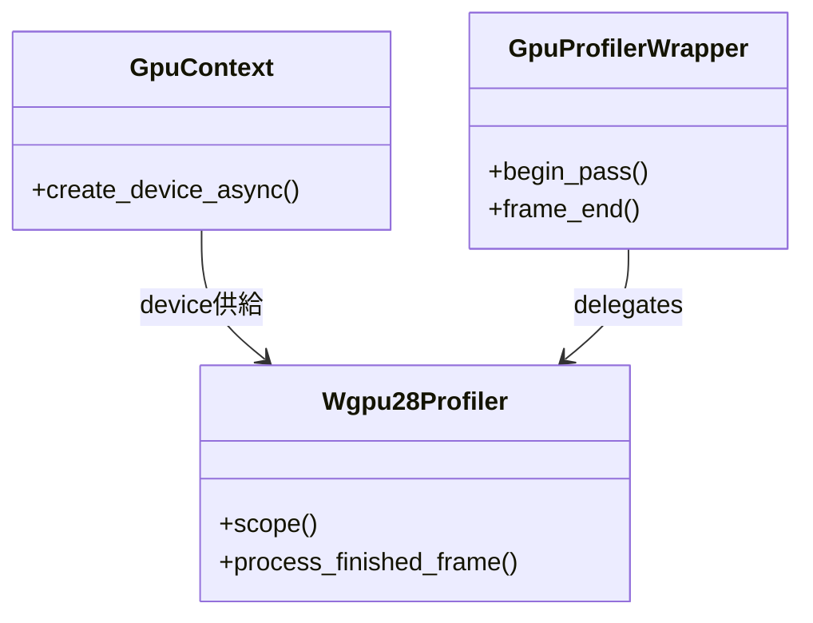

# GPUプロファイラ強化 実装計画（Stage2: wgpu 30＋profiler 0.28＋egui更新）

> 状態: 手順1で検証中断（2026-09-27）。`wgpu 30.0.1` はWindowsで上流の版数不整合によりビルド不可のため、 repoはStage1（wgpu 24）に復帰済み。再開条件は下記「手順1の検証結果」を参照。

## 手順1の検証結果（2026-09-27実施）
- 解決版数: `wgpu 30.0.1`、`wgpu-profiler 0.28.0`、`egui 0.36.2`、`winit 0.30.13`、`naga 30.0.1` で解決成功（`cargo metadata` で確定）。
- ビルド結果: `cargo check -p cloth_core` が `wgpu-hal 30.0.1` の `dx12/suballocation.rs:83` で失敗。`gpu-allocator 0.28.0` が `windows 0.58.0`、`wgpu-hal 30.0.1` 本体が `windows 0.62.2` を要求し、同一型の二重定義で不整合になる。
- 対応: `crates/cloth_core/Cargo.toml` と `crates/cloth_gui/Cargo.toml` をStage1版数へ復帰し、`cargo check -p cloth_core` の成功を確認済み。
- 次の選択肢: 上流修正（`wgpu 30.0.2+` または `gpu-allocator 0.29+`）待ち、または `wgpu 29系＋egui 0.34系` での代替検証。

## 背景と目的
Stage1でwgpu 24維持のまま `wgpu-profiler 0.20系` 委譲を完了した。Stage2では保守限界が近いwgpu 24とegui 0.31から脱し、現行のwgpu 30系へ追従する。profilerも0.20から0.28へ上げ、API簡略化（device引数不要化）とQuerySet改善（未書込スロット0解決保証）を得る。compute本体の書換えは小さい見込みだが、`context.rs` の定型置換とGUI側の連動更新が中心になる。

## 版数対応表（根拠付き）
| 対象 | 現行 | 目標 | 根拠 |
|---|---|---|---|
| `wgpu` | 24.0（`cloth_core/Cargo.toml:8`、`cloth_gui/Cargo.toml:13`） | 30.0 | gfx-rs/wgpu releases（v30は2026-07-01） |
| `wgpu-profiler` | 0.20.0（Stage1で確定） | 0.28.0 | Wumpf/wgpu-profiler CHANGELOG（0.28でwgpu 30対応） |
| `egui`/`egui-wgpu`/`egui-winit` | 0.31（`cloth_gui/Cargo.toml:22-24`） | 0.36系 | emilk/egui CHANGELOG（0.36.0でwgpu v30対応、2026-08-05） |
| `naga`（dev） | 24.0（`cloth_core/Cargo.toml:24`） | 30.0 | wgpu 30に同梱のnaga版数に追従 |
| `winit` | 0.30 | 0.30維持見込み | egui 0.36との組合せを `cargo tree` で確定（未検証） |

## 提案する変更

### 1. 依存更新
#### [MODIFY] `crates/cloth_core/Cargo.toml:8`
```toml
# Before
wgpu = "24.0"
wgpu-profiler = "0.20"
# After
wgpu = "30.0"
wgpu-profiler = "0.28"
```
#### [MODIFY] `crates/cloth_core/Cargo.toml:24`
- `naga = "24.0"` → `"30.0"`（`wgsl-in` 維持）。
#### [MODIFY] `crates/cloth_gui/Cargo.toml:13,21-24`
- `wgpu = "24.0"` → `"30.0"`、`egui/egui-wgpu/egui-winit = "0.31"` → `"0.36"`。`winit = "0.30"` は据置きで解決可否を確認し、不可ならegui 0.36要求版へ追従。
- **影響**: `Cargo.lock` 全面更新。BLAS等の新backend差分はない見込み。

### 2. Instance/Adapter/Device取得（`context.rs` 中心）
#### [MODIFY] `crates/cloth_core/src/context.rs:107-210`
- **変更内容**:
  - `Instance::new(&InstanceDescriptor{ backends, ..Default::default() })` → v29で `Default/from_env_or_default` 削除のため `new_without_display_handle` 系へ置換（ヘッドレスcompute想定、未検証のため `cargo build` で確定）。
  - `enumerate_adapters(backends):112,151` → v28でasync化のため `.await` 追加。
  - `request_adapter(..):159,171,189,199` → v25で `Option`→`Result` のため `match Some/None` を `match Ok/Err`＋`AdapterNotFound` 変換へ書換え。
  - `DeviceDescriptor:227-234` → `experimental_features` 追加（全指定リテラルのため新フィールド補完）、`memory_hints` 維持。
  - `Limits:214-223` → v29で `max_uniform/storage_buffer_binding_size` が `u32`→`u64` のため `as u64` 代入を再確認。
- **擬似コード**:
```rust
// Before (v24)
let adapter_opt = instance.request_adapter(&opts).await;
match adapter_opt { Some(a) => a, None => return Err(AdapterNotFound) }
// After (v25以降)
let adapter = instance.request_adapter(&opts).await.map_err(|_| AdapterNotFound)?;
```

### 3. ポーリング置換（11件）
#### [MODIFY] `crates/cloth_core/src/simulation/dispatch.rs:311,399,465,575,606,672,801`、`simulation/mod.rs:1349`、`sdf_baker.rs:559,724,1396`
```rust
// Before
self.context.device.poll(wgpu::Maintain::Wait);
// After
let _ = self.context.device.poll(wgpu::PollType::wait_indefinitely());
// v27でWaitにtimeout導入のため、無期限待機の意図を明示。戻り値 Result は無視または warn ログ。
```
- **影響**: 同期読戻しの意味は不変。`PollError::Timeout` が返り得るため握りつぶし方針を統一する。

### 4. マップ範囲のResult化（10件）
#### [MODIFY] `dispatch.rs:404,414,468,578,609,675,804`、`mod.rs:1352`、`sdf_baker.rs:567,732`
```rust
// Before (v24: panic)
let data = slice.get_mapped_range();
// After (v30: Result)
let data = slice.get_mapped_range().expect("profile/readback map failed");
```
- 方針は既存 `unwrap` 箇所と統一し、読戻し失敗時は空結果＋継続（profiler系）かpanic（物理読戻し系か）を呼出元仕様に合わせる。

### 5. パイプラインレイアウトのOption化（9件）
#### [MODIFY] `simulation/pipeline_cache.rs:173`、`simulation/mod.rs:1610,1643,1676`、`sdf_baker.rs:462,818,1028,1256`、`cloth_gui/src/mesh_render.rs:248`
```rust
// Before
bind_group_layouts: &[bgl],
// After (v29)
bind_group_layouts: &[Some(bgl)],
```
- `mesh_render.rs:231` の `BufferBindingType` と `sdf_baker.rs` のStorage記述は型自体は維持見込み。`cargo build` のエラーで確定させる。

### 6. GUIレンダー側の追従
#### [MODIFY] `crates/cloth_gui/src/app.rs:905,919,962,984`、`mesh_render.rs:213-304,654-817`
- `RenderPassDescriptor` の `multiview_mask` 等の新必須項目は `..Default::default()` で吸収できるか確認。不可なら明示追加。
- `VertexState::buffers: &[Option<...>]`（v30）への変更はcomputeのみなら無影響だが、GUIメッシュ描画の頂点レイアウト指定を再確認。
- `SurfaceTexture::present` → `Queue::present`（v30）の有無を `app.rs:986` で確認。computeのみの想定が崩れる場合はGUI側も置換。
- `egui-wgpu 0.36` の `Renderer::new/update_buffers/render` シグネチャ差分は `cargo build -p cloth_gui` で潰す。`forget_lifetime:975` 周りの干渉に注意。

### 7. profiler 0.28 API移行
#### [MODIFY] `crates/cloth_core/src/simulation/profile.rs:1`
- **変更内容**:
  - `GpuProfiler::new(settings)` → `GpuProfiler::new(&device, settings)`（0.28文書のHow to useより）。
  - `scope(label, encoder, device)` → `scope(label, encoder)`（device不要化、0.22の#93以降）。
  - `begin_pass_query(label, encoder, device)` のdevice引数要否を `cargo doc -p wgpu-profiler` で確定。不要化ならwrapperの `begin_pass` からdevice渡しを削除。
  - `resolve_queries/end_frame/process_finished_frame` のシグネチャ再確認（`end_frame` のエラー型、`process` のperiod引数は維持見込み）。
  - `GpuProfilerSettings` の既定値（`enable_debug_groups` 等）を0.28既定に合わせ、現行の `enable_debug_groups:false` 方針を継続。
- **影響**: `dispatch.rs:883-1005` と `spatial_hash.rs:158-454` の呼出部はwrapper内に吸収し、呼出側シグネチャ（`begin_pass(label, encoder)`）は変えない方針。変更は `profile.rs` 内に閉じる。

### 8. 非対象（触らない見込み）
- `dispatch_workgroups`（既に新名のため対応不要）、`timestamp_writes`/`BufferUsages::QUERY_RESOLVE`（維持）、`cloth_py/Cargo.toml`（wgpu直接依存なし）、WGSLシェーダ本体。

## パフォーマンス影響分析
| 観点 | 内容 | 影響度 |
|---|---|---|
| 時間計算量 | パス数・クエリ数は不変。QuerySet未書込0保証で無効スロット処理が安定 | 🟢 低 |
| 無効時 | bool早期return＋`timestamp_writes: None` 維持で従来同等 | 🟢 低 |
| 有効時 | profiler 0.28のプール再利用改善で長期運用の確保量が収束しやすい | 🟢 低 |
| 起動時 | wgpu 30のパイプライン生成差分は `get_build_timings` で回帰計測 | 🟡 中 |
| GUI | egui 0.36描画の差分は実機FPSで確認（144Hz超の独立描画は維持見込み） | 🟡 中 |

## 設計上の考慮事項
- **依存**: wgpu系3件＋egui系3件＋nagaの計7件を同時上げする。Tracy/puffinはStage2でも有効化しない。
- **責務**: 版数差異は `context.rs`（生成）と `profile.rs`（計測）に集約し、dispatch/spatial_hashの呼出形は維持する。
- **公開API**: `set_profiling_enabled/take_profile/save_profile_trace` のPython署名は不変。遅延仕様も不変。


## ベストプラクティスの遵守チェック
- [ ] 一括上げでも呼出側のラベル体系（`sc_*/pair_*/hash_*`）を維持し、Stage1 traceと差分比較可能にする
- [ ] `..Default::default()` の残存で新必須項目を黙って吸収せず、GUI描画の差分は目視確認する
- [ ] `expect` 追加時はメッセージにファイル・用途を含め、握りつぶし（poll等）と区別する
- [ ] YAGNI: `TIMESTAMP_QUERY_INSIDE_*` の追加要求やRender計装は効果確認後にする

## エラーハンドリングと例外処理
- `request_adapter:Err` → `AdapterNotFound` へ変換し、既存のCI許容（GPUなし環境）方針を維持。
- `poll:Err(Timeout)` → warnログ＋継続。物理読戻しの成否判定は従来の `receive()` 結果で継続。
- `get_mapped_range:Err` → profiler系は空結果＋前回値返却、座標読戻し系は従来のpanic/空分岐に合わせる。
- `end_frame:Err(Unclosed/Unresolved)` → warnログ＋継続（既にStage1で導入済み）。
- `egui Renderer::new` 失敗時はGUI起動失敗として従来同様に伝播させる。

## テスト計画
| テストタイプ | 内容 |
|---|---|
| Rust単体 | `cargo test -p cloth_core` 全54＋3件の全成功（Stage1と同等）。`get_build_timings` の起動時間回帰を確認 |
| Python統合 | `run_tests.py --ci -t test_config_parity.py`、`test_debug_recorder.py`、`test_coupled_self_collision.py`、`test_pair_caching.py` の全成功 |
| 物理回帰 | golden差分なし（WGSL・ソルバ無変更の確認）。`log_tools inspect/render` でON/OFF座標一致 |
| GUI手動 | `cloth_gui` 起動、-egui表示・Surface再構成（Lost時）・144Hz描画の目視。chrometraceを `chrome://tracing` で開けること |
- クリーンアップ: 更新後の `trace.json` は `scratch/` に限定。`.venv_ci` は使い回し、GPU Contextの共有状態は変更しない。

## 後方互換性とマイグレーション
- 破壊的変更なし（Python署名・`.blend`・ログ形式の移行不要）。差分はバイナリ（`.pyd`/`taremin_cloth_gui.exe`）の再ビルドのみ。
- 挙動差分は起動時間（パイプライン生成）と計測値の微差に限定される見込み。物理結果の差分が出たら即差し戻し対象とする。
- `implementation_plan.md`（Stage1）との対応を本書に明記し、重複更新を避ける。

## セキュリティとプライバシー
- 新規ネットワーク・外部送信なし。Tracyは無効のまま。
- chrometraceはローカルJSONのみ。デバイス名の扱いは既存範囲に限定。

## ドキュメント更新計画
- [ ] `AGENTS.md:95-104`：版数表記を `wgpu 30＋profiler 0.28` へ更新（手順自体は不変）
- [ ] `docs/algorithms.md:310`：委譲版数を0.28へ更新
- [ ] `docs/architecture.md`：表1.1の `wgpu v24.0+` と1.5節のパイプライン記述を更新
- [ ] `crates/cloth_core/src/simulation/profile.rs:1`：モジュールdocの版数を更新
- [ ] README：セットアップ・対応表に版数記載がある場合のみ更新（要否チェック）

## リスクと代替案
| リスク | 発生確率 | 影響度 | 軽減策 |
|---|---|---|---|
| egui 0.36とwinit 0.30の組合せ不可 | 中 | 高 | `cargo tree` で先に解決可否を確認し、不可ならegui要求版へ追従 |
| `InstanceDescriptor` 置換先の誤選 | 中 | 高 | ヘッドレスは `new_without_display_handle` 系を第一候補にし、GUI起動で目視確認 |
| profiler 0.28のdevice引数差異の見落とし | 高 | 中 | `cargo doc` で実シグネチャ確定後に `profile.rs` のみ修正 |
| GUI描画の微差（multiview/present等） | 中 | 中 | `app.rs` の差分はビルドエラー駆動で潰し、目視回帰する |
| 起動時間の悪化 | 低 | 中 | `get_build_timings` でStage1前後を比較 |

| アプローチ | メリット | デメリット |
|---|---|---|
| 案A: 本計画（一気に30へ） | 保守性が最大、profiler改善も得られる | GUI連動で工数が最大 |
| 案B: 24のまま据置き | 工数ゼロ | セキュリティ・egui追従から取り残される |
| 案C: 段階上げ（25→27→30） | 差分切り分けが容易 | 中間版の解決・検証が3回分増える |

## 作業順序（目安）
1. `Cargo.toml` 7件の版数更新＋`cargo tree` で解決確定
2. `context.rs` の生成系置換＋`poll` 11件の置換で `cargo check -p cloth_core` を通過
3. `get_mapped_range` 10件＋レイアウト9件で `cargo check` を通過
4. `profile.rs` の0.28対応＋`cargo test -p cloth_core`
5. `cargo check -p cloth_gui` のGUI差分潰し＋目視
6. CI 4種＋ドキュメント同期
